# Car Crash Simulation

A browser-based car crash simulator. A car drives itself into a barrier, a brick wall, another car or a pole. The crash is computed with a deformable-structure physics model at 0.1 ms steps and replayed in bullet-time slow motion. You see:

- **the body crumpling:** glass shatters, panels and wheels tear off;
- **a crash-test dummy:** a 3D dummy moves inside the deforming car, and its injury criteria are scored the way crash-test programs score them;
- **the aftermath:** steam, or an engine-bay fire if the crash would start one.

The replay slows to 1/40× around the peak deceleration, the camera shakes with the impact, the sounds are placed in 3D and follow the energy the crash absorbs, and the replay can be saved as an MP4 video. An optional, experimental GPU solver (WebGPU) can compute the barrier crash.

It runs in any modern browser from plain files: no install, no server, no build step needed to use it.

<p>
  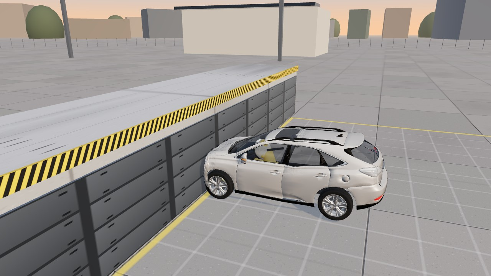
  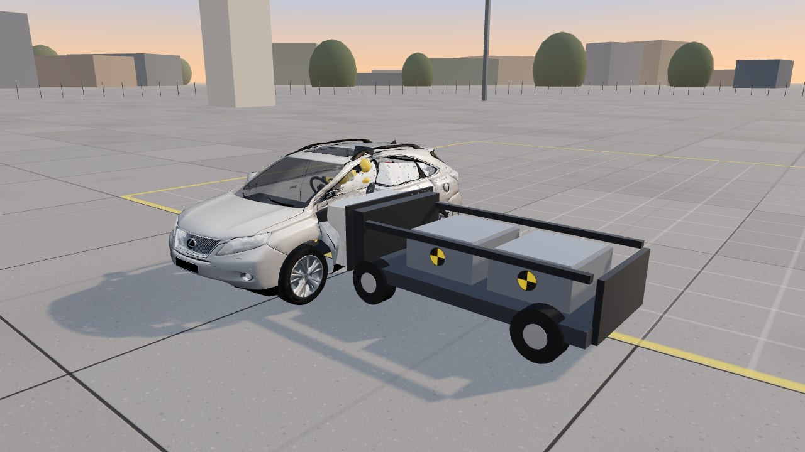
</p>

There are eight simulations: the two **barrier tests** (a free simulator with full control) and six **crash labs**, each set up like a test protocol:

| | | | |
|---|---|---|---|
| <br>**Rigid barrier** | 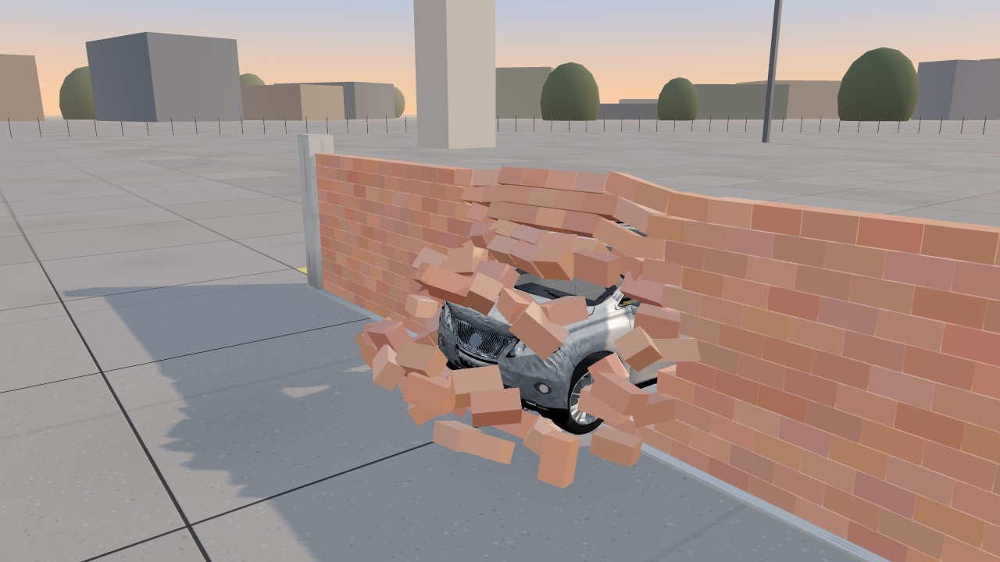<br>**Brick wall** | 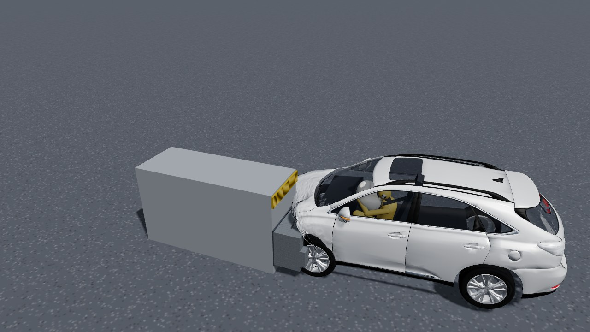<br>**Frontal overlap** | 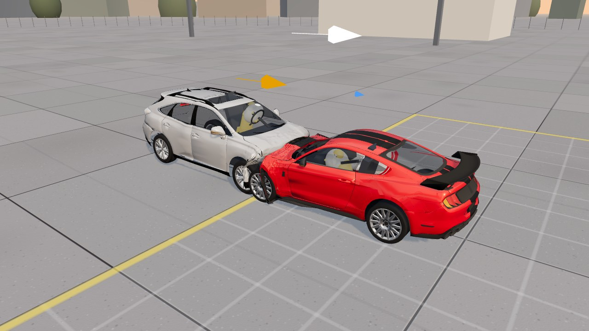<br>**Two-vehicle collision** |
| <br>**Side impact** | 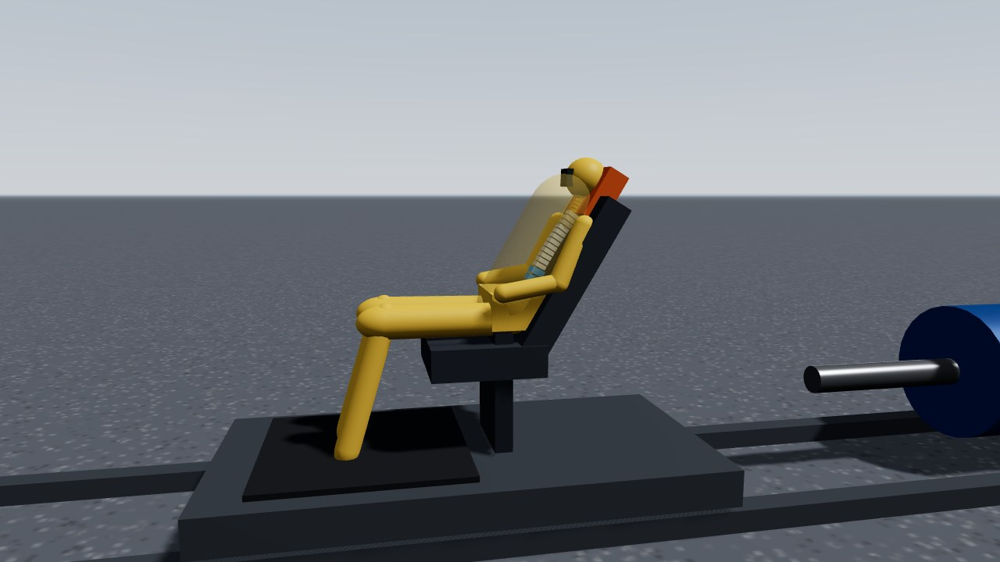<br>**Whiplash sled** | 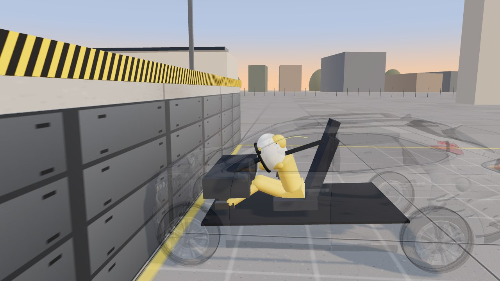<br>**Occupant restraints** | 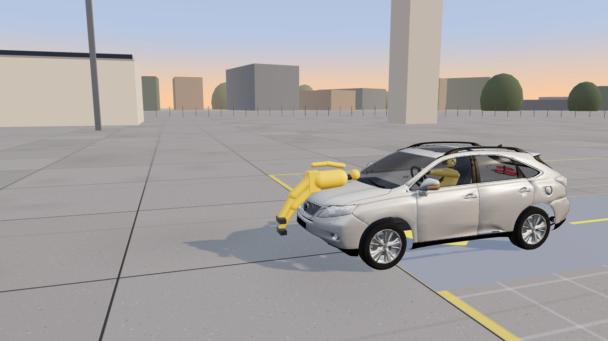<br>**Pedestrian & braking** |

There are also two game modes, with crashes worked out by the same solver:
- **[Race](#race-game-mode):** drive it yourself, three laps of a city street circuit against seven rivals through two-way traffic.
- **[Destruction](#destruction-game-mode):** drive into a busy junction at dusk and cause as much damage as you can, Burnout-style, with gas tankers that explode.

> **A teaching model.** It is not validated against physical crash tests. Use it to compare settings and see trends, not to predict real injuries.

---

## Contents

1. [Getting started](#getting-started)
2. [The simulations](#the-simulations)
3. [Using the simulator](#using-the-simulator)
4. [Race (game mode)](#race-game-mode)
5. [Destruction (game mode)](#destruction-game-mode)
6. [Technical architecture](#technical-architecture)
7. [How the physics works](#how-the-physics-works)
8. [Occupant and injury models](#occupant-and-injury-models)
9. [How each crash lab works](#how-each-crash-lab-works)
10. [Simulation diagrams](#simulation-diagrams): [rigid barrier](#rigid-barrier), [brick wall](#brick-wall), [frontal overlap](#frontal-overlap-lab), [two vehicles](#two-vehicle-collision-lab), [side impact](#side-impact-lab), [whiplash](#whiplash-sled-lab), [restraints](#occupant-restraint-lab), [pedestrian](#pedestrian-and-emergency-braking-lab)
11. [Rendering the damage](#rendering-the-damage)
12. [Equations and sources](#equations-and-sources)
13. [Verification](#verification)
14. [Tools: building, recording, exporting models](#tools-building-recording-exporting-models)
15. [Design decisions](#design-decisions)
16. [Limitations](#limitations)
17. [Project structure](#project-structure)
18. [Credits](#credits)
19. [References](#references)

---

## Getting started

**Open `Car Crash Simulation.html`** (the home page), **`Simulator.html`** (the simulator), **`Race.html`** (the Race game) or **`Destruction.html`** (the Destruction mode) in Chrome, Edge, Firefox or Safari. Each is a single self-contained file, so they work straight from disk (`file://`) or from any static web host, such as GitHub Pages.

Requirements:
- **WebGL 2.** Any desktop or laptop GPU from the last decade works; phones work but the layout is cramped.
- **An internet connection.** three.js and its Draco decoder load from the jsDelivr CDN; everything else is in the files. Saving a video also loads mp4-muxer from the CDN the first time.
- **Optional:** WebCodecs to save videos (recent Chrome, Edge, Safari or Firefox), and WebGPU for the GPU solver.
- **Node.js 22 or later**, only for the developer tools (physics check, single-file build, media recording).

Pick a simulation from the home page, or switch between all eight with the **Simulation** menu at the top of the simulator. Settings can also be passed in the URL:

```
Simulator.html?preset=rigid                    56 km/h full-frontal rigid-barrier test
Simulator.html?preset=brick                    64 km/h into a brick wall, Dramatic damage
Simulator.html?vehicle=mustang&speed=100&angle=30
Simulator.html?lab=side&impactor=pole&steel=mild
Simulator.html?solver=gpu                      the crash computed on the GPU (WebGPU); also with ?lab=
```

For development, open `index.html` (or `game.html` for Race, `junction.html` for Destruction) instead. It loads the source files one by one, so edits show on reload. Then rebuild the single files with `node tools/build-standalone.js`. Opened from disk, `game.html` and `junction.html` run their crashes on the main thread, because the browser won't let them read their own scripts for the worker; `Race.html`, `Destruction.html` and any web server don't have that limit.

**Hosting.** The site is static and needs no build step.
- **Vercel:** import the repository with the framework preset *Other*. `vercel.json` serves `home.html` at `/`; it loads the video and pictures from `media/` instead of embedding them, so it opens faster than the single-file home page. `.vercelignore` keeps the docs and tools off the site. It also leaves out `index.html` (the developer page), because Vercel serves a real file at `/` before it applies any rewrite, `game.html` with `media/race/`, which `Race.html` embeds, and `junction.html`. `/race` serves `Race.html`, and `/destruction` serves `Destruction.html`.
- **Other static hosts** (GitHub Pages, Netlify and others) work too: open `home.html` or `Car Crash Simulation.html`.

---

## The simulations

### Barrier tests (the free simulator)

| Setting (URL name) | Options |
|---|---|
| Vehicle (`vehicle`) | Lexus RX 350 (default), Ford Mustang GT500, Lab sedan (a simple procedural car, the physics baseline) |
| Damage (`damage`) | *Realistic*: break limits set so a 56 km/h barrier test keeps its panels and wheels, as real cars do. *Dramatic*: limits about 3× lower, so parts fly off at moderate speeds. |
| Speed (`speed`) | 10–150 km/h |
| Approach angle (`angle`) | −45° to +45°: slider, or drag the blue handle behind the car |
| Mass (`mass`) | Light / Standard / Heavy, around each car's curb mass (0.73×, 1×, 1.47×) |
| Front-structure stiffness (`stiffness`) | Soft (0.6×), Standard, Stiff (1.7×) |
| Barrier (`barrier`, `wall`) | Rigid concrete barrier, or a brick wall with weak, standard or strong mortar |
| Restraints | Seatbelt and airbag, each on or off |
| Physics solver (`solver`) | CPU (default), or GPU: WebGPU, experimental, rigid barrier only in the free simulator, parts stay on (see [the GPU solver](#9-the-gpu-solver-optional)) |

### Crash labs (`Simulator.html?lab=<id>`)

Each lab has its own setup panel, live readouts across the top, results and charts. Speeds are in mph, as in the test protocols they follow, with km/h alongside. The overlap, two-vehicle, side-impact and restraint labs can also be solved on the GPU (*Physics solver*, or `solver=gpu`); the whiplash and pedestrian labs have no car structure to solve, so they always run on the CPU.

| Lab (`id`) | Controls (URL names) | What it shows |
|---|---|---|
| Frontal overlap (`overlap`) | speed 10–50 mph (`mph`); 40% moderate or 25% small overlap (`overlap=moderate\|small`); rigid or aluminium honeycomb barrier (`barrier=rigid\|honeycomb`) | The Lexus hits a 1 m wide block with the driver's side of its front. Crash pulse; steering-column movement (flagged over 10 cm); brake-pedal, toe-pan and hinge-pillar intrusion (flagged over 15 cm); occupant injury criteria. |
| Two vehicles (`multi`) | for each car: class (`aCls`, `bCls` = `coupe` Mustang, `suv` / `heavy` Lexus, `compact` the simple Lab sedan), mass 800–3,000 kg (`aMass`, `bMass`), speed 0–60 mph (`aMph`, `bMph`); approach angle 0–45° (`angle`) | Two cars collide in one solver. Each driver's speed change (Δv), crash pulse and injuries, momentum before and after (arrows in the scene), and where the kinetic energy went. |
| Side impact (`side`) | a 1,900 kg SUV-height barrier trolley at 37 mph or a rigid 254 mm pole at 20 mph (`impactor=mdb\|pole`); mild or hot-stamped B-pillar steel (`steel=mild\|uhss`); curtain airbag (`curtain`) | B-pillar and door intrusion (flagged over 15 cm), timed against the curtain airbag's deployment; the side-impact dummy's rib deflection, pelvis force and HIC36. |
| Whiplash sled (`whiplash`) | striking-car speed 20–30 mph (`mph`); head-restraint backset 0–12 cm (`backset`) and height −12 to +4 cm (`height`) | A sled pulse pushes the seat and a 24-vertebra spine bends. Head-restraint contact time (70 ms or less passes), upper-spine (T1) acceleration (9.5 g or less), NIC, neck extension. |
| Occupant restraints (`restraint`) | unbelted, plain 3-point belt, or belt with pretensioner, load limiter and airbags (`restraint=none\|belt\|full`) | A 35 mph rigid-barrier crash with its three collisions on a timeline (vehicle, occupant, organs); HIC and chest compression; all three restraint options compared on the same crash; the head's path; brain and heart movement. |
| Pedestrian & braking (`pedestrian`) | speed 12–37 mph (`mph`); adult or child (`target=adult\|child`); rigid steel or energy-absorbing bumper (`bumper=steel\|foam`); automatic emergency braking (`aeb`) | The sensor cone changes colour as the system sees, tracks, warns and brakes. Detection, warning and braking times, impact speed or distance to spare, head, pelvis and leg pulses for both bumpers, knee bending, wrap-around distance and throw. |

---

## Using the simulator

Every simulation runs through the same four stages, shown in the top bar.

1. **Setup.** Choose the settings. Readouts show the kinetic energy, the equivalent drop height and the momentum.
2. **Approach.** The car drives itself onto the approach line: a PID speed controller and pure-pursuit steering. It starts slightly off-line so you can watch the controllers correct. **Emergency stop** cuts the drive and brakes hard; if the car stops short, the test is aborted.
3. **Impact.** The crash is computed in 0.1 ms steps, with the live state on screen: 1–2 s for a rigid barrier, a few seconds for the brick wall or two cars. Emergency stop cancels the computation.
4. **Playback.** A slow-motion replay with a scrubber. Space plays or pauses; the arrow keys step 1 ms (10 ms with Shift).
   - **Bullet-time** (the default speed) follows the crash pulse. It runs at 1/4× into the crash, slows smoothly to 1/40× around the peak deceleration, and speeds up to real time for the rebound and falling debris. A 2 s barrier crash replays in about 7 s.
   - **Fixed speeds** from 1/40× to 1× are in the same menu.

In playback:
- **Cameras.**
  - *Free* is the default: drag to orbit, scroll to zoom, and the view follows the car (or both cars).
  - *Side*, *Front ¾* and *Top* track the car.
  - *Onboard* is fixed to the car.
  - An onboard inset shows the dummy without the car body.
- **Toggles:** strain map on the car, injury map on the dummy, X-ray body, camera shake. Shake starts off when the system asks for reduced motion.
- **Sound.** Sounds come from where they happen and follow the camera (3D, with headphones best). In slow motion they are pitched down and drawn out. A structural groan follows the power the crash is absorbing.
- **Save video.** Saves the replay as an MP4 file: 1080p at 30 frames per second, with its sound, at the speed chosen (bullet-time included), plus a second after the end. The title and the replay clock are drawn on the picture. Every frame is rendered, however slow the computer, so none are dropped. It needs WebCodecs (recent Chrome, Edge, Safari or Firefox).
- **Results panel.** It shows:
  - injury criteria against their limits;
  - vehicle metrics;
  - what came off;
  - charts. Click a chart to jump to that moment.
- **Re-run the dummy.** Change the seatbelt, airbag, curtain airbag or restraint system to replay the same crash with different restraints.
- **After the crash.** If the crash crushed the radiator, steam vents. If it drove the engine back into the firewall, the engine bay catches fire. This plays in real time once the replay reaches its end; **Show the aftermath** in the results jumps there.

**On a phone** (a narrow screen, or a short one held sideways), the panels start folded so the 3D view and the main buttons stay clear:
- **Setup** shows its title, **Settings** and the run button. Settings opens the full panel, with the run button kept at its foot.
- **Results** show only their header each time they appear. **Show** opens them.
- **The playback bar** keeps play, the scrubber, the speed and the cameras. **More** adds the map and X-ray toggles and Save video.
- **Held sideways,** the panels sit at the sides instead of top and bottom.

---

## Race (game mode)

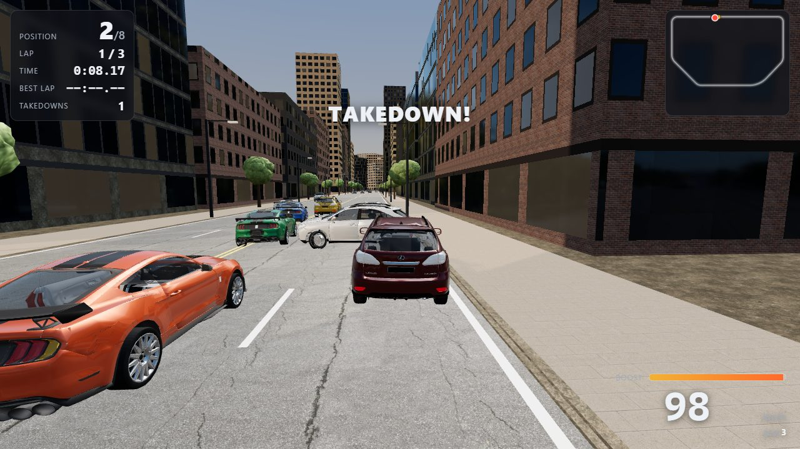

`Race.html` puts you behind the wheel: three laps of a city street circuit against seven rivals, through traffic going both ways, in the spirit of arcade street racers. A crash is worked out by the same lattice solver as the simulations, starting from your car's real position, speed and spin at the moment of impact. While it computes in the background, a slow-motion crash camera plays it back. Open it from the home page, the **Simulation** menu in the simulator, or `/race` on the website. For development, open `game.html`.

| | Keyboard | Controller (Xbox layout) |
|---|---|---|
| Steer | A / D, ← / → | Left stick |
| Accelerate | W, ↑ | Right trigger |
| Brake, then reverse | S, ↓ | Left trigger |
| Handbrake | Space | X |
| Boost | Shift | A or right bumper |
| Camera (chase or bumper) | C | Y |
| Look back | B | Left bumper |
| Back on the road | R | View |
| Pause | Esc, P | Menu |
| Menus (car select) | arrows or WASD, Enter | d-pad or left stick, A |

Controllers work through the Gamepad API's standard mapping, with rumble where the browser supports it.

**On a touch screen** (phones and tablets), on-screen buttons appear on their own while racing:
- **Left thumb:** steer left and right.
- **Right thumb:** gas, brake, boost and drift (the handbrake).
- **Top:** pause, camera, back on the road, and full screen where the browser allows it (Android Chrome; not iPhone Safari).
- **Holding the phone:** race with it sideways. Held upright, the race pauses and asks you to turn it.
- **Picture:** on a touch screen the game draws at a lower resolution, with a smaller shadow map, to suit a phone's graphics chip.
- **Testing:** `?touch=1` shows the buttons on any screen, and `?touch=0` hides them.

### The race

- **Car select.** Before the race, pick the Lexus RX 350 or the Ford Mustang GT500 and one of eight paints. The car waits on the street past the start line, facing the camera, while you choose.
  - **Performance.** The screen shows each car's performance as bars and figures: top speed (and with boost), 0–100 km/h, 100–0 km/h braking distance and steady cornering grip. It also lists the car's power, weight, drive and gearbox.
  - **Where the figures come from.** They aren't typed in. `RaceCar.measure` works them out at load by driving each car on an empty road with the game's own physics, about 0.1 s for both. `tools/race-check.js` checks the same figures.
  - **The paint** covers the whole car, parts that break off it in a crash included.
  - **Remembered choice.** The choice is kept in the browser for the next race. `?car=lexus|mustang` sets the car the screen starts on.
- **The circuit.** A 1.47 km loop through a generated city: six corners from a fast sweeper to tight right-angles, four lanes (two each way) with pavements, street lights, trees and closed side streets, rolling hills on three stretches and three jump ramps across the street. Three laps take the fastest rival about 3 minutes (3:06 in the AI-only test race). The same seed always gives the same city (`?seed=<n>` for another one).
- **Eight cars.** You start sixth on the grid, against seven rivals in Lexus and Mustang models, each with a name, a paint colour, a skill level and an aggression level.
- **Traffic, both ways.** Cars keep to their lanes and follow the car ahead with the Intelligent Driver Model \[[77](#ref-77)\]: $\dot v = a\big[1 - (v/v_0)^4 - (s^*/s)^2\big]$, $s^* = s_0 + vT + \frac{v\,\Delta v}{2\sqrt{ab}}$. Here $s$ is the gap to the car ahead and $\Delta v$ the closing speed. The game uses $a = 1.6$ m/s², $b = 3$ m/s², $s_0 = 4$ m, a time gap $T = 1.4$ s, and cruising speeds $v_0$ of 13–19 m/s (47–68 km/h). They are added ahead of you and removed behind you, so the street is busy wherever the race is. They move on rails until something hits them, then become free cars that brake to a stop.
- **Boost.** Hold Shift for 1.65× engine power, with a surge as it kicks in (up to 1.4 times that, fading over 0.6 s) that also widens the view. It fills from near misses (passing a traffic car within a metre; more for oncoming ones), driving in the oncoming lanes, drifting, slams and takedowns.
- **Drifting,** as in Burnout. Above 60 km/h, tap the brake or the handbrake while steering (or hold full lock above 135 km/h, or land a jump sideways), and the rear lets go. Then the steering sets the slide angle: steer in for up to about 40°, let go and the car straightens up, counter-steer to take it in faster, brake to widen it. On the throttle the tyres don't slow the car down (a drift keeps about 85% of its speed over 2.5 s). It ends when the slide swings the other way, when you let go with little slide left, below 43 km/h, on a hard hit or in the air.
- **Slams and takedowns,** as in Burnout 3 (`rules.js`). A slam never wrecks a rival by itself.
  - **Slams.** Each contact you make with a rival is a rub, a light slam or a full slam, by how hard you drove into it along the contact normal. Your nose into its tail is a shunt (light from 3 m/s, full from 7 m/s); anything else is a side slam (2.5 and 5 m/s). A slam takes a little of the rival's boost for you. Two cars can't slam each other again within a second.
  - **Out of control.** A full slam takes the rival's steering away for 0.4–1 s, and for a second any solid touch (1.5 m/s) wrecks it.
  - **Takedowns.** A rival that wrecks within two seconds of your hit is yours: a wall, traffic or another car at over 7 m/s, a crash anyway, or a spin past 60°. It counts half a second later, and is lost if you crash first. Two within 1.5 s are a double; three or more within 30 s a spree.
  - **Psyche-outs.** A rival that wrecks with no contact while you're tailgating it (within 7 m, in the last second) is a takedown too.
  - **Takedown denied.** A rival you slammed that touches something and comes through its two seconds.
  - **Rivals fight back.** From 10 s into the race, the aggressive ones pick fights (`ai.js`), at most two at a time and none while you're a ghost after a respawn. A rival picks a car within 30 m, you first: it catches up through the traffic (or eases off to let you come alongside), takes a lane next to you on the clearer side, swings out and steers into you for up to 1.2 s, then cools down (longer after a slam that landed, shorter the more aggressive it is). It stands down when it hits anything else. Aggressive rivals also move across to block you when you're catching them from close behind. Rivals fight each other the same way. Each slam you land on a rival makes it more aggressive.
  - **Slammed.** A rival's slam on you follows the same rules, the other way round: it takes some of your boost, and a full one turns your wheel away from the hit (all of it for 0.3 s, then handed back over up to a second). Crash within two seconds of a rival driving into you and it took you down ("taken down by …" on the crash screen); it's then marked as your revenge target (a tag over its car and a red ring on the map), and taking it down is a revenge takedown. Come through a rival's full slam after touching something and it's a lucky escape.
  - Without your help, a rival needs 13 m/s into a wall (nose or tail first) and 20 m/s into another rival, so the pack can jostle. Wrecked rivals spin away from the hit and rejoin three seconds later.
- **Collisions.** Walls are slippery, and a car already spinning hard isn't spun harder by one, so a scrape along a wall keeps most of your speed (91% after a 26° scrape at 108 km/h). Sliding into a wall sideways is a bounce, not a wreck. Car against car, the lighter car is pushed out more, and steering into a car alongside shoves it (an extra push of 12 m/s² at full lock, on top of the contact). A wreck is shoved out of the way without slowing the car that hits it.
- **Health, then the crash.** Your car has a health bar rather than crashing at the first hard hit.
  - **Damage.** Each hit takes damage by how hard it is. That is the change of speed it gives the car, $\Delta v = (1+e)\,v_n$ from the approach speed along the contact normal and the bounce. Against another car it is the share $m_o/(m+m_o)$ of that. Against a wall it is the full amount nose or tail first, down to 0.4 of it sliding in sideways. Damage $= \max(0,\ \Delta v - 2.5)^2/650$ of the bar.
  - **What hits cost.** Scrapes and nudges are free, and bumping rivals costs little: an 8 m/s nudge is about 1%. A square hit on a wall at 47 km/h takes about a fifth. From about 90 km/h a single hit empties the bar.
  - **The crash.** When the bar is empty, the crash camera starts (below). Then you're put back on the road with full health, and the traffic just ahead is cleared. The race goes on meanwhile, so the rivals gain time.
  - **Rivals** have no health bar. They still wreck at fixed impact speeds (13 m/s into a wall nose or tail first, 20 m/s into another rival).
- **Things to knock over.** Street lights and signal posts break off their bases and topple. Cones, bins, newspaper boxes, hydrants, benches, crates and barrels fly and tumble. They are along the pavements, in roadworks by the kerb and stacked at the side streets' barriers. A burst hydrant sprays water. They cost no health and little speed: a street light about 5 km/h, a cone almost none. Each one you hit adds a little boost. Trees, buildings and the concrete barriers stay solid.
- **Hills and jumps.** The ramps are 1.3–1.5 m high. From 144 km/h, the first one gives 1.2 s and about 50 m in the air. Taken slowly, you only hop. Over the crest of the steepest hill you stay on the road at 108 km/h and fly at 180 km/h and up. In the air there's no grip, so steer before the lip. A car in the air clears the barriers, the props and the other cars.
- **Results.** Positions, lap times and takedowns. Rivals still racing get an estimated time from their pace. **Watch your last crash** replays it with the simulator's bullet-time.

### How it works

- **Driving physics** (`js/race/vehicle.js`). Each car is a rigid body moving over the ground, stepped at 240 Hz.
  - **Tyres.** The lateral force follows Pacejka's Magic Formula \[[55](#ref-55)\], $F_y = D\sin\!\big(C\arctan(B\alpha - E(B\alpha - \arctan B\alpha))\big)$ with $D = \mu F_z$. Drive and brake forces share each tyre's grip with it (the friction ellipse), and the loads shift with acceleration and cornering.
  - **Engine and brakes.** The engine is power-limited, with an automatic gearbox for the engine sound. The brakes have ABS, and the handbrake locks the rear wheels.
  - **Assists.** The steering lock narrows with speed. An assist steers into slides, and a stability control limits the yaw rate to what the tyres can hold.
  - **Your car's handling** (`car.arcade`; the rivals and traffic keep the plain model). The stick's travel is rate-limited (about 0.2 s to full lock, at any speed) rather than the wheel's angle, so the car isn't twitchy at speed. In a drift the rear tyres keep 60% of their grip, a yaw controller holds the slide angle the steering asks for (in place of the stability control), the brakes bite at 30%, and on the throttle most of the tyres' pull against the travel is cancelled. Boost starts with a surge, spin dies away in the air, and a rival's full slam switches the stability control off for 0.3 s.
  - **Performance.** Pitch and roll are drawn, not simulated. The Lexus reaches 100 km/h in 5.9 s, tops out at 217 km/h (261 with boost), stops from 100 km/h in 37 m and corners at 0.86 g. The Mustang: 5.7 s, 230 km/h (278 with boost), 36 m and 0.89 g.
- **Collisions** (`js/race/world.js`). Cars are oriented boxes, tested against each other and the city's buildings, barriers and trees with the separating-axis test \[[78](#ref-78)\]. They're resolved with impulses, with restitution and friction \[[7](#ref-7)\].
- **Hills and flight** (`js/race/world.js`). The ground is a height field: smooth hills $h(x,z) = \sum A\,e^{-r^2/2\sigma^2}$ plus the ramps' profiles on the street. Everything stands on it: street, pavements, buildings and props.
  - **On the ground.** A car follows the surface under its centre of gravity. Gravity pulls it along the slope, $\mathbf a = -g\,\nabla h$.
  - **Taking off.** A car leaves the ground when the surface falls away faster than gravity can pull it down: $(v_y - \dot h)/\Delta t > g$, where $\dot h$ is the vertical speed the ground asks for. That happens at a ramp's lip, or over a crest when $v^2\kappa > g$.
  - **In the air.** It flies ballistically without grip and lands where it meets the ground again. The nose follows the flight path.
- **Props** (`js/race/props.js`). Each prop is a rigid box with a position, velocity, orientation (quaternion) and spin, stepped at 120 Hz.
  - **Contacts.** Its corners meet the ground and the buildings with impulses (bounce and friction), and props push each other apart as spheres.
  - **Struck by a car.** The two exchange momentum along the contact normal, $J = (1+e)\,v_\text{rel}/(1/M + 1/m)$, turned toward the side the prop was struck on. The prop also gets a kick upward and a spin.
  - **Poles.** Street lights and signal posts topple away from the car instead.
  - **Sleep.** A prop at rest sleeps and costs nothing until it is hit again.
- **Rivals** (`js/race/ai.js`).
  - **Speed.** Each rival follows a speed profile limited by the curve, $v \le \sqrt{\mu g/\kappa}$ with $\mu = 0.78$. A backward pass along the circuit keeps braking within 8 m/s².
  - **Steering.** They steer by pure pursuit \[[53](#ref-53)\] toward a point ahead, with a correction for their sideways offset.
  - **Lane choice.** They pick lanes by time to collision with the traffic ahead. They keep out of oncoming lanes with traffic in them, and don't change lanes mid-corner.
  - **Pace.** Their pace is rubber-banded to yours, and they boost on the straights.
- **The crash camera** (`js/race/crash.js`).
  - **Hand-over.** The world steps back one tick, to just before the cars touched. Each car involved goes to the crash solver with its pose, velocity and yaw rate.
  - **The street.** Nearby buildings, barriers and trees become a `world` barrier: boxes and cylinders combined into one distance field, with horizontal normals.
  - **On a hill.** The solver's ground is flat, so a crash on a hill runs at height 0 and is drawn raised to the ground's height at the impact. That applies to the cars, the parts that come off and the sparks.
  - **The worker.** The solver runs in a Web Worker built from the physics scripts' own text, so it also works from a file opened from disk. Without a worker, it runs on the main thread a few milliseconds per frame.
  - **Streaming.** The worker sends what it has computed so far: node positions, plastic strain, parts that came off and glass as it breaks. A pane is published only once the next frame confirms it, so the list matches the full run's.
  - **Playback** never gets ahead of the newest frame. It runs at 1/4× before contact and 0.08× just after, then speeds up to real time by 0.8 s. It ends 1.25 s after contact (accelerate to skip).
  - **Timing.** The first deformed frame shows within about 0.15 s of the impact, and you're back on the road about 4 s later.
  - **No stall at the first break.** At load, each car model breaks once out of sight: a panel, a side window, a lamp and the windshield's crack overlay. Each piece is drawn once, not just compiled, because Chrome's Direct3D backend finishes a shader only at its first draw. In testing this removed a 50–140 ms freeze when the windshield first cracked; no crash-camera frame now takes more than about 35 ms.
- **Rendering** (`js/race/render.js`). Rivals and traffic are instanced copies of the two car models, one draw call per material. Your car is the simulator's deformable model, so the crash's damage shows on the same mesh you drove.
  - **Street surfaces.** Road, pavements, kerbs and walls use photographed CC0 textures from Poly Haven, with normal and roughness maps.
  - **Facades.** Windows, floors and shop fronts are drawn by a shader over the wall textures, with some windows lit.
  - **Lighting.** A street HDRI lights the scene and gives the cars their reflections. A sun shadow map follows the car.
  - **Frame time.** About 16.7 ms per frame on the development machine (95th percentile 18 ms), about 2.4 million triangles in about 190 draw calls.
- **Textures** come from `tools/fetch-race-assets.py`. It downloads them, scales and recompresses them with Blender's image library, and writes `media/race/assets.js`. The single-file `Race.html` embeds them.

### Checks

```
node tools/race-check.js                the Race game's DOM-free parts, in Node
node tools/headless-check.js world      the crash solver's world barrier
```

- **`race-check.js`** checks:
  - **the level:** the circuit's length and tightest radius, that no building or post reaches into the road, and that the same seed gives the same city;
  - **the cars:** the car-select screen's figures (`RaceCar.measure`): 0–100 km/h, top speed, braking and cornering grip are in plausible bands, and boost raises the top speed. A head-on into a wall is a crash and a shallow scrape isn't;
  - **near misses:** passing within a metre counts and 1.5 m doesn't;
  - **props:** each kind is driven into on its own. It must be knocked more than 3 m (the poles past 45°), with no crash, the car less than 8 km/h slower, and the prop settled again within 12 s;
  - **jump:** airtime off the first ramp from 144 km/h (0.8–1.6 s, and it lands), less from 43 km/h; over the steepest crest none at 108 km/h, but a take-off at 216 km/h;
  - **damage:** a scrape is free, an 8 m/s nudge into a car costs under 3%, a 13 m/s wall 12–35%, and 28 m/s is a wreck;
  - **walls:** 18 m/s along a wall's normal is a crash nose first and not 60° off square, which also costs less health. A car pushed broadside into a wall touches it mid-side. A 26° scrape at 108 km/h keeps over 88% of the speed and leaves the car running along the wall;
  - **slams:** real contacts are classified: your shunt from behind (full and light), side slams (full and light), a rub, and a rival's slam on you;
  - **takedown rules:** the timeline of `rules.js`: a fragile rival wrecks on a light touch, the takedown counts half a second later, a second soon after is a double, a crash before it counts loses it, a slammed rival that touches something and comes through is denied (not without a touch), a tailgated rival's wreck is a psyche-out, and three in 30 s are a spree; crashing within two seconds of a rival's slam is its takedown of you, and taking it down then is revenge; touching something after a rival's full slam and coming through is a lucky escape;
  - **shove:** steering into a car alongside pushes it at least 1.5 times as far as holding straight, and faster than the contacts alone would;
  - **attack:** an aggressive rival 15 m behind your car in the next lane catches it and drives into it within 8 s; a calm one never does;
  - **drift:** your handling at 90 km/h, a brake tap with full lock and then throttle steering in: a 20–45° slide held for at least 1.5 s, over 80% of the speed kept, and straight again within 1.5 s of letting go (both cars). The same inputs don't make a rival's car drift;
  - **a full race:** eight AI cars race three laps through traffic and the props, all finish, the winner takes 150–210 s (about 3 minutes), none is stuck for more than 5 s, and lane-bound traffic never overlaps.
- **The `world` checks** in `headless-check.js`:
  - a one-cylinder world reproduces the pole barrier exactly;
  - a box wall agrees with the rigid barrier (peak deceleration and crush), also when turned 30°;
  - glass streamed live matches the batch result;
  - two cars at 160 km/h stay finite and gain no energy.
- **In the browser,** `game.html?test=wall150`, `?test=headon` and `?test=takedown` run scripted crashes and a takedown. The results go in `window.__race.test`: time to the first frame, frame times, the respawn time and the parts that came off, and the slams, takedowns and denials. `?worker=0` forces the main-thread fallback.

---

## Destruction (game mode)

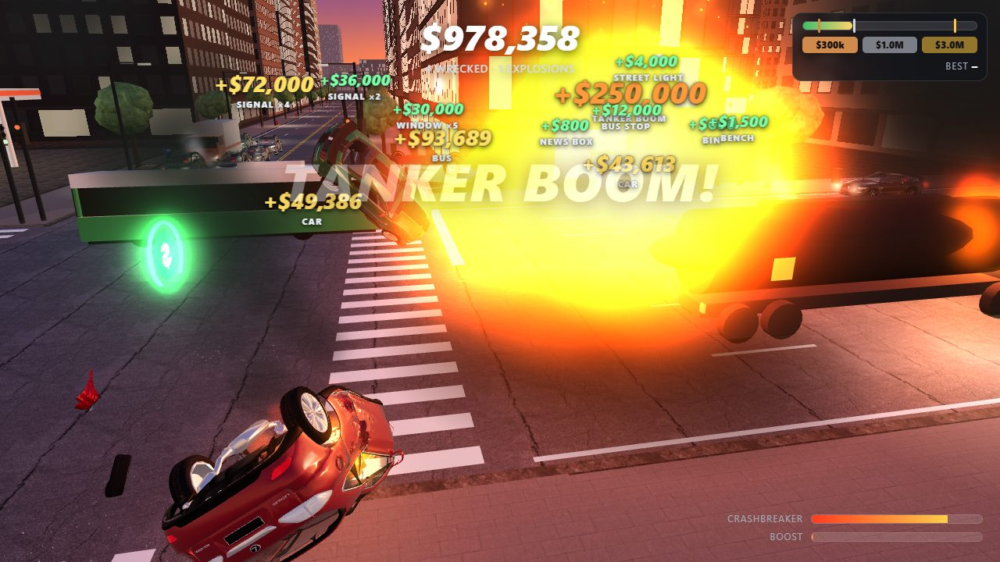

`Destruction.html` is a crash mode in the spirit of Burnout 3's. You drive down into one busy crossroads at dusk and cause as much damage as you can.
- **The impact.** The full crash solver works out your car's impact, as in Race, played back in slow motion.
- **The pile-up.** Then the wrecks tumble on as rigid bodies while the traffic keeps piling in.
- **Payouts.** Everything damaged pays out in dollars.
- **Explosions.** Gas tankers and fuel pumps explode, and so do totalled cars after a while.
- **Score.** Each attempt is scored against bronze, silver and gold targets, and your best is kept in the browser.

Open it from the home page, the **Simulation** menu in the simulator, or `/destruction` on the website. For development, open `junction.html`.

| | Keyboard | Controller (Xbox layout) |
|---|---|---|
| Steer | A / D, ← / → | Left stick |
| Accelerate · brake | W · S, ↑ · ↓ | Triggers |
| Boost; after the crash, the Crashbreaker | Shift | A or right bumper |
| Handbrake | Space | X |
| Retry (at any time) | R, or Enter on the results | View, or A |
| Pause | Esc, P | Menu |

On a touch screen the Race game's buttons appear. Boost turns into **BOOM** once the Crashbreaker is ready, and Retry sits at the top. The running total moves to the top left.

### An attempt

- **Car and paint.** The same cars and eight paints as Race. The select screen also shows the junction's targets and your best.
- **The junction: "Crossroads at dusk"** (`js/destruction/junction.js`).
  - **Main St.** Two lanes each way. You start 340 m from the junction, at the top of a gentle hill (9 m of drop). The street is flat within 75 m of the junction, because the crash solver's ground is flat.
  - **Harbor Blvd.** It crosses with three lanes each way and a painted median. It is on green for the whole run-up. Main St is on red, with a queue waiting on the far side.
  - **The corners.** A gas station with four pumps under a lit canopy and two cars parked at the pumps. A bus stop, and a café with tables and shop windows. A roadworks yard. Traffic lights on every corner, showing red to Main St and green to Harbor Blvd.
  - **The ramp.** A roadworks ramp in the right lane, 2 m high, with its lip 55 m before the junction. Taken fast, it throws you into the traffic in the air: in the scripted ramp attempt, at 136 km/h, the car is still airborne when it hits the tanker.
- **The traffic is the same every attempt** (`js/destruction/traffic.js`).
  - **The schedule.** About 120 vehicles, from 24 s before the start to a minute after it, so the street is already busy when the countdown starts.
  - **Specials.** A gas tanker is timed to reach the middle of the junction when a car boosting from the start gets there. A bus arrives when a car that never boosts gets there. Box trucks are mixed in, and a second tanker comes into the pile-up later.
  - **Driving.** The drivers use the Intelligent Driver Model \[[77](#ref-77)\] with $s_0 = 3$ m and $T = 1.3$ s.
  - **Noticing wrecks.** They see a wreck in their lane only within their own attention distance: 6–18 m for most of them, 18–34 m for the rest. They brake no harder than 5.5 m/s², so many run into the pile.
  - **The countdown** runs on the junction's own clock. Every attempt reaches "Go" with the traffic in exactly the same places.
- **Boost** starts full. It is spent while held, and there are no near misses to refill it. What's left at the impact feeds the Crashbreaker.
- **The crash.** The first hit that would cost a Race car 6% of its health or more is the crash; a light scrape isn't.
  - **Slow motion.** As in Race, the cars go back one step and the crash solver takes them, with the same slow-motion playback.
  - **The junction keeps time with it.** It runs on at the playback's pace, so the cross traffic moves in slow motion too.
  - **Your car and a car you hit** are both lattices in the solver.
  - **Buses, trucks, tankers and other vehicles within 20 m** go in as boxes moving at their own speed, with roofs.
  - **From the air.** Off the ramp, your car starts the solver already in the air: its height, vertical speed, pitch and roll come from the flight.
  - **A heavy vehicle you hit** is held to its speed while the solver sees it, then let go.
- **The pile-up** (`js/destruction/wrecks.js`).
  - **The hand-over.** After 0.9 s of crash, the solver's cars become rigid wrecks that keep the shape it left them in. Each wreck's mass centre comes from the node masses, its rotation from the cabin axes, and its velocity and spin from the last frames. Its collision shape is the box round its crushed nodes.
  - **Your crushed car on screen** is the same deformed mesh, moved with its wreck. Parts that came off (panels, wheels) become small wrecks of their own.
  - **The rest of the traffic** becomes wrecks at the first touch, with the speed it had.
- **Fire and explosions.**
  - **Totalled vehicles.** A vehicle at full damage catches fire and explodes 2.2–4.8 s later.
  - **Tankers** go up at a third of that, within a second.
  - **Fuel pumps** explode once knocked.
  - **Chain reactions.** Explosions throw wrecks into the air and damage them, which sets off the next ones.
- **The Crashbreaker.** Once five vehicles are wrecked, Boost blows up your own wreck. The blast's radius is 12 m plus 10 m for a full gauge left at the impact, and its push is 18 m/s plus 10. So saving boost is a real choice.
- **Pickups.**
  - ×2 in the empty oncoming lane, and +$25,000 in the right lane, on the way down.
  - ×4 in the air in the ramp's flight path.
  - +$100,000 in the middle of the junction, for your wreck.
  - Multipliers stack, up to ×8, and scale the total.
- **The end.** The attempt ends when nothing has paid out for 4 s, or 25 s after the crash. The total counts up against the targets, a medal is stamped, and the results show what was wrecked. Retry starts the same junction again at once.

**What things are worth.** A vehicle pays its value times its damage (0 to 1) as the damage grows, and a quarter more when totalled. Explosions pay a bonus. Props pay their value the first time they're knocked.

| Item | Value | Item | Value |
|---|---|---|---|
| Lexus | $48,000 | Gas tanker | $300,000 (+ $250,000 when it explodes) |
| Mustang | $80,000 | Fuel pump | $30,000 (+ $20,000 when it explodes) |
| Box truck | $95,000 (+ $30,000) | Traffic light | $18,000 |
| Bus | $250,000 (+ $60,000) | Bus shelter | $12,000 |
| A car exploding | $15,000 | Shop window | $6,000 |
| Street light | $4,000 | Hydrant, bench, bin, newspaper box, table, cone, barrel, crate | $50–3,000 |

**Targets:** bronze $300,000, silver $1,000,000, gold $3,000,000. They were set from scripted attempts in the browser:
- **No boost** (into the bus): about $0.8 million, three runs within 2%.
- **Boosting into the tanker,** with the Crashbreaker: about $1.3 million.
- **Taking the ramp and its ×4:** about $4 million.
- **Outliers.** A run scores well above its usual when the later tanker joins the pile-up: one no-boost run reached $2.4 million.

### How it works

- **The pile-up solver** (`js/destruction/wrecks.js`). Each wreck is a rigid body (position, quaternion, velocity, spin), with the inertia of a box of its size \[[7](#ref-7)\], stepped at 120 Hz.
  - **Its shape.** A hull of spheres over the box's surface: rows along it, two across, and one or two high. A sedan has 24, a bus about 40.
  - **Contacts.** Against the ground (the hill and the ramp), the buildings and posts, other wrecks, and the vehicles still driving (boxes moving on their lanes). They are solved by sequential impulses, 8 passes, with restitution, Coulomb friction and a little positional correction (Baumgarte 0.25).
  - **Sleep.** A wreck that stays still for 0.6 s sleeps until something hits it.
  - **Kinematic bodies.** The two cars inside the crash solver have kinematic stand-ins that push the wrecks but aren't pushed.
- **Damage.** The approach speed of each touch along the contact normal, with the bounce, and against another wreck the share by mass, goes through the Race game's damage curve, $\max(0,\ \Delta v - 2.5)^2/650$. That is scaled by 1.6, since this is a game about damage. Within 0.15 s only the worst touch counts. Where a vehicle was hit (front, rear, either side, roof) dents it on screen.
- **Explosions.** Each pushes every wreck within its radius $R$ away from a point 1.2 m below the blast, with a strong lift, and a little off-centre so it spins. The speed it gives a 1.5 t car at distance $d$ is $v_0(1 - d/R)^2$, less for heavier ones, by $(m/1500)^{-0.35}$. That is exaggerated: a car 4 m from a tanker flies about 8 m up. It also adds $1.3(1 - d/R)^2$ to their damage. Traffic within the radius is wrecked, and props are flung.

  | Blast | Radius | Push |
  |---|---|---|
  | Car | 9 m | 14 m/s |
  | Box truck | 11 m | 16 m/s |
  | Bus | 12 m | 16 m/s |
  | Gas tanker | 28 m | 26 m/s |
  | Fuel pump | 15 m | 20 m/s |
  | Crashbreaker | 12–22 m | 18–28 m/s |
- **The crash solver's options for this mode** (`js/physics.js`; all opt-in, so existing runs are unchanged).
  - **Moving boxes.** A box in the `world` barrier can move at a steady speed. Contacts and friction are then worked out relative to it, and the work it does on the cars is booked in the energy check.
  - **Roofs.** A box can have a roof to land on.
  - **Starting in the air.** A car can start with a height, vertical speed, pitch and roll.
  - **Race unchanged.** `world.js` widens its car-pair broad phase for long vehicles, and `props.js` looks further round them. Both stay exactly as before for the Race cars.
- **Rendering** (`js/destruction/look.js`, with the Race renderer).
  - **Dusk.** A low orange sun down Harbor Blvd and a violet sky, through the renderer's `look` option. More windows are lit, and there are neon signs, pools of light under the street lights, steam from manholes, and headlights and tail lights on the traffic.
  - **The heavy vehicles.** The bus, truck and tanker are built from boxes and cylinders, one instanced set each.
  - **Dents.** Every instanced vehicle has per-instance crush amounts that a vertex shader applies: the end that hit something pushed back, a side pushed in, the roof flattened. A burnt wreck turns black.
  - **Effects.** Explosions (fireball, smoke column, shockwave over the ground, flash, embers, scorch marks) and burning wrecks are camera-facing sprites. Each particle is a function of the time since it started.
  - **Lights.** A fixed pool of four point lights (two on touch screens) follows the brightest fires and blasts. Adding a light would rebuild every shader.
  - **Bloom and shake.** A selective bloom (the simulator's) makes fire, sparks and neon glow. It's off on touch screens. Camera shake follows the blasts.
  - **Warm-up.** Every effect is drawn once at load.
  - **Frame time.** In the single file, every stage of an attempt runs at 16.7 ms per frame (95th percentile 17 ms, longest 18 ms after the countdown) on the development machine. The number of compiled shaders is the same after a tanker explodes as at the start.

### Checks

```
node tools/destruction-check.js         the Destruction mode's DOM-free parts, in Node
node tools/headless-check.js world      includes the solver's moving boxes, roofs and airborne start
```

- **`destruction-check.js`** checks:
  - **the junction:** no building, tree or post in a road; every lane inside the roads; the ground flat round the junction; the ramp's lip 2 m up in its lane only; the same seed builds the same junction;
  - **the broad phase:** the Race cars keep `world.js`'s old 7 m limit; a car square into the end of a 12 m bus is found at first touch (the old limit found it only 75 cm in);
  - **prop reach:** a bus's front corner knocks a cone over;
  - **traffic:** two minutes without the player. No vehicle touches another, the red light holds the queue, everyone who enters leaves, and a rerun is identical;
  - **the pile-up:** a wreck left across the lanes is run into;
  - **the wrecks:**
    - a dropped wreck settles (it sinks under 1 cm and never gains energy);
    - one dropped on another stays on top and both sleep;
    - at a wall at 30 m/s it stops at the wall;
    - a T-bone changes its momentum by under 8% (ground friction included);
    - a blast pushes harder near it and not at all beyond its radius;
    - runs are deterministic;
  - **the score:** what's shown is what was paid; multipliers; the totalled bonus; a tanker alight at a third of its damage.
- **`world-moving`** in `headless-check.js`:
  - a box at 15 m/s into a car's side carries it off at its speed;
  - a car into the side of one crossing at 15 m/s is dragged along;
  - a car started 2 m up lands;
  - one dropped on a roof stays on it;
  - none gains energy.
- **In the browser,** `junction.html?test=plain|tbone|tanker|ramp` runs a scripted attempt: full throttle down the left lane without boost, the same with the Crashbreaker, boosting from the start, or boosting over the ramp. The results go in `window.__destruction`: the total and ledger, the pickups and explosions, frame times by stage, and how the wrecks carried on from the solver's last frame (4 cm and no change of speed in the first 60 ms). `?worker=0` forces the main-thread crash solver.
- **Not verified:**
  - **Hardware:** a real Xbox controller, and a real phone. The touch buttons were tested with simulated taps at phone size.
  - **The pile-up's physics:** it is a game's rigid-body model, not the crash solver. Wrecks dent by shader, not by deforming.

---

## Technical architecture

### Principles

- **Offline integration, slow-motion replay.** A crash pulse lasts about 100 ms and needs sub-millisecond steps to resolve; no browser can do that in real time for thousands of springs. So the impact is integrated ahead of time in short time slices, recorded, and then replayed and interpolated at any speed, like high-speed crash-test footage.
- **Physics without the DOM.** The physics, occupant, guidance and fire-rule modules have no dependencies and run identically in the browser and in Node. The headless check runs the same code as the page.
- **Plain classic scripts.** Every module is a classic script that sets one global (e.g. `CrashPhysics`) and also exports itself for Node. Classic scripts load from `file://`, where browsers block ES-module imports, so the app works opened straight from disk. Only three.js is an ES module, loaded from a CDN through an import map.
- **Single-file builds.** `tools/build-standalone.js` inlines every script, and for the home page every picture and the video, into one HTML file each.
- **Optional extras stay optional.** The GPU solver (WebGPU) and video saving (WebCodecs) are used only when chosen and only where the browser has them. Everything else needs nothing beyond WebGL 2.

### Modules

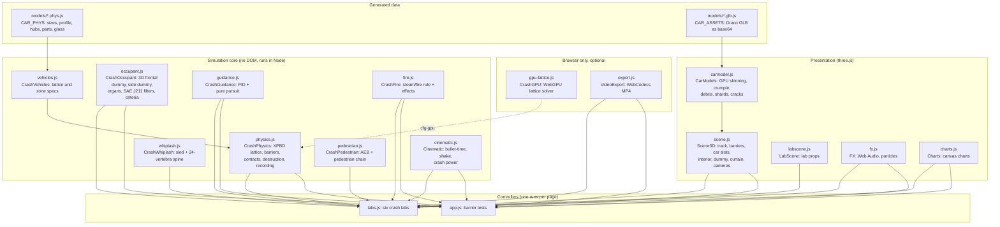
```mermaid
flowchart TB
  subgraph Data["Generated data"]
    PHYS["models/*.phys.js<br/>CAR_PHYS: sizes, profile, hubs, parts, glass"]
    GLB["models/*.glb.js<br/>CAR_ASSETS: Draco GLB as base64"]
  end
  subgraph Core["Simulation core (no DOM, runs in Node)"]
    VEH["vehicles.js<br/>CrashVehicles: lattice and zone specs"]
    PH["physics.js<br/>CrashPhysics: XPBD lattice, barriers,<br/>contacts, destruction, recording"]
    OCC["occupant.js<br/>CrashOccupant: 3D frontal dummy, side dummy,<br/>organs, SAE J211 filters, criteria"]
    GUI["guidance.js<br/>CrashGuidance: PID + pure pursuit"]
    WL["whiplash.js<br/>CrashWhiplash: sled + 24-vertebra spine"]
    PED["pedestrian.js<br/>CrashPedestrian: AEB + pedestrian chain"]
    FIRE["fire.js<br/>CrashFire: steam/fire rule + effects"]
    CIN["cinematic.js<br/>Cinematic: bullet-time, shake,<br/>crash power"]
    OCC ~~~ WL
    GUI ~~~ PED
    FIRE ~~~ CIN
  end
  subgraph GPUs["Browser only, optional"]
    direction TB
    GPU["gpu-lattice.js<br/>CrashGPU: WebGPU lattice solver"]
    EXP["export.js<br/>VideoExport: WebCodecs MP4"]
  end
  subgraph View["Presentation (three.js)"]
    CM["carmodel.js<br/>CarModels: GPU skinning, crumple,<br/>debris, shards, cracks"]
    SC["scene.js<br/>Scene3D: track, barriers, car slots,<br/>interior, dummy, curtain, cameras"]
    LS["labscene.js<br/>LabScene: lab props"]
    FX["fx.js<br/>FX: Web Audio, particles"]
    CH["charts.js<br/>Charts: canvas charts"]
  end
  subgraph Ctl["Controllers (one runs per page)"]
    APP["app.js: barrier tests"]
    LABS["labs.js: six crash labs"]
  end
  PHYS --> VEH --> PH
  GLB --> CM
  PH --> APP & LABS
  OCC & GUI --> APP & LABS
  WL & PED --> LABS
  FIRE --> APP & LABS
  CIN --> APP & LABS
  GPU -. "cfg.gpu" .-> PH
  EXP --> APP & LABS
  CM --> SC --> APP & LABS
  LS --> LABS
  FX & CH --> APP & LABS
```

`index.html` loads the data and core modules as classic scripts. A small module script then imports three.js (0.170, OrbitControls, GLTFLoader, DRACOLoader), puts it on `window`, and loads the presentation modules and **one** controller: `labs.js` when the URL has `?lab=`, otherwise `app.js`.

### Data flow of one run

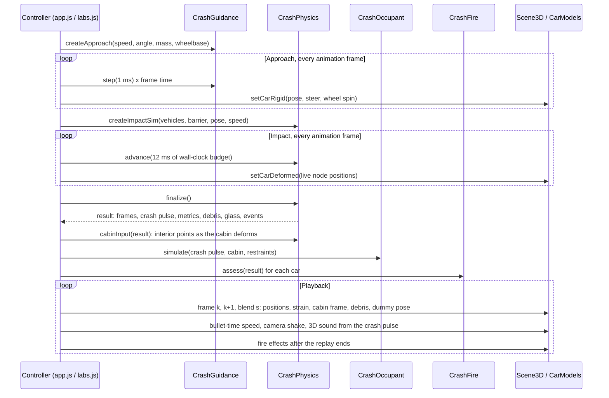
```mermaid
sequenceDiagram
  participant UI as Controller (app.js / labs.js)
  participant G as CrashGuidance
  participant P as CrashPhysics
  participant O as CrashOccupant
  participant F as CrashFire
  participant S as Scene3D / CarModels
  UI->>G: createApproach(speed, angle, mass, wheelbase)
  loop Approach, every animation frame
    UI->>G: step(1 ms) x frame time
    UI->>S: setCarRigid(pose, steer, wheel spin)
  end
  UI->>P: createImpactSim(vehicles, barrier, pose, speed)
  loop Impact, every animation frame
    UI->>P: advance(12 ms of wall-clock budget)
    UI->>S: setCarDeformed(live node positions)
  end
  UI->>P: finalize()
  P-->>UI: result: frames, crash pulse, metrics, debris, glass, events
  UI->>P: cabinInput(result): interior points as the cabin deforms
  UI->>O: simulate(crash pulse, cabin, restraints)
  UI->>F: assess(result) for each car
  loop Playback
    UI->>S: frame k, k+1, blend s: positions, strain, cabin frame, debris, dummy pose
    UI->>S: bullet-time speed, camera shake, 3D sound from the crash pulse
    UI->>S: fire effects after the replay ends
  end
```

The impact computation is time-sliced. `sim.advance(budgetMs)` runs substeps until its wall-clock budget is spent, then returns, so the page keeps drawing and stays responsive. Emergency stop can cancel it. With the GPU solver the steps run in the background, and `advance` only reports progress.

### The crash result

`finalize()` returns one object that everything downstream reads:

| Field | Contents |
|---|---|
| `frames` | Recorded snapshots: time, every node's position (Float32), every node's plastic strain (Uint8), the cabin frame (origin, forward, up), brick and debris poses (position + quaternion), crush, intrusion, and the energy breakdown. Recorded every 1 ms for 0.3 s after first contact, every 4 ms to 1 s, then every 10 ms. |
| `pulse` | The cabin's acceleration and velocity resampled onto a uniform 0.1 ms grid and filtered (CFC 60), plus the barrier force. This drives the dummy. |
| `metrics` | Impact speed, speed change (Δv), rebound, peak deceleration, time to stop, maximum and permanent crush, cabin intrusion, initial kinetic energy. |
| `units` | Per vehicle (two in the two-vehicle and side labs): its own pulse, metrics, crush, cabin frames and intrusion measurements. |
| `debris`, `glass`, `bursts` | Parts and wheels that came off (with the lattice state at that moment), panes and lamps that broke (time, origin, velocity), tyres that burst. |
| `events` | First contact, contact impulses, parts detaching, glass breaking: these drive sounds and particles. |
| `solver` | Which solver computed it: `cpu`, or `gpu` with the device, colour groups, steps and GPU time. |

Playback finds the two frames around the playback time and blends between them (positions linearly, rotations by slerp), so any playback speed looks smooth.

### Rendering and loading

- **three.js scene** (`scene.js`):
  - a test track with sky, ground and shadows;
  - an approach-path gizmo;
  - the rigid barrier, or an instanced brick wall;
  - one or more **car slots**, each with its body, interior (seat, dash, steering wheel, airbag, belts), dummy and curtain airbag;
  - cameras, with an onboard picture-in-picture inset.
- **Imported cars** (`carmodel.js`): parsed once from the embedded GLB, then skinned to the physics lattice on the GPU (see [Rendering the damage](#rendering-the-damage)).
- **Single-file build** (`tools/build-standalone.js`):
  - **Simulator:** inlines the model data and core modules as ordinary scripts, and the presentation modules as `text/x-inline` blocks that the loader executes after three.js is ready. It fails if any embedded file doesn't match its source.
  - **Home page:** embeds the pictures as data URLs and the video as base64, which the page turns into a blob URL.

---

## How the physics works

All the vehicle physics is in `js/physics.js`. Units are SI throughout. Car-local axes are x forward, y up, z right, with the ground at y = 0. The rigid barrier's face is at x = 0, and the car approaches from −x.

### 1. The vehicle as a lattice

Each car is a 3D grid of point masses (**nodes**) joined by springs (**distance constraints**), fitted to the car's body:

- **The grid.** Columns run along the car, placed so both axles fall on columns: about 24 cm apart for the imported cars, uniform for the Lab sedan. There are about 29 cm between rows and about 22 cm across the car. Nodes more than one row above the body's roof profile are dropped. The row just above the surface becomes light **ghost nodes** (0.25 kg) that only carry the render mesh.
- **The springs.** Every node connects to 13 neighbours: 3 along the axes, 6 face diagonals and 4 body diagonals, each pair once. The diagonals give the lattice shear and bending stiffness.

  | Vehicle | Nodes (ghost) | Springs |
  |---|---|---|
  | Lab sedan | 672 (96) | 6,506 |
  | Lexus RX 350 | 999 (144) | 9,913 |
  | Ford Mustang GT500 | 774 (144) | 7,563 |
  | Side-impact barrier trolley | 480 | 4,490 |

- **Mass.** The curb mass is spread over the structural nodes. 12% sits on the engine block's nodes, and 20 kg per corner sits on the wheel nodes (imported cars).
- **Zones.** Spring stiffness and yield strain are multiples of a base stiffness *K₀* = 1.1 MN/m (scaled with the lattice spacing, so the material stays as stiff) and a base yield strain *ε_y* = 1.15%:

  | Zone | Stiffness | Yield strain |
  |---|---|---|
  | Front crumple zone (ahead of the firewall) | 1× (× the Soft/Standard/Stiff setting) | 1× |
  | Engine block (inside the crumple zone) | 2.5× | 2.5× |
  | Passenger safety cell | 2.5× | 2.4× |
  | Rear structure | 1.5× | 1.2× |
  | Ghost springs | 0.15× | 1× |

  The zones are placed relative to each car's H-point (the driver's hip point) and rear axle, so every car gets a crumple zone, an engine, a cabin and a rear of the right size.

### 2. The solver: XPBD with plastic flow

The structure is integrated with **XPBD**, extended position-based dynamics (Macklin, Müller & Chentanez, 2016). It uses many small substeps, each with one constraint pass ("small steps" XPBD), which keeps stiff springs stable without a global solve. Each substep:

1. **Predict.** Save each node's position *x\**, add gravity to its velocity, move it: *x ← x + v·Δt*.
2. **Project the springs.** For each spring between nodes *a* and *b*, with inverse masses *w*, rest length *L₀* and compliance *α = 1/k*:

   ```
   C      = |x_b − x_a| − L₀                        (constraint: stretch of the spring)
   γ      = (c · α) / Δt                             (damping weight; c = 2ζ·√(k·m_reduced), ζ = 0.08)
   ẋ_rel  = relative displacement along the spring this substep
   Δλ     = −(C + γ·ẋ_rel) / ((1 + γ)(w_a + w_b) + α/Δt²)
   x_a   −= w_a·Δλ·n,   x_b += w_b·Δλ·n            (n: unit vector from a to b)
   ```

   Stiffness is physical. A spring of stiffness *k* behaves like one, independent of the step size, and each spring carries 8% of critical damping.
3. **Plastic yield.** If the spring's elastic strain after the correction exceeds its yield strain, the excess flows plastically: **the rest length moves**. The steel stays bent instead of springing back. The work done, yield force × plastic flow, is booked as plastic deformation energy, and the accumulated plastic strain is stored per spring. Rest lengths are clamped to 0.25–1.8× their original length, which models crushed structure bottoming out.
4. **Contacts.** Penetrating nodes are pushed out (next section).
5. **Friction.** Coulomb friction at every contact. The kinetic energy it removes, net of what went into springs and height, is booked as friction heat.
6. **Velocities.** *v = (x − x\*) / Δt*, then a velocity pass for contacts with rigid bodies.

**Time step.** 0.1 ms from the start and for 0.3 s after first contact, while the crash pulse runs. Then 0.5 ms for the rebound and debris settling. 1 ms gains energy with the stiff mortar bonds, so it isn't used.

**Duration.** The barrier tests continue 1.2–2.4 s after first contact, depending on the car and barrier, so parts and bricks land.

### 3. Contacts and friction

Every structural node is a sphere of radius 12 cm. Contacts with bricks, debris and the lab obstacles cancel the node's approach in that substep but never push it apart faster than 1 m/s, so deep penetrations can't pump energy in.

| Contact | How |
|---|---|
| Ground | Nodes stay above their floor height. Wheel nodes ride at hub height, so the tyre carries the car: friction 0.8 sideways, rolling resistance 0.015. |
| Rigid barrier | A concrete block (18 m wide, 3 m tall) with its face at x = 0, friction 0.3. The normal forces are summed like a load-cell wall. |
| Brick wall | Bricks are rigid boxes found through a spatial hash. Contacts are solved between the node and the brick's closest surface point, with the brick's own generalised mass and rotation. |
| Offset barrier, pole | A signed-distance function: a block with a 150 mm rounded edge (small-overlap test), or a 254 mm cylinder. |
| Honeycomb face | A 5 cm grid of aluminium cells in front of the offset barrier. A node presses on the cells under its share of the lattice face. Below their crush stress (0.34 MPa, or 1.7 MPa in the front strip) they stop it; above it they crush at constant force and bottom out when nearly flat. A cell's crush per step is capped at the node's forward advance, so sideways sliding can't crush it. The crush work is a separate energy channel. |
| Vehicle against vehicle | All cars' lattices run in one solver. Nodes of different cars meet as spheres, found through a spatial hash of the overlap of their bounding boxes, with friction 0.4. Crushed fronts interlock, so these contacts only cancel approach (at most 2 cm/s of separation); pushing nodes apart would pump energy in. |
| Debris | Parts and wheels that came off are rigid bodies with contact points on their outline, colliding with the ground, barrier and bricks. |

### 4. The brick wall

The wall has 366 bricks (40 × 20 × 25 cm, 2,000 kg/m³) in 12 courses, between two concrete pillars. Each brick is a rigid body: position, quaternion, linear and angular velocity, and the gyroscopic term for free spin.

- **Mortar.** Each joint is two **bond points**, so a joint carries bending as well as tension and shear. A bond is a stiff XPBD point constraint (compliance 2×10⁻⁸ m/N).
- **Failure.** A bond breaks in tension or shear above the mortar strength: weak 8 kN, standard 30 kN, strong 120 kN. Compression raises the shear capacity (Coulomb, factor 0.6). The energy stored in a breaking bond is booked as fracture energy.
- **Sleeping.** Bricks are *dormant* until loaded and go back to sleep when still. Bricks cut off from the footing and pillars lose their support and fall, singly or as clusters.

### 5. Destruction

Imported cars are split into named parts: bumpers, hood, fenders, doors, trunk or tailgate, mirrors, glass panes, lamps and wheels.

- **Panels ride on the lattice** until the springs they're mounted on have yielded far enough (mean plastic strain), then **come off as rigid debris** that keeps its crushed shape.

  | Part | Mass | Comes off at (mean plastic strain of its mounts) |
  |---|---|---|
  | Front / rear bumper | 9 / 7 kg | 16.5% / 15% |
  | Hood | 15 kg | 25% |
  | Fender | 4 kg | 18% |
  | Front / rear door | 24 / 20 kg | 6% |
  | Trunk or tailgate | 14 kg | 15% |
  | Mirror | 1.5 kg | 5%, or when it hits something |

  *Dramatic* damage multiplies every limit by 0.3.
- **Conservation at the break.** A debris body's mass is taken out of the nodes it sat on. Its velocity comes from their momentum. Its angular velocity is *I⁻¹L*, clamped so kinetic energy can't rise; the kinetic energy given up is booked as fracture energy. The headless check fails if a break changes total momentum or energy.
- **Wheels** are lattice nodes until their mount yields (30% mean plastic strain) or the hub is shoved back 45 cm; then they come off as rigid wheels spinning at their rolling speed. A **tyre bursts** when the rim meets an obstacle or the hub is shoved back 20 cm. It then goes flat over 50 ms, keeping 25% of its sidewall height, and its rolling resistance rises.
- **Glass and lamps** are decided after the run, from the recorded strain of the structure around each pane:
  - tempered side and rear windows break at 6% mean plastic strain;
  - the roof glass at 12%;
  - lamps at 10%;
  - any pane or lamp breaks when it touches the barrier or a brick, or when its panel comes off.

  Tempered glass bursts into a few hundred shards. The laminated windshield stays in and cracks instead, at 2.5% or where the dummy's head hits it.

### 6. Measuring the crash

- **The cabin frame.** Its origin is the mass-weighted centre of the passenger-cell nodes; forward runs from the rear to the front cabin nodes, and up from the floor to the roof nodes. The dummy rides in this frame.
- **The crash pulse.** The cabin velocity is resampled onto a uniform 0.1 ms grid, differentiated and filtered with an SAE J211 CFC 60 filter (a phaseless 4-pole Butterworth). It gives the deceleration, Δv, peak g and time to stop.
- **Crush and intrusion.** Crush is how far the front face has moved back relative to the cabin (mean of the front column). Cabin intrusion is how far the dash has moved toward the seat.
- **Lab measurement points.** Steering column, brake pedal, toe pan, hinge pillar, B-pillar and door points are embedded in the lattice. They are measured in a frame fitted (least squares, polar decomposition) to the undamaged rear corner of the cabin, so the car's own rotation doesn't count as intrusion.
- **Energy.** The books hold: car and debris kinetic energy (with wheel spin), elastic, plastic, fracture, friction, gravity and honeycomb crush. Position-based dynamics can't attribute contact, structural damping and numerical losses separately, so they form one residual channel, "contact, damping & solver". The energy chart shows where the initial ½mv² went.

### 7. The approach

`js/guidance.js` drives the car on a kinematic bicycle model:
- a **PID speed controller** sets the drive or brake force;
- **pure-pursuit steering** follows the approach line through the barrier centre at the chosen angle.

The car starts 30–130 m back (3 s at the test speed), 0.6 m off the line with a 4° heading error, so the controllers have something to correct. The impact simulation takes over when the gap is 1 cm plus 4 ms of travel, with the car's exact pose, speed and yaw rate.

### 8. After the crash: steam and fire

`js/fire.js` decides from the recorded crash:

- **Steam.** The front was crushed back to the radiator (25 cm behind the front, or the front of the engine if that's nearer). Hot coolant vents as steam.
- **Engine-bay fire.** The engine block, measured as the mean of its lattice nodes in the cabin frame, was driven **30 cm or more** back toward the firewall. That crushes the fuel rail and the fuel and oil lines against the hot exhaust at the back of the engine.

The fire grows in stages:
- smoke starts at once (0.3 s);
- flames after about a second;
- well alight after about 9 s, with burning fluid spreading under the car.

With the Lexus into the rigid barrier:
- 56 km/h pushes the engine back about 10 cm: steam only;
- 80, 100 and 130 km/h push it back about 43–50 cm: fire.

Rear impacts, which cause most fuel-tank fires, aren't simulated, so there is no fuel-tank rule.

### 9. The GPU solver (optional)

`js/gpu-lattice.js` runs the car lattice on the graphics card with WebGPU compute shaders (WGSL). Choose **GPU** under *Physics solver* in the free simulator or a lab, or add `?solver=gpu` to the URL.

**What it covers.** The rigid barrier, the offset barrier with or without its honeycomb face, the pole (with the low-friction carrier), and several vehicles crashing into each other: every crash the labs set up. The brick wall isn't covered, so the free simulator's brick-wall runs stay on the CPU. In GPU runs parts don't come off and tyres don't burst, because detaching a part changes the lattice and that bookkeeping stays on the CPU. If the GPU can't take a set-up, the CPU solves it and the results say why.

- **The same equations.** Each step runs predict, the XPBD springs with damping and plastic yield (same formulas and limits as section 2), the contacts (section 3), Coulomb friction, then velocities.
- **A different order.** The CPU projects the springs one after the other (Gauss-Seidel). On the GPU they are split by greedy colouring into groups where no two springs share a node: 27–28 groups for these cars. Each group is projected in parallel and the groups run one after the other. It is the same method in a different order.
- **Car against car.** Each node checks every node of the other cars, tiled through the GPU's workgroup memory. Its share of each correction comes from the same positions (Jacobi), rather than the contacts being solved one after the other. The contacts are kept per node for friction.
- **Honeycomb.** One thread per lane of nodes (one behind the other at the same height and side position) crushes the cells in the CPU's order. Cells are claimed atomically, so a cell still counts toward one node per step.
- **32-bit floats.** The GPU uses 32-bit floats, the CPU 64-bit. The car sits near the barrier at x = 0, so positions keep sub-micrometre resolution.
- **Batches.** The steps run in batches, one recorded frame's worth each (1 ms during the pulse, up to 10 ms later). After each batch the state is read back: positions, velocities, rest lengths, plastic strain and work, contact impulses (for the barrier's load cell, each car's contact force and the events), the honeycomb's crush and crush work, and the step of first contact. The CPU then records the frame, telemetry and energies with the same code as for its own runs.
- **Energy books.** Friction heat isn't tracked on the GPU, so it is counted in the "contact, damping & solver" share.

`node tools/gpu-check.js` runs the same crashes with both solvers in headless Chrome. These are crashes in which nothing comes off on the CPU either. Results on an AMD RDNA 3 GPU:

| Crash | Crush | Peak (CFC 60) | Δv | Plastic energy | Time: CPU / GPU |
|---|---|---|---|---|---|
| Lab sedan, 56 km/h | 543 / 543 mm | 57.5 / 56.8 g | 66.1 / 66.1 km/h | 61.4 / 61.5% | 0.6 / 4.0 s |
| Lexus, 56 km/h | 583 / 582 mm | 69.1 / 68.0 g | 66.0 / 66.0 km/h | 63.1 / 63.1% | 1.4 / 2.6 s |
| Mustang, 48 km/h | 552 / 553 mm | 35.0 / 34.4 g | 55.7 / 55.8 km/h | 73.9 / 73.9% | 1.1 / 2.5 s |

The peak deceleration comes out 1–2% lower on the GPU. Its telemetry is taken once per recorded frame (1 ms) rather than every 0.1 ms step, so the filtered peak is a little smoother.

The labs' crashes (CPU / GPU). On the CPU some parts came off; on the GPU none can, so these aren't quite the same crash:

| Lab crash | What the lab reports | CPU | GPU |
|---|---|---|---|
| Overlap 40%, honeycomb, 40 mph | peak, crush, honeycomb crushed | 27.6 g, 503 mm, 397 mm | 27.6 g, 520 mm, 390 mm |
| Overlap 25%, rigid, 40 mph | peak, crush, hinge pillar | 25.3 g, 428 mm, 158 mm | 25.7 g, 438 mm, 144 mm |
| Two cars (Mustang vs 2,400 kg Lexus), 40 mph each | Δv A / B | 79.8 / 63.4 km/h | 79.7 / 63.5 km/h |
| Side, barrier trolley 37 mph, mild steel | B-pillar, Δv | 252 mm, 38.9 km/h | 253 mm, 38.5 km/h |
| Side, pole 20 mph | B-pillar, Δv | 42.7 mm, 49.7 km/h | 42.6 mm, 49.3 km/h |

**At this lattice size the GPU is slower.** The cars have about 1,000 nodes and 10,000 springs, and every 0.1 ms step is about 30 small compute dispatches, plus a read-back every recorded frame. The GPU pays off on finer lattices. Same check, the lab sedan's lattice refined, first 150 ms after contact:

| Lattice | Nodes | Springs | CPU | GPU | GPU speed-up |
|---|---|---|---|---|---|
| As used (1×) | 672 | 6,506 | 0.25 s | 0.65 s | 0.4× |
| 2× finer | 4,230 | 46,905 | 1.6 s | 0.9 s | 1.8× |
| 3× finer | 13,002 | 151,419 | 5.2 s | 1.5 s | 3.5× |

The crush agrees within 2 mm at every resolution.

---

## Occupant and injury models

The dummies are **driven by the crash**, like a sled test. The vehicle simulation produces the cabin's motion, and the dummy reacts to it inside the cabin frame. The frontal dummy also feels the cabin **deforming around it**: the parts of the interior it can touch move with the crushed structure. Its own forces aren't fed back into the car; at 75 kg against a 1,500–2,000 kg car they would barely change it. So the dummy stays cheap enough to re-run instantly with other restraints on the same crash.

### Frontal dummy (`occupant.js`)

- **Body.** A 3D multibody of 15 particles, 75 kg in all:
  - **pelvis:** both hip joints and the sacrum;
  - **torso:** thorax, T1 (the base of the neck) and both shoulders, which carry the arms' mass;
  - **sternum:** on a compliant chest;
  - **head:** the top of the neck (occipital condyle) and the front and back of the skull;
  - **legs:** knees and ankles.

  Distance constraints keep each segment rigid. The joints are springs with damping and end stops: the lumbar spine at the sacrum, the hips, the knees, and the lower and upper neck. Torques act on each segment through its inertia (*α = I⁻¹τ*), so they turn it without pushing it.
- **Three-point belt, in 3D.** The shoulder belt runs from the D-ring on the B-pillar over the collarbone (between the neck and the outboard shoulder) and the sternum to the buckle beside the inboard hip. So the torso can twist out of it, as real ones do. The lap belt runs across the front of the pelvis. A **pretensioner** takes out up to 8 cm of slack in the first milliseconds, and a **force limiter** caps the webbing tension at 4.5 kN.
- **Driver airbag.** A flattened ellipsoid (the same shape that's drawn) growing out of the steering wheel along the column. It fires when the cabin's speed change reaches 2 m/s within 45 ms of contact, then vents. It catches the head, chest and shoulders; its damping grows as the contact patch does.
- **Seat.** The cushion and seat back behave like foam: firm going in, giving back about a quarter of the force on the way out. The seat back has friction, and side bolsters hold the pelvis. There is also a head restraint.
- **Contacts:**
  - the steering wheel's rim and hub, with a collapsing column;
  - the windshield (it cracks where the head hits) and the roof, placed per car from its glass and roof lines;
  - the A-pillar, the door beside the pelvis, chest and shoulder, and the side window beside the head;
  - the knee bolster (its padding crushes), the floor and the toe pan (with friction), and the centre console;
  - chin to chest.
- **The cabin deforming around it.** `physics.js cabinInput()` embeds interior points in the lattice: the wheel hub and a point down the column, the knee bolster, the toe pan, the windshield's edges, the roof, the A-pillar's foot and top, and the door at chest and window height. It reports where they are at every recorded frame, in the cabin frame the crash pulse is measured in. The contact surfaces move with them, so a column driven back carries the wheel and airbag (drawn moving too), and a toe pan pushed in pushes the feet. In the 25% small-overlap test the toe pan comes back about 10 cm, and the driver's left foot ends up about 10 cm further back than with a fixed cabin.
- **Injury criteria.** Channels are filtered per SAE J211 (CFC 1000 head, CFC 180 chest, CFC 600 neck and femur) and scored against FMVSS 208-style limits. The upper neck's axial force comes from Newton's law on the head; its flexion moment, for Nij, is the upper neck joint's torque at the occipital condyle. The formulas are in [Equations and sources](#injury-criteria).

  | Criterion | Limit |
  |---|---|
  | HIC15 (head injury criterion, 15 ms window) | 700 |
  | Chest acceleration, 3 ms clip | 60 g |
  | Chest deflection | 63 mm |
  | VC (viscous criterion: chest compression × its rate, for soft-tissue injury) | 1.0 m/s |
  | Nij (neck injury criterion: axial force and flexion/extension moment) | 1.0 |
  | Neck tension / compression | 4.17 / 4.0 kN |
  | Femur axial force | 10 kN |

### Side-impact dummy

- **Body.** A frontal-plane dummy: pelvis, thorax with struck-side ribs, shoulders, neck and head, in the struck car's frame.
- **Loading.** The car's lateral acceleration, taken from the undamaged far half of the car where the seats are mounted. Also the door's inner surface, taken from the lattice at pelvis, chest and window height. Door padding crushes at a plateau force.
- **Window and curtain.** The window glass breaks at 4 kN or when the intruding door reaches it. A vented curtain airbag fires on a 1 m/s lateral speed change.
- **Criteria.** HIC36 (limit 1,000), rib deflection from a chest potentiometer (44 mm), pelvis force (6 kN).

### Organs: the third collision

The brain and the heart are masses on springs inside the head (50 Hz) and the chest (25 Hz). They keep moving after the body has stopped and then strike the inside of the skull or rib cage: the "third collision". It is why a hard stop can injure the brain or tear the aorta without a mark outside.

### Whiplash dummy (`whiplash.js`)

- **Spine.** A side-view chain of pelvis, 24 vertebrae (5 lumbar, 12 thoracic, 7 cervical) and head. Each joint has a rotational spring and a damper, with an end stop in the neck. The damping is integrated exactly per joint, because explicit damping is unstable on 2 cm vertebrae.
- **Seat.** Foam, a 25° seatback on a recliner that yields above 2.2 kN·m, and a head restraint placed by backset and height.
- **Sled pulse.** A triangular pulse of 91 ms whose speed change is half the striking car's speed: a stationary car struck from behind.
- **Criteria.** Head-restraint contact time (70 ms or less), T1 acceleration (9.5 g or less), NIC (15 m²/s²), neck extension.

### Pedestrian (`pedestrian.js`)

- **Body.** A 2D chain of feet, knees, pelvis, chest, neck and head, for an adult (1.75 m, 75 kg) or a 6-year-old child (1.17 m, 23 kg), struck in the car's plane.
- **The car's front.** Built from the car's real side profile. Its surfaces crush in two stages (elastic, then plastic): the bumper (rigid steel or energy-absorbing foam), the hood's leading edge, the hood (it dents onto the engine), the windshield and the roof edge.
- **Criteria.** HIC15 is scored separately for the head striking the car and the road. Also tibia and pelvis acceleration, knee bending, wrap-around distance and throw.
- **Emergency braking.** A rule-based model of a radar-and-camera system:
  - it sees ±25° to 60 m (45 m for a child), unless a parked car blocks the line of sight (checked with a segment-box test);
  - it confirms a pedestrian after 0.25 s;
  - it warns at 1.8 s to collision;
  - it brakes at 1.1 s (0.85 g, built up over 0.25 s after 0.1 s of latency).

---

## How each crash lab works

| Lab | Setup in the physics |
|---|---|
| Frontal overlap | An `offset` barrier: a rigid block 1 m wide covering 40% or 25% of the Lexus's width, optionally faced with honeycomb (0.54 m deep). The lab gives the cabin's outer front corners (toe pan, hinge pillar) sheet-metal strength instead of safety-cell strength, so a wheel driven back can push them in. Intrusion points are measured in the undamaged-cabin frame. |
| Two vehicles | Two lattices in one solver, placed nose to nose at the chosen angle with a tiny gap, no barrier. Each car gets its own crash pulse, dummy, plastic work and momentum. Mass is set independently of the model. The camera follows the pair's centre of mass, which moves at a nearly steady speed through the crash. |
| Side impact | Two units: the struck Lexus, standing still, and the barrier trolley. The trolley is a lattice with a crushable SUV-height face (0.38–1.14 m, 0.45 m deep) on a rigid body. In the pole test, the car slides sideways on a low-friction carrier (friction 0.03) into a fixed cylinder. The door ring (doors, B-pillar, sill, roof rail) uses the chosen steel: mild 0.6× stiffness and yield, hot-stamped 1.4× stiffness and 1.8× yield. The cabin between floor and roof is hollow, so the door can come in. |
| Whiplash sled | No vehicle physics: the sled pulse drives the seat and spine model directly. |
| Occupant restraints | A 35 mph (56 km/h) full-width rigid-barrier crash of the Lexus. The same crash pulse drives three dummy runs (unbelted, plain belt, full system), and the organ model splits the crash into its three collisions. |
| Pedestrian & braking | The car's motion is planned first: constant speed, sensor detection and braking. The impact is then computed with the pedestrian chain; the pedestrian is too light to change the car's motion. The other bumper is run too, for comparison. |

---

## Simulation diagrams

Each simulation as a pipeline from its settings to what you see, followed by the timing or state logic that drives it. The numbers are the model's actual thresholds and settings.

Colour key for the pipeline charts:
- **blue:** settings;
- **amber:** the model that is built;
- **purple:** computation;
- **red:** decisions;
- **green:** results on screen.

### Rigid barrier

`Simulator.html?preset=rigid`: the free simulator's full-frontal test (preset 56 km/h, Realistic damage).


```mermaid
flowchart TB
  classDef input fill:#dbeafe,stroke:#2563eb,color:#0f172a
  classDef model fill:#fef3c7,stroke:#d97706,color:#0f172a
  classDef calc fill:#ede9fe,stroke:#7c3aed,color:#0f172a
  classDef decide fill:#fee2e2,stroke:#dc2626,color:#0f172a
  classDef out fill:#dcfce7,stroke:#16a34a,color:#0f172a

  subgraph SET["1 · Setup"]
    direction TB
    S1["Vehicle<br/>Lexus RX 350 · Mustang GT500 · Lab sedan"]
    S2["Speed 10–150 km/h<br/>approach angle −45° to +45°"]
    S3["Mass Light / Standard / Heavy<br/>0.73× · 1× · 1.47× curb mass"]
    S4["Front stiffness<br/>Soft 0.6× · Standard · Stiff 1.7×"]
    S5["Damage<br/>Realistic, or Dramatic: break limits × 0.3"]
    S6["Seatbelt on/off · airbag on/off"]
  end

  subgraph APP["2 · Approach"]
    direction TB
    A1["Start 30–130 m back (3 s at speed)<br/>0.6 m off the line, 4° heading error"]
    A2["PID speed control → drive or brake force"]
    A3["Pure-pursuit steering on a kinematic bicycle model"]
    A4{"Gap ≤ 1 cm + 4 ms of travel?"}
    A1 --> A2 --> A3 --> A4
    A4 -- "no: 1 ms steps" --> A2
  end

  subgraph BUILD["3 · Model"]
    direction TB
    B1["Lattice fitted to the body<br/>Lexus: 999 nodes · 9,913 springs<br/>13 neighbours per node"]
    B2["Zones: crumple zone 1× · engine block 2.5×<br/>safety cell 2.5× k, 2.4× yield · rear 1.5×"]
    B3["Mass: 12% on the engine · 20 kg per wheel corner<br/>ghost nodes 0.25 kg carry the render mesh"]
    B4["Rigid barrier: concrete block, face at x = 0<br/>18 m wide · 3 m tall · friction 0.3"]
    B5["Parts on the lattice: bumpers, hood, fenders,<br/>doors, trunk, mirrors, panes, lamps, wheels"]
  end

  subgraph RUN["4 · One substep, repeated"]
    direction TB
    R1["Predict: gravity, x ← x + v·Δt"]
    R2["XPBD springs with compliance 1/k<br/>and 8% critical damping"]
    R3["Plastic yield: strain beyond yield<br/>moves the rest length (0.25–1.8× L₀)"]
    R4["Contacts: ground, tyres, barrier face<br/>(forces summed like a load-cell wall)"]
    R5["Coulomb friction → friction heat"]
    R6["Velocities v = (x − x*) / Δt"]
    R7["Every 5th substep: damage checks<br/>part off at mean plastic strain of its mounts<br/>wheel off at 30% or 45 cm back · tyre burst at the rim"]
    R1 --> R2 --> R3 --> R4 --> R5 --> R6 --> R7
    R7 -- "Δt = 0.1 ms to T0 + 0.3 s, then 0.5 ms" --> R1
  end

  REC["Record: every node, its plastic strain, cabin frame,<br/>energy · every 1 ms to +0.3 s, 4 ms to +1 s, then 10 ms"]
  STOP{"T0 + 2.0 s<br/>(1.2 s Lab sedan)?"}

  subgraph FIN["5 · finalize()"]
    direction TB
    F1["Crash pulse: cabin velocity on a 0.1 ms grid<br/>CFC 60 filter → deceleration"]
    F2["Metrics: impact speed · Δv · rebound · peak g<br/>time to stop · max and permanent crush · intrusion"]
    F3["Glass and lamps from the recorded strain<br/>tempered 6% · roof 12% · lamps 10% · windshield cracks 2.5%"]
  end

  subgraph DUMMY["6 · Occupant"]
    direction TB
    D1["15-particle 3D dummy: crash pulse<br/>+ the cabin deforming around it"]
    D2["Belt: pretensioner up to 8 cm · 4.5 kN load limiter<br/>Airbag: fires at Δv 2 m/s within 45 ms"]
    D3["Contacts: wheel and column · windshield · roof<br/>knee bolster · chin to chest"]
    D4["SAE J211 filters → HIC15 · chest 3 ms<br/>deflection · Nij · neck tension and compression"]
    D1 --> D2 --> D3 --> D4
  end

  subgraph HAZ["7 · After the crash"]
    direction TB
    H1{"Front crushed back<br/>to the radiator?"}
    H2{"Engine driven back<br/>≥ 30 cm?"}
    H3["Steam vents"]
    H4["Engine-bay fire<br/>smoke 0.3 s · flames 1.2 s · well alight 9 s"]
    H1 -- yes --> H3
    H2 -- yes --> H4
  end

  subgraph OUT["8 · Playback and results"]
    direction TB
    O1["Slow-motion replay 1/40× to 1×<br/>free camera follows the car"]
    O2["Injury criteria vs FMVSS 208 limits<br/>HIC15 700 · chest 60 g, 63 mm · Nij 1.0"]
    O3["Charts: occupant · vehicle (pulse, force vs crush)<br/>energy: where ½mv² went"]
    O4["Damage list: parts off · panes · tyres"]
    O5["Re-run the dummy with other restraints<br/>on the same crash"]
  end

  SET --> APP --> BUILD --> RUN
  RUN --> REC --> STOP
  STOP -- no --> RUN
  STOP -- yes --> FIN
  FIN --> DUMMY --> OUT
  FIN --> HAZ --> OUT
  D3 -. "head strike cracks the windshield" .-> O1

  S1 ~~~ S4
  S2 ~~~ S5
  S3 ~~~ S6
  B1 ~~~ B4
  B2 ~~~ B5
  O1 ~~~ O4
  O2 ~~~ O5

  class S1,S2,S3,S4,S5,S6 input
  class B1,B2,B3,B4,B5 model
  class A1,A2,A3,R1,R2,R3,R4,R5,R6,R7,REC,F1,F2,F3,D1,D2,D3,D4 calc
  class A4,STOP,H1,H2 decide
  class H3,H4,O1,O2,O3,O4,O5 out
```

The first 150 ms, as the restraints see it (times are relative to the airbag's firing time, *t_fire*):

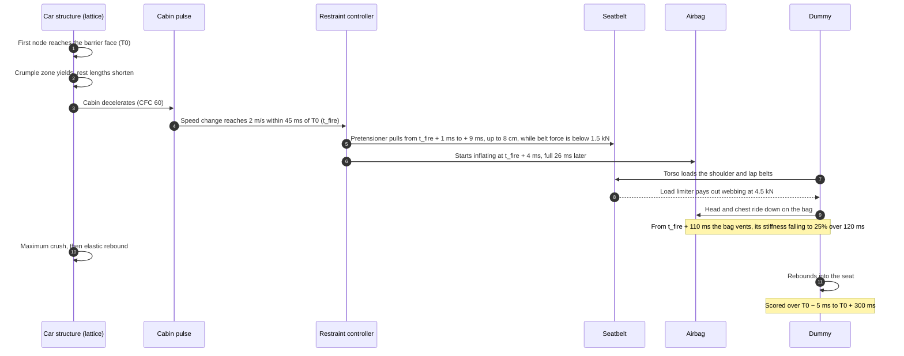
```mermaid
sequenceDiagram
  autonumber
  participant Car as Car structure (lattice)
  participant Pulse as Cabin pulse
  participant Ctl as Restraint controller
  participant Belt as Seatbelt
  participant Bag as Airbag
  participant Dum as Dummy
  Car->>Car: First node reaches the barrier face (T0)
  Car->>Car: Crumple zone yields, rest lengths shorten
  Car->>Pulse: Cabin decelerates (CFC 60)
  Pulse->>Ctl: Speed change reaches 2 m/s within 45 ms of T0 (t_fire)
  Ctl->>Belt: Pretensioner pulls from t_fire + 1 ms to + 9 ms, up to 8 cm, while belt force is below 1.5 kN
  Ctl->>Bag: Starts inflating at t_fire + 4 ms, full 26 ms later
  Dum->>Belt: Torso loads the shoulder and lap belts
  Belt-->>Dum: Load limiter pays out webbing at 4.5 kN
  Dum->>Bag: Head and chest ride down on the bag
  Note over Bag,Dum: From t_fire + 110 ms the bag vents, its stiffness falling to 25% over 120 ms
  Car->>Car: Maximum crush, then elastic rebound
  Dum->>Dum: Rebounds into the seat
  Note over Dum: Scored over T0 − 5 ms to T0 + 300 ms
```

### Brick wall

`Simulator.html?preset=brick`: the same free simulator into a breakable wall (preset 64 km/h, Dramatic damage).

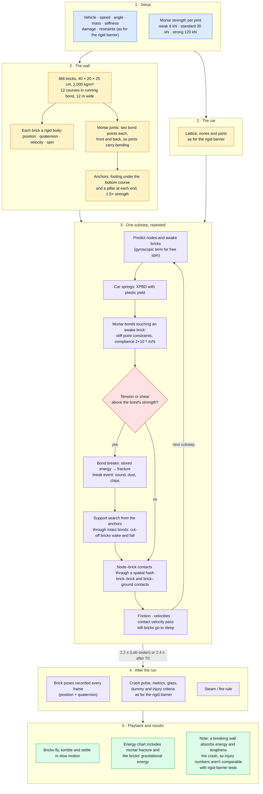
```mermaid
flowchart TB
  classDef input fill:#dbeafe,stroke:#2563eb,color:#0f172a
  classDef model fill:#fef3c7,stroke:#d97706,color:#0f172a
  classDef calc fill:#ede9fe,stroke:#7c3aed,color:#0f172a
  classDef decide fill:#fee2e2,stroke:#dc2626,color:#0f172a
  classDef out fill:#dcfce7,stroke:#16a34a,color:#0f172a

  subgraph SET["1 · Setup"]
    direction TB
    S1["Vehicle · speed · angle · mass · stiffness<br/>damage · restraints (as for the rigid barrier)"]
    S2["Mortar strength per joint<br/>weak 8 kN · standard 30 kN · strong 120 kN"]
  end

  subgraph WALL["2 · The wall"]
    direction TB
    W1["366 bricks, 40 × 20 × 25 cm, 2,000 kg/m³<br/>12 courses in running bond, 12 m wide"]
    W2["Each brick a rigid body:<br/>position · quaternion · velocity · spin"]
    W3["Mortar joints: two bond points each,<br/>front and back, so joints carry bending"]
    W4["Anchors: footing under the bottom course<br/>and a pillar at each end, 1.5× strength"]
    W1 --> W2
    W1 --> W3 --> W4
  end

  subgraph CAR["2 · The car"]
    direction TB
    C1["Lattice, zones and parts<br/>as for the rigid barrier"]
  end

  subgraph RUN["3 · One substep, repeated"]
    direction TB
    R1["Predict nodes and awake bricks<br/>(gyroscopic term for free spin)"]
    R2["Car springs: XPBD with plastic yield"]
    R3["Mortar bonds touching an awake brick:<br/>stiff point constraints, compliance 2×10⁻⁸ m/N"]
    R4{"Tension or shear<br/>above the bond's strength?"}
    R5["Bond breaks: stored energy → fracture<br/>break event: sound, dust, chips"]
    R6["Support search from the anchors<br/>through intact bonds: cut-off bricks wake and fall"]
    R7["Node–brick contacts through a spatial hash<br/>brick–brick and brick–ground contacts"]
    R8["Friction · velocities · contact velocity pass<br/>still bricks go to sleep"]
    R1 --> R2 --> R3 --> R4
    R4 -- yes --> R5 --> R6 --> R7
    R4 -- no --> R7
    R7 --> R8
    R8 -- "next substep" --> R1
  end

  subgraph FIN["4 · After the run"]
    direction TB
    F1["Brick poses recorded every frame<br/>(position + quaternion)"]
    F2["Crash pulse, metrics, glass,<br/>dummy and injury criteria as for the rigid barrier"]
    F3["Steam / fire rule"]
  end

  subgraph OUT["5 · Playback and results"]
    direction TB
    O1["Bricks fly, tumble and settle in slow motion"]
    O2["Energy chart includes mortar fracture and<br/>the bricks' gravitational energy"]
    O3["Note: a breaking wall absorbs energy and lengthens<br/>the crash, so injury numbers aren't comparable<br/>with rigid-barrier tests"]
  end

  SET --> WALL & CAR
  WALL --> RUN
  CAR --> RUN
  RUN -- "2.2 s (Lab sedan) or 2.4 s after T0" --> FIN --> OUT

  class S1,S2 input
  class W1,W2,W3,W4,C1 model
  class R1,R2,R3,R5,R6,R7,R8,F1,F2,F3 calc
  class R4 decide
  class O1,O2,O3 out
```

A brick's life, and a mortar bond's:

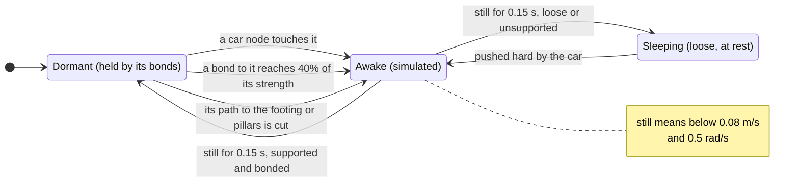
```mermaid
stateDiagram-v2
  direction LR
  state "Dormant (held by its bonds)" as Dormant
  state "Awake (simulated)" as Awake
  state "Sleeping (loose, at rest)" as Sleeping
  [*] --> Dormant
  Dormant --> Awake: a car node touches it
  Dormant --> Awake: a bond to it reaches 40% of its strength
  Dormant --> Awake: its path to the footing or pillars is cut
  Awake --> Dormant: still for 0.15 s, supported and bonded
  Awake --> Sleeping: still for 0.15 s, loose or unsupported
  Sleeping --> Awake: pushed hard by the car
  note right of Awake
    still means below 0.08 m/s
    and 0.5 rad/s
  end note
```

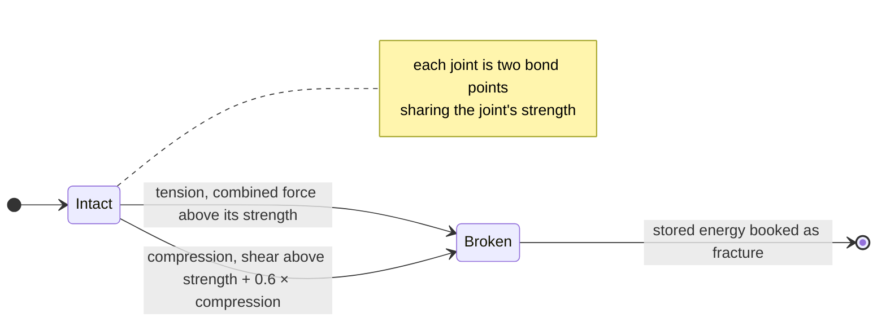
```mermaid
stateDiagram-v2
  direction LR
  state "Intact" as Intact
  state "Broken" as Broken
  [*] --> Intact
  Intact --> Broken: tension, combined force above its strength
  Intact --> Broken: compression, shear above strength + 0.6 × compression
  Broken --> [*]: stored energy booked as fracture
  note right of Intact
    each joint is two bond points
    sharing the joint's strength
  end note
```

### Frontal overlap lab

`Simulator.html?lab=overlap`: part of the front hits a barrier.

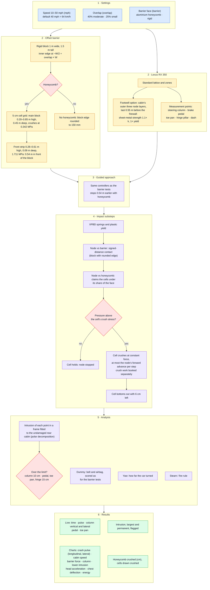
```mermaid
flowchart TB
  classDef input fill:#dbeafe,stroke:#2563eb,color:#0f172a
  classDef model fill:#fef3c7,stroke:#d97706,color:#0f172a
  classDef calc fill:#ede9fe,stroke:#7c3aed,color:#0f172a
  classDef decide fill:#fee2e2,stroke:#dc2626,color:#0f172a
  classDef out fill:#dcfce7,stroke:#16a34a,color:#0f172a

  subgraph SET["1 · Settings"]
    direction TB
    S1["Speed 10–50 mph (mph)<br/>default 40 mph = 64 km/h"]
    S2["Overlap (overlap)<br/>40% moderate · 25% small"]
    S3["Barrier face (barrier)<br/>aluminium honeycomb · rigid"]
  end

  subgraph BAR["2 · Offset barrier"]
    direction TB
    B1["Rigid block 1 m wide, 1.5 m tall<br/>inner edge at −W/2 + overlap × W"]
    B2{"Honeycomb?"}
    B3["5 cm cell grid: main block 0.20–0.85 m high,<br/>0.45 m deep, crushes at 0.342 MPa"]
    B4["Front strip 0.28–0.61 m high, 0.09 m deep,<br/>1.711 MPa: 0.54 m in front of the block"]
    B5["No honeycomb: block edge rounded<br/>to 150 mm"]
    B1 --> B2
    B2 -- yes --> B3 --> B4
    B2 -- no --> B5
  end

  subgraph CAR["2 · Lexus RX 350"]
    direction TB
    C1["Standard lattice and zones"]
    C2["Footwell option: cabin's outer three node layers,<br/>last 0.55 m before the firewall:<br/>sheet-metal strength 1.1× k, 1× yield"]
    C3["Measurement points: steering column · brake pedal<br/>toe pan · hinge pillar · dash"]
    C1 --> C2
    C1 --> C3
  end

  subgraph APP["3 · Guided approach"]
    direction TB
    A1["Same controllers as the barrier tests<br/>stops 0.54 m earlier with honeycomb"]
  end

  subgraph RUN["4 · Impact substeps"]
    direction TB
    R1["XPBD springs and plastic yield"]
    R2["Node vs barrier: signed-distance contact<br/>(block with rounded edge)"]
    R3["Node vs honeycomb: claims the cells under<br/>its share of the face"]
    R4{"Pressure above<br/>the cell's crush stress?"}
    R5["Cell holds: node stopped"]
    R6["Cell crushes at constant force,<br/>at most the node's forward advance per step<br/>crush work booked separately"]
    R7["Cell bottoms out with 6 cm left"]
    R1 --> R2 --> R3 --> R4
    R4 -- no --> R5
    R4 -- yes --> R6 --> R7
  end

  subgraph ANA["5 · Analysis"]
    direction TB
    N1["Intrusion of each point in a frame fitted<br/>to the undamaged rear cabin (polar decomposition)"]
    N2{"Over the limit?<br/>column 10 cm · pedal, toe pan, hinge 15 cm"}
    N3["Dummy: belt and airbag, scored as<br/>for the barrier tests"]
    N4["Yaw: how far the car turned"]
    N5["Steam / fire rule"]
    N1 --> N2
  end

  subgraph OUT["6 · Results"]
    direction TB
    O1["Live: time · pulse · column vertical and lateral<br/>pedal · toe pan"]
    O2["Intrusion, largest and permanent, flagged"]
    O3["Charts: crash pulse (longitudinal, lateral) · cabin speed<br/>barrier force · column · lower intrusion<br/>head acceleration · chest deflection · energy"]
    O4["Honeycomb crushed (cm), cells drawn crushed"]
  end

  SET --> BAR & CAR
  BAR --> APP
  CAR --> APP
  APP --> RUN --> ANA --> OUT

  O1 ~~~ O3
  O2 ~~~ O4

  class S1,S2,S3 input
  class B1,B3,B4,B5,C1,C2,C3 model
  class A1,R1,R2,R3,R5,R6,R7,N1,N3,N4,N5 calc
  class B2,R4,N2 decide
  class O1,O2,O3,O4 out
```

Why the two overlaps differ (the claim the physics check holds it to):

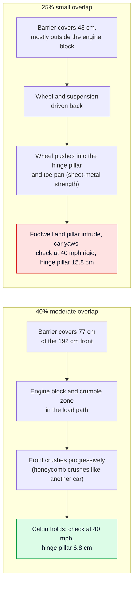
```mermaid
flowchart LR
  classDef good fill:#dcfce7,stroke:#16a34a,color:#0f172a
  classDef bad fill:#fee2e2,stroke:#dc2626,color:#0f172a
  subgraph M40["40% moderate overlap"]
    direction TB
    a1["Barrier covers 77 cm<br/>of the 192 cm front"]
    a2["Engine block and crumple zone<br/>in the load path"]
    a3["Front crushes progressively<br/>(honeycomb crushes like another car)"]
    a4["Cabin holds: check at 40 mph,<br/>hinge pillar 6.8 cm"]
    a1 --> a2 --> a3 --> a4
  end
  subgraph M25["25% small overlap"]
    direction TB
    b1["Barrier covers 48 cm,<br/>mostly outside the engine block"]
    b2["Wheel and suspension<br/>driven back"]
    b3["Wheel pushes into the hinge pillar<br/>and toe pan (sheet-metal strength)"]
    b4["Footwell and pillar intrude, car yaws:<br/>check at 40 mph rigid, hinge pillar 15.8 cm"]
    b1 --> b2 --> b3 --> b4
  end
  class a4 good
  class b4 bad
```

### Two-vehicle collision lab

`Simulator.html?lab=multi`: two cars crash into each other in one solver.

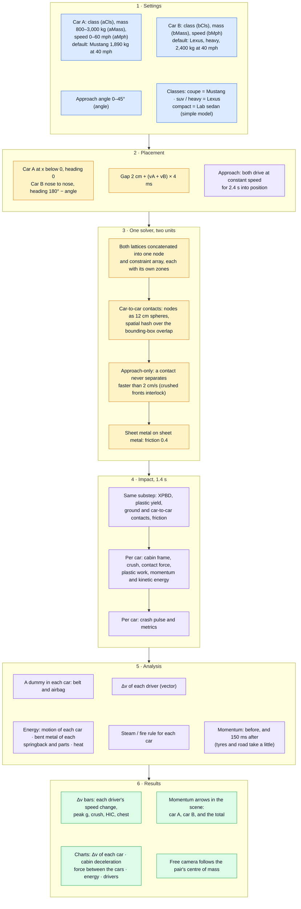
```mermaid
flowchart TB
  classDef input fill:#dbeafe,stroke:#2563eb,color:#0f172a
  classDef model fill:#fef3c7,stroke:#d97706,color:#0f172a
  classDef calc fill:#ede9fe,stroke:#7c3aed,color:#0f172a
  classDef out fill:#dcfce7,stroke:#16a34a,color:#0f172a

  subgraph SET["1 · Settings"]
    direction TB
    SA["Car A: class (aCls), mass 800–3,000 kg (aMass),<br/>speed 0–60 mph (aMph)<br/>default: Mustang 1,890 kg at 40 mph"]
    SB["Car B: class (bCls), mass (bMass), speed (bMph)<br/>default: Lexus, heavy, 2,400 kg at 40 mph"]
    SG["Approach angle 0–45° (angle)"]
    SC["Classes: coupe = Mustang · suv / heavy = Lexus<br/>compact = Lab sedan (simple model)"]
  end

  subgraph GEO["2 · Placement"]
    direction TB
    G1["Car A at x below 0, heading 0<br/>Car B nose to nose, heading 180° − angle"]
    G2["Gap 2 cm + (vA + vB) × 4 ms"]
    G3["Approach: both drive at constant speed<br/>for 2.4 s into position"]
  end

  subgraph BUILD["3 · One solver, two units"]
    direction TB
    U1["Both lattices concatenated into one node<br/>and constraint array, each with its own zones"]
    U2["Car-to-car contacts: nodes as 12 cm spheres,<br/>spatial hash over the bounding-box overlap"]
    U3["Approach-only: a contact never separates<br/>faster than 2 cm/s (crushed fronts interlock)"]
    U4["Sheet metal on sheet metal: friction 0.4"]
    U1 --> U2 --> U3 --> U4
  end

  subgraph RUN["4 · Impact, 1.4 s"]
    direction TB
    R1["Same substep: XPBD, plastic yield,<br/>ground and car-to-car contacts, friction"]
    R2["Per car: cabin frame, crush, contact force,<br/>plastic work, momentum and kinetic energy"]
    R3["Per car: crash pulse and metrics"]
    R1 --> R2 --> R3
  end

  subgraph ANA["5 · Analysis"]
    direction TB
    N1["A dummy in each car: belt and airbag"]
    N2["Δv of each driver (vector)"]
    N3["Momentum: before, and 150 ms after<br/>(tyres and road take a little)"]
    N4["Energy: motion of each car · bent metal of each<br/>springback and parts · heat"]
    N5["Steam / fire rule for each car"]
  end

  subgraph OUT["6 · Results"]
    direction TB
    O1["Δv bars: each driver's speed change,<br/>peak g, crush, HIC, chest"]
    O2["Momentum arrows in the scene:<br/>car A, car B, and the total"]
    O3["Charts: Δv of each car · cabin deceleration<br/>force between the cars · energy · drivers"]
    O4["Free camera follows the pair's centre of mass"]
  end

  SET --> GEO --> BUILD --> RUN --> ANA --> OUT

  SA ~~~ SG
  SB ~~~ SC
  N1 ~~~ N4
  N2 ~~~ N5
  O1 ~~~ O3
  O2 ~~~ O4

  class SA,SB,SG,SC input
  class G1,G2,U1,U2,U3,U4 model
  class G3,R1,R2,R3,N1,N2,N3,N4,N5 calc
  class O1,O2,O3,O4 out
```

What the lab teaches, step by step:

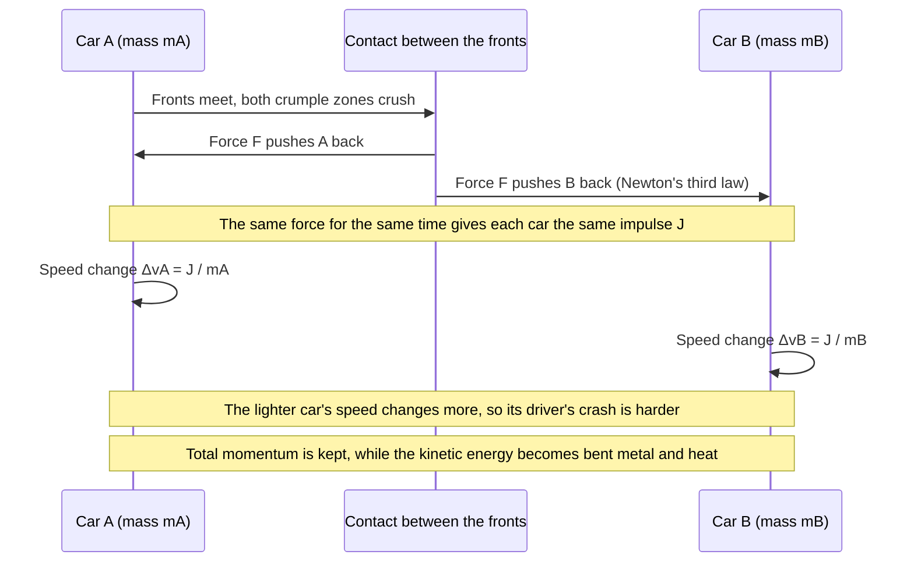
```mermaid
sequenceDiagram
  participant A as Car A (mass mA)
  participant I as Contact between the fronts
  participant B as Car B (mass mB)
  A->>I: Fronts meet, both crumple zones crush
  I->>A: Force F pushes A back
  I->>B: Force F pushes B back (Newton's third law)
  Note over A,B: The same force for the same time gives each car the same impulse J
  A->>A: Speed change ΔvA = J / mA
  B->>B: Speed change ΔvB = J / mB
  Note over A,B: The lighter car's speed changes more, so its driver's crash is harder
  Note over A,B: Total momentum is kept, while the kinetic energy becomes bent metal and heat
```

### Side impact lab

`Simulator.html?lab=side`: a barrier trolley or a pole hits the driver's door.

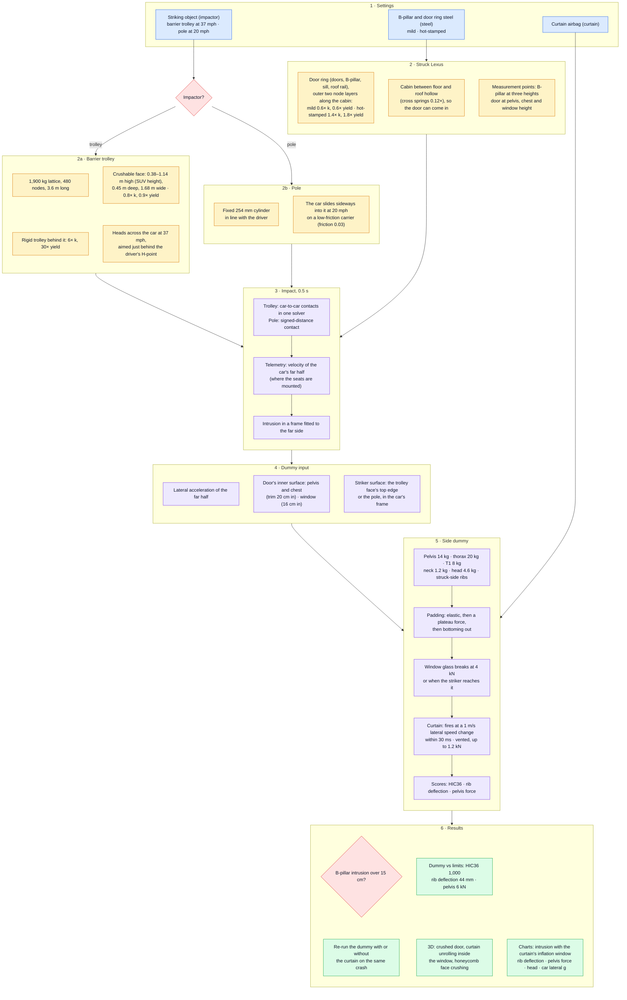
```mermaid
flowchart TB
  classDef input fill:#dbeafe,stroke:#2563eb,color:#0f172a
  classDef model fill:#fef3c7,stroke:#d97706,color:#0f172a
  classDef calc fill:#ede9fe,stroke:#7c3aed,color:#0f172a
  classDef decide fill:#fee2e2,stroke:#dc2626,color:#0f172a
  classDef out fill:#dcfce7,stroke:#16a34a,color:#0f172a

  subgraph SET["1 · Settings"]
    direction TB
    S1["Striking object (impactor)<br/>barrier trolley at 37 mph · pole at 20 mph"]
    S2["B-pillar and door ring steel (steel)<br/>mild · hot-stamped"]
    S3["Curtain airbag (curtain)"]
  end

  S1 --> K{"Impactor?"}

  subgraph MDB["2a · Barrier trolley"]
    direction TB
    M1["1,900 kg lattice, 480 nodes, 3.6 m long"]
    M2["Crushable face: 0.38–1.14 m high (SUV height),<br/>0.45 m deep, 1.68 m wide · 0.8× k, 0.9× yield"]
    M3["Rigid trolley behind it: 6× k, 30× yield"]
    M4["Heads across the car at 37 mph,<br/>aimed just behind the driver's H-point"]
  end

  subgraph POLE["2b · Pole"]
    direction TB
    P1["Fixed 254 mm cylinder<br/>in line with the driver"]
    P2["The car slides sideways into it at 20 mph<br/>on a low-friction carrier (friction 0.03)"]
  end

  subgraph CAR["2 · Struck Lexus"]
    direction TB
    C1["Door ring (doors, B-pillar, sill, roof rail),<br/>outer two node layers along the cabin:<br/>mild 0.6× k, 0.6× yield · hot-stamped 1.4× k, 1.8× yield"]
    C2["Cabin between floor and roof hollow<br/>(cross springs 0.12×), so the door can come in"]
    C3["Measurement points: B-pillar at three heights<br/>door at pelvis, chest and window height"]
  end

  subgraph RUN["3 · Impact, 0.5 s"]
    direction TB
    R1["Trolley: car-to-car contacts in one solver<br/>Pole: signed-distance contact"]
    R2["Telemetry: velocity of the car's far half<br/>(where the seats are mounted)"]
    R3["Intrusion in a frame fitted to the far side"]
    R1 --> R2 --> R3
  end

  subgraph INPUT["4 · Dummy input"]
    direction TB
    I1["Lateral acceleration of the far half"]
    I2["Door's inner surface: pelvis and chest<br/>(trim 20 cm in) · window (16 cm in)"]
    I3["Striker surface: the trolley face's top edge<br/>or the pole, in the car's frame"]
  end

  subgraph DUM["5 · Side dummy"]
    direction TB
    D1["Pelvis 14 kg · thorax 20 kg · T1 8 kg<br/>neck 1.2 kg · head 4.6 kg · struck-side ribs"]
    D2["Padding: elastic, then a plateau force,<br/>then bottoming out"]
    D3["Window glass breaks at 4 kN<br/>or when the striker reaches it"]
    D4["Curtain: fires at a 1 m/s lateral speed change<br/>within 30 ms · vented, up to 1.2 kN"]
    D5["Scores: HIC36 · rib deflection · pelvis force"]
    D1 --> D2 --> D3 --> D4 --> D5
  end

  subgraph OUT["6 · Results"]
    direction TB
    O1{"B-pillar intrusion over 15 cm?"}
    O2["Dummy vs limits: HIC36 1,000<br/>rib deflection 44 mm · pelvis 6 kN"]
    O3["Charts: intrusion with the curtain's inflation window<br/>rib deflection · pelvis force · head · car lateral g"]
    O4["Re-run the dummy with or without<br/>the curtain on the same crash"]
    O5["3D: crushed door, curtain unrolling inside<br/>the window, honeycomb face crushing"]
  end

  K -- trolley --> MDB
  K -- pole --> POLE
  S2 --> CAR
  MDB --> RUN
  POLE --> RUN
  CAR --> RUN
  RUN --> INPUT --> DUM --> OUT
  S3 --> DUM

  M1 ~~~ M3
  M2 ~~~ M4
  O1 ~~~ O4
  O2 ~~~ O5

  class S1,S2,S3 input
  class M1,M2,M3,M4,P1,P2,C1,C2,C3 model
  class R1,R2,R3,I1,I2,I3,D1,D2,D3,D4,D5 calc
  class K,O1 decide
  class O2,O3,O4,O5 out
```

The race between the door and the curtain airbag:

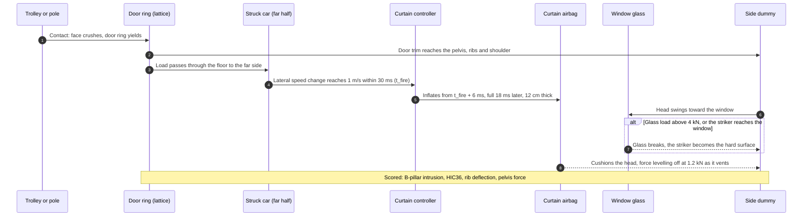
```mermaid
sequenceDiagram
  autonumber
  participant Str as Trolley or pole
  participant Door as Door ring (lattice)
  participant Car as Struck car (far half)
  participant Ctl as Curtain controller
  participant Cur as Curtain airbag
  participant Glass as Window glass
  participant Dum as Side dummy
  Str->>Door: Contact: face crushes, door ring yields
  Door->>Dum: Door trim reaches the pelvis, ribs and shoulder
  Door->>Car: Load passes through the floor to the far side
  Car->>Ctl: Lateral speed change reaches 1 m/s within 30 ms (t_fire)
  Ctl->>Cur: Inflates from t_fire + 6 ms, full 18 ms later, 12 cm thick
  Dum->>Glass: Head swings toward the window
  alt Glass load above 4 kN, or the striker reaches the window
    Glass-->>Dum: Glass breaks, the striker becomes the hard surface
  end
  Cur-->>Dum: Cushions the head, force levelling off at 1.2 kN as it vents
  Note over Door,Dum: Scored: B-pillar intrusion, HIC36, rib deflection, pelvis force
```

### Whiplash sled lab

`Simulator.html?lab=whiplash`: a seat on a sled is shoved forward, as when a stopped car is hit from behind.

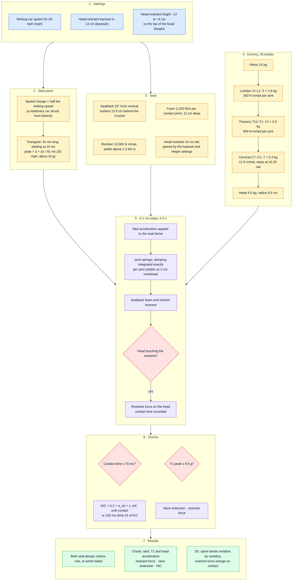
```mermaid
flowchart TB
  classDef input fill:#dbeafe,stroke:#2563eb,color:#0f172a
  classDef model fill:#fef3c7,stroke:#d97706,color:#0f172a
  classDef calc fill:#ede9fe,stroke:#7c3aed,color:#0f172a
  classDef decide fill:#fee2e2,stroke:#dc2626,color:#0f172a
  classDef out fill:#dcfce7,stroke:#16a34a,color:#0f172a

  subgraph SET["1 · Settings"]
    direction TB
    S1["Striking-car speed 20–30 mph (mph)"]
    S2["Head-restraint backset 0–12 cm (backset)"]
    S3["Head-restraint height −12 to +4 cm<br/>vs the top of the head (height)"]
  end

  subgraph PULSE["2 · Sled pulse"]
    direction TB
    P1["Speed change = half the striking speed<br/>(a stationary car struck from behind)"]
    P2["Triangular, 91 ms long, starting at 10 ms<br/>peak = 2 × Δv / 91 ms (20 mph: about 10 g)"]
    P1 --> P2
  end

  subgraph SEAT["3 · Seat"]
    direction TB
    T1["Seatback 25° from vertical,<br/>surface 13.5 cm behind the H-point"]
    T2["Foam 2,100 N/m per contact point, 12 cm deep"]
    T3["Recliner 12,000 N·m/rad, yields above 2.2 kN·m"]
    T4["Head restraint 24 cm tall,<br/>placed by the backset and height settings"]
  end

  subgraph DUM["4 · Dummy, 26 bodies"]
    direction TB
    D1["Pelvis 15 kg"]
    D2["Lumbar L5–L1: 5 × 1.6 kg<br/>350 N·m/rad per joint"]
    D3["Thoracic T12–T1: 12 × 2.6 kg<br/>600 N·m/rad per joint"]
    D4["Cervical C7–C1: 7 × 0.3 kg<br/>11 N·m/rad, stops at ±0.25 rad"]
    D5["Head 4.5 kg, radius 9.5 cm"]
    D1 --> D2 --> D3 --> D4 --> D5
  end

  subgraph RUN["5 · 0.1 ms steps, 0.3 s"]
    direction TB
    R1["Sled acceleration applied to the seat frame"]
    R2["Joint springs; damping integrated exactly<br/>per joint (stable on 2 cm vertebrae)"]
    R3["Seatback foam and recliner moment"]
    R4{"Head touching the restraint?"}
    R5["Restraint force on the head<br/>contact time recorded"]
    R1 --> R2 --> R3 --> R4
    R4 -- yes --> R5
  end

  subgraph SCORE["6 · Scores"]
    direction TB
    C1{"Contact time ≤ 70 ms?"}
    C2{"T1 peak ≤ 9.5 g?"}
    C3["NIC = 0.2 × a_rel + v_rel², until contact<br/>or 150 ms (limit 15 m²/s²)"]
    C4["Neck extension · restraint force"]
  end

  subgraph OUT["7 · Results"]
    direction TB
    O1["Both seat-design criteria met, or which failed"]
    O2["Charts: sled, T1 and head acceleration<br/>restraint force · neck extension · NIC"]
    O3["3D: spine bends vertebra by vertebra,<br/>restraint turns orange on contact"]
  end

  SET --> PULSE --> RUN
  SET --> SEAT
  SEAT --> RUN
  DUM --> RUN
  RUN --> SCORE --> OUT

  T1 ~~~ T3
  T2 ~~~ T4
  C1 ~~~ C3
  C2 ~~~ C4

  class S1,S2,S3 input
  class P1,P2,T1,T2,T3,T4,D1,D2,D3,D4,D5 model
  class R1,R2,R3,R5,C3,C4 calc
  class R4,C1,C2 decide
  class O1,O2,O3 out
```

The rear-impact sequence:

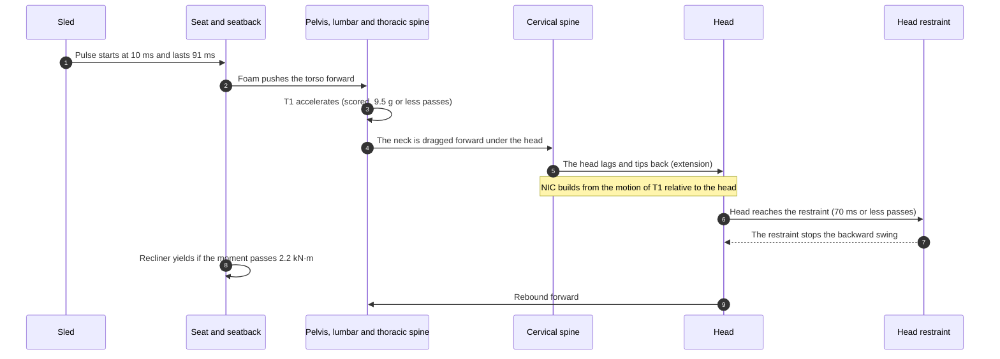
```mermaid
sequenceDiagram
  autonumber
  participant Sled
  participant Seat as Seat and seatback
  participant Torso as Pelvis, lumbar and thoracic spine
  participant Neck as Cervical spine
  participant Head
  participant HR as Head restraint
  Sled->>Seat: Pulse starts at 10 ms and lasts 91 ms
  Seat->>Torso: Foam pushes the torso forward
  Torso->>Torso: T1 accelerates (scored, 9.5 g or less passes)
  Torso->>Neck: The neck is dragged forward under the head
  Neck->>Head: The head lags and tips back (extension)
  Note over Neck,Head: NIC builds from the motion of T1 relative to the head
  Head->>HR: Head reaches the restraint (70 ms or less passes)
  HR-->>Head: The restraint stops the backward swing
  Seat->>Seat: Recliner yields if the moment passes 2.2 kN·m
  Head->>Torso: Rebound forward
```

### Occupant restraint lab

`Simulator.html?lab=restraint`: one crash, three restraint systems, three collisions.

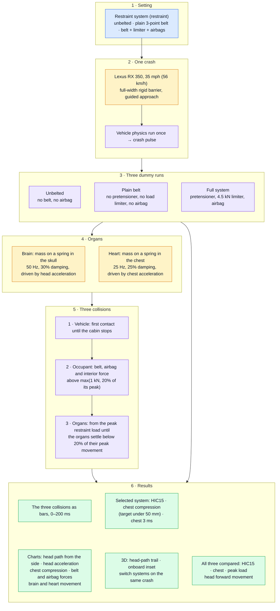
```mermaid
flowchart TB
  classDef input fill:#dbeafe,stroke:#2563eb,color:#0f172a
  classDef model fill:#fef3c7,stroke:#d97706,color:#0f172a
  classDef calc fill:#ede9fe,stroke:#7c3aed,color:#0f172a
  classDef out fill:#dcfce7,stroke:#16a34a,color:#0f172a

  subgraph SET["1 · Setting"]
    direction TB
    S1["Restraint system (restraint)<br/>unbelted · plain 3-point belt · belt + limiter + airbags"]
  end

  subgraph CRASH["2 · One crash"]
    direction TB
    C1["Lexus RX 350, 35 mph (56 km/h)<br/>full-width rigid barrier, guided approach"]
    C2["Vehicle physics run once → crash pulse"]
    C1 --> C2
  end

  subgraph RUNS["3 · Three dummy runs"]
    direction TB
    D1["Unbelted<br/>no belt, no airbag"]
    D2["Plain belt<br/>no pretensioner, no load limiter, no airbag"]
    D3["Full system<br/>pretensioner, 4.5 kN limiter, airbag"]
  end

  subgraph ORG["4 · Organs"]
    direction TB
    G1["Brain: mass on a spring in the skull<br/>50 Hz, 30% damping, driven by head acceleration"]
    G2["Heart: mass on a spring in the chest<br/>25 Hz, 25% damping, driven by chest acceleration"]
  end

  subgraph PH["5 · Three collisions"]
    direction TB
    P1["1 · Vehicle: first contact until the cabin stops"]
    P2["2 · Occupant: belt, airbag and interior force<br/>above max(1 kN, 20% of its peak)"]
    P3["3 · Organs: from the peak restraint load until<br/>the organs settle below 20% of their peak movement"]
    P1 --> P2 --> P3
  end

  subgraph OUT["6 · Results"]
    direction TB
    O1["The three collisions as bars, 0–200 ms"]
    O2["Selected system: HIC15 · chest compression<br/>(target under 50 mm) · chest 3 ms"]
    O3["All three compared: HIC15 · chest · peak load<br/>head forward movement"]
    O4["Charts: head path from the side · head acceleration<br/>chest compression · belt and airbag forces<br/>brain and heart movement"]
    O5["3D: head-path trail · onboard inset<br/>switch systems on the same crash"]
  end

  S1 --> CRASH --> RUNS
  RUNS --> ORG --> PH --> OUT
  RUNS --> OUT

  O1 ~~~ O4
  O2 ~~~ O5

  class S1 input
  class C1,G1,G2 model
  class C2,D1,D2,D3,P1,P2,P3 calc
  class O1,O2,O3,O4,O5 out
```

What each system does with the same crash (the physics check's numbers at 56 km/h):

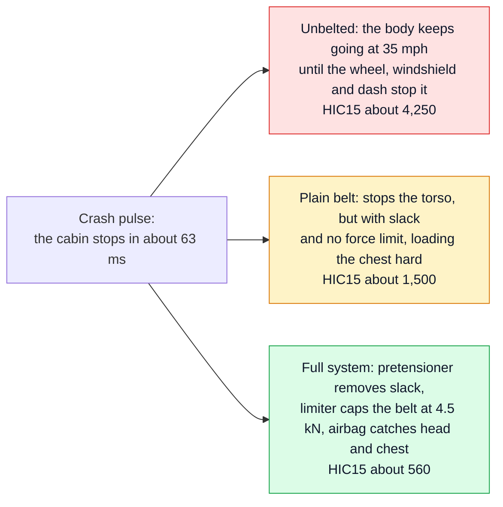
```mermaid
flowchart LR
  classDef bad fill:#fee2e2,stroke:#dc2626,color:#0f172a
  classDef mid fill:#fef3c7,stroke:#d97706,color:#0f172a
  classDef good fill:#dcfce7,stroke:#16a34a,color:#0f172a
  P["Crash pulse:<br/>the cabin stops in about 63 ms"]
  P --> U["Unbelted: the body keeps going at 35 mph<br/>until the wheel, windshield and dash stop it<br/>HIC15 about 4,250"]
  P --> B["Plain belt: stops the torso, but with slack<br/>and no force limit, loading the chest hard<br/>HIC15 about 1,500"]
  P --> F["Full system: pretensioner removes slack,<br/>limiter caps the belt at 4.5 kN, airbag catches head and chest<br/>HIC15 about 560"]
  class U bad
  class B mid
  class F good
```

### Pedestrian and emergency braking lab

`Simulator.html?lab=pedestrian`: a pedestrian crosses, and the car may or may not brake in time.

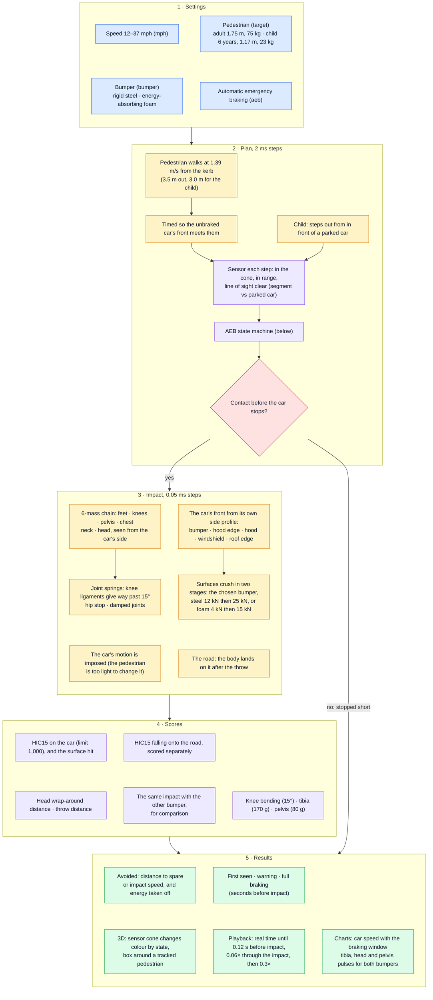
```mermaid
flowchart TB
  classDef input fill:#dbeafe,stroke:#2563eb,color:#0f172a
  classDef model fill:#fef3c7,stroke:#d97706,color:#0f172a
  classDef calc fill:#ede9fe,stroke:#7c3aed,color:#0f172a
  classDef decide fill:#fee2e2,stroke:#dc2626,color:#0f172a
  classDef out fill:#dcfce7,stroke:#16a34a,color:#0f172a

  subgraph SET["1 · Settings"]
    direction TB
    S1["Speed 12–37 mph (mph)"]
    S2["Pedestrian (target)<br/>adult 1.75 m, 75 kg · child 6 years, 1.17 m, 23 kg"]
    S3["Bumper (bumper)<br/>rigid steel · energy-absorbing foam"]
    S4["Automatic emergency braking (aeb)"]
  end

  subgraph PLAN["2 · Plan, 2 ms steps"]
    direction TB
    L1["Pedestrian walks at 1.39 m/s from the kerb<br/>(3.5 m out, 3.0 m for the child)"]
    L2["Timed so the unbraked car's front meets them"]
    L3["Child: steps out from in front of a parked car"]
    L4["Sensor each step: in the cone, in range,<br/>line of sight clear (segment vs parked car)"]
    L5["AEB state machine (below)"]
    L6{"Contact before the car stops?"}
    L1 --> L2 --> L4
    L3 --> L4
    L4 --> L5 --> L6
  end

  subgraph IMP["3 · Impact, 0.05 ms steps"]
    direction TB
    I1["6-mass chain: feet · knees · pelvis · chest<br/>neck · head, seen from the car's side"]
    I2["Joint springs: knee ligaments give way past 15°<br/>hip stop · damped joints"]
    I3["The car's front from its own side profile:<br/>bumper · hood edge · hood · windshield · roof edge"]
    I4["Surfaces crush in two stages: the chosen bumper,<br/>steel 12 kN then 25 kN, or foam 4 kN then 15 kN"]
    I5["The car's motion is imposed (the pedestrian<br/>is too light to change it)"]
    I6["The road: the body lands on it after the throw"]
    I1 --> I2
    I3 --> I4
  end

  subgraph SC["4 · Scores"]
    direction TB
    C1["HIC15 on the car (limit 1,000), and the surface hit"]
    C2["HIC15 falling onto the road, scored separately"]
    C3["Knee bending (15°) · tibia (170 g) · pelvis (80 g)"]
    C4["Head wrap-around distance · throw distance"]
    C5["The same impact with the other bumper,<br/>for comparison"]
  end

  subgraph OUT["5 · Results"]
    direction TB
    O1["Avoided: distance to spare<br/>or impact speed, and energy taken off"]
    O2["First seen · warning · full braking<br/>(seconds before impact)"]
    O3["Charts: car speed with the braking window<br/>tibia, head and pelvis pulses for both bumpers"]
    O4["3D: sensor cone changes colour by state,<br/>box around a tracked pedestrian"]
    O5["Playback: real time until 0.12 s before impact,<br/>0.06× through the impact, then 0.3×"]
  end

  SET --> PLAN
  L6 -- yes --> IMP --> SC --> OUT
  L6 -- "no: stopped short" --> OUT

  S1 ~~~ S3
  S2 ~~~ S4
  I2 ~~~ I5
  I4 ~~~ I6
  C1 ~~~ C4
  C2 ~~~ C5
  O1 ~~~ O4
  O2 ~~~ O5

  class S1,S2,S3,S4 input
  class L1,L2,L3,I1,I2,I3,I4,I5,I6 model
  class L4,L5,C1,C2,C3,C4,C5 calc
  class L6 decide
  class O1,O2,O3,O4,O5 out
```

The emergency-braking system's states (the colour of the sensor cone in the scene):

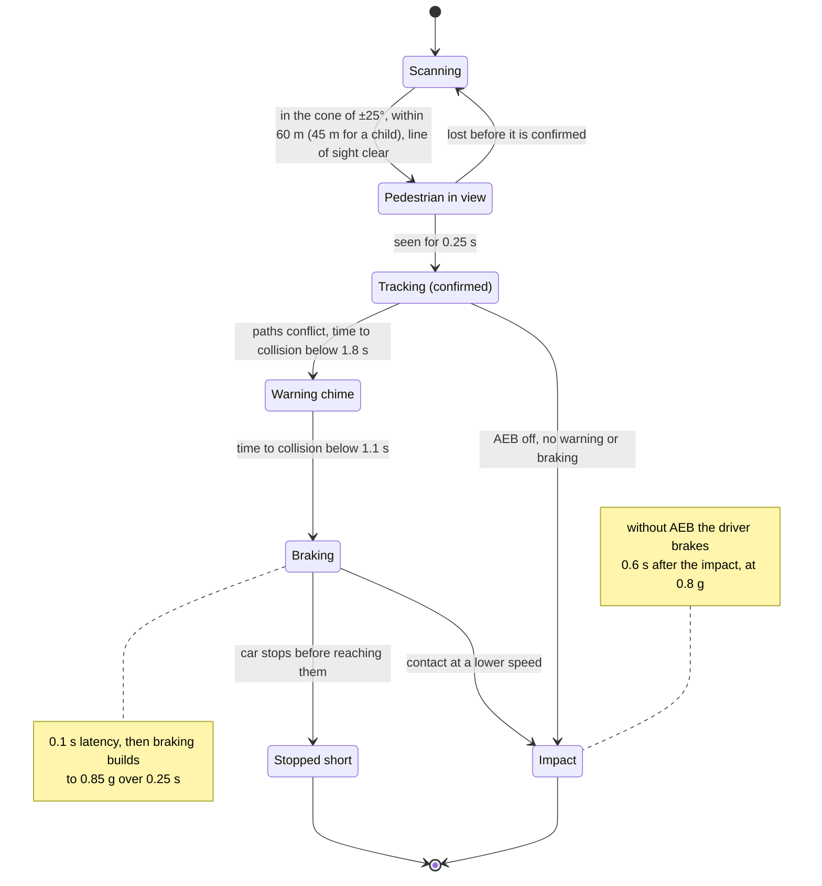
```mermaid
stateDiagram-v2
  state "Scanning" as Scan
  state "Pedestrian in view" as View
  state "Tracking (confirmed)" as Track
  state "Warning chime" as Warn
  state "Braking" as Brake
  state "Stopped short" as Stop
  state "Impact" as Hit
  [*] --> Scan
  Scan --> View: in the cone of ±25°, within 60 m (45 m for a child), line of sight clear
  View --> Scan: lost before it is confirmed
  View --> Track: seen for 0.25 s
  Track --> Warn: paths conflict, time to collision below 1.8 s
  Warn --> Brake: time to collision below 1.1 s
  Brake --> Stop: car stops before reaching them
  Brake --> Hit: contact at a lower speed
  Track --> Hit: AEB off, no warning or braking
  Stop --> [*]
  Hit --> [*]
  note right of Brake
    0.1 s latency, then braking builds
    to 0.85 g over 0.25 s
  end note
  note left of Hit
    without AEB the driver brakes
    0.6 s after the impact, at 0.8 g
  end note
```

The impact itself:

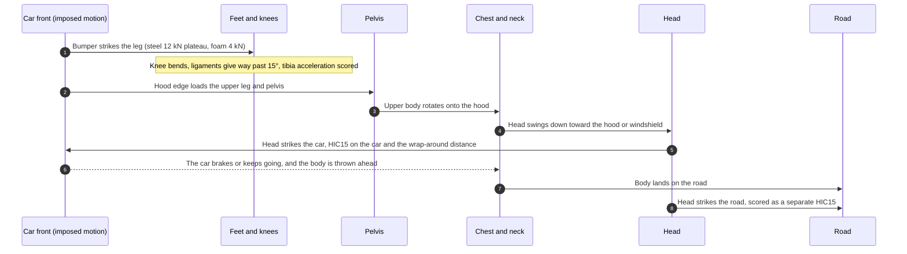
```mermaid
sequenceDiagram
  autonumber
  participant Car as Car front (imposed motion)
  participant Leg as Feet and knees
  participant Pel as Pelvis
  participant Up as Chest and neck
  participant Head
  participant Road
  Car->>Leg: Bumper strikes the leg (steel 12 kN plateau, foam 4 kN)
  Note over Leg: Knee bends, ligaments give way past 15°, tibia acceleration scored
  Car->>Pel: Hood edge loads the upper leg and pelvis
  Pel->>Up: Upper body rotates onto the hood
  Up->>Head: Head swings down toward the hood or windshield
  Head->>Car: Head strikes the car, HIC15 on the car and the wrap-around distance
  Car-->>Up: The car brakes or keeps going, and the body is thrown ahead
  Up->>Road: Body lands on the road
  Head->>Road: Head strikes the road, scored as a separate HIC15
```

---

## Rendering the damage

### Skinning the model to the lattice (GPU)

Each vertex of the imported car's mesh is embedded in the lattice cell that contains it: 8 node indices and its position (*t*ₓ, *t*ᵧ, *t*_z) in the cell. Every frame, the node positions and plastic strains are uploaded as a float texture (one RGBA texel per node). The vertex shader then rebuilds each vertex by trilinear interpolation.

Normals aren't recomputed. Each authored normal is turned by the cell's deformation gradient *F* through its cofactor, *n′ = cof(F)·n*. So the model keeps its own smoothing and hard edges while it crumples, and stays exact under rigid motion. A custom depth material skins the shadows the same way. The simple Lab sedan is a subdivided box skinned on the CPU.

### Crumpled metal

The lattice, about 24 cm between nodes, is too coarse for sheet-metal folds, so the shader adds them where the lattice says the metal yielded:

- **Where.** From about 4.5% plastic strain, fully at 18%.
- **Buckles.** Broad buckles move the surface by up to 2.2 cm, along a smoothed normal so hard edges stay closed. Their wavelength is about 20 cm, as the mesh's vertices are 3–8 cm apart.
- **Folds.** Finer folds shade the surface through a screen-space bump, faded with distance so they don't shimmer.
- **Direction.** Where a lattice cell was compressed, the fold pattern blends toward copies squeezed 2.2× along that axis, so the folds run across the crush as on a crushed panel.
- **Paint.** Creases darken, and paint cracks off to grey primer along the sharpest ones.
- **Debris.** A part that comes off keeps its folds: they are baked into its frozen copy on the CPU, with a JavaScript port of the same noise.

This is visual only: intrusion and every number come from the lattice.

### Other effects

- **Debris** is a frozen copy of the part, skinned on the CPU at the moment it came off, following its rigid body's recorded pose.
- **Glass shards** are instanced meshes on precomputed ballistic paths (fall, bounce, settle). They are seeded from the pane name, so scrubbing and replays are consistent.
- **Windshield cracks** are a spider-web pattern drawn on a canvas texture from the break origin and head strikes.
- **Burst tyres** flatten against the ground in the vertex shader.
- **The curtain airbag** is shaped from the car's driver-side window panes: a quilted cushion with sewn chambers that unrolls from the roof rail just inside the glass. Its points ride on the lattice, so the crushed door pushes it in.
- **Fire and steam** are camera-facing instanced sprites: flames (additive), sooty smoke, embers and steam, plus a flickering point light. Each particle's state is a pure function of its index and the time since the crash, so the fire looks the same on every replay.
- **Bloom.** Flames, embers and hot sparks glow. Their glow twins (a separate render layer) are drawn into a half-size buffer over the solid scene drawn in black, so the car and barrier hide what's behind them. The imported cars' black copy is skinned like the body, so the crushed engine bay doesn't hide its own fire behind the undeformed shape. The buffer is blurred down a chain of smaller buffers and back up, then added onto the frame. Everything else keeps its look, and the pass runs only while something glows. Sparks cool as they fly, so their glow fades faster than their colour.
- **Sound** is synthesised live with Web Audio:
  - structural crunch, metal clank and tearing, glass, windshield crackle, a tyre blowout (bang, casing thump, rubber flap, escaping air), airbag, the AEB chime, fire roar and crackle, steam hiss;
  - each sound plays from where it happens, through an HRTF panner, and the listener follows the camera;
  - a continuous structural groan follows the power the crash is absorbing (plastic work, fracture and contact losses per millisecond, from the energy books): about 0.5 at 1 MW, 0.85 at 5 MW and 1.2 at 25 MW. It grows louder, more resonant and more distorted with power, over a deeper rumble;
  - in slow motion the sounds are pitched down (down to 0.4× at 1/40×) and drawn out;
  - a limiter in front of the speakers keeps the loudest moments from clipping.

  Point particles show sparks, dust and glass.
- **Bullet-time and shake** (`cinematic.js`) are worked out once per replay from the crash pulse, in 1 ms bins:
  - **Speed.** The deceleration relative to its peak is widened and smoothed, so the slow-down starts a little before the peak and eases in and out. It is mapped between 1/4× and 1/40×. Once 97% of the pulse's impulse has gone by, the speed rises to real time over 250 ms.
  - **Shake** grows with the deceleration (1 at 50 g), with kicks for first contact, parts tearing off, tyre bursts and head strikes. It goes mostly along the deceleration's direction and scales with the camera's distance. It wobbles with replay time, so it slows down in slow motion.
- **Saving a video** (`export.js`) renders the replay frame by frame at 1920×1080 and 30 frames per second, whatever the computer's speed. Its sounds are rendered offline on the same clock (an `OfflineAudioContext`).
  - Encoding: H.264 through WebCodecs (VP9 if there is no H.264 encoder), with AAC or Opus sound.
  - Container: an MP4 written by mp4-muxer.
  - Overlay: the title, the replay clock and the speed are drawn on each frame.

---

## Equations and sources

The models written out as the code computes them. Numbers in square brackets point to the [references](#references). Where a value is the model's own setting rather than a published one, it says so.

### Energy, momentum and the crash pulse

The setup readouts are the kinetic energy, the height the car would have to fall from to reach the same speed, and the momentum:

```math
E_k = \tfrac12 m v^2, \qquad h = \frac{v^2}{2g}, \qquad p = m v
```

Energy grows with the square of speed, so 112 km/h carries four times the energy of 56 km/h \[[20](#ref-20), [23](#ref-23)\]. The impulse-momentum theorem links the force to the time it acts for. For the same speed change, a longer crush means a lower average deceleration:

```math
J = \int F\,dt = m\,\Delta v, \qquad \bar a = \frac{v_0^2}{2s}
```

Stopping from 56 km/h over the Lexus's 0.58 m of crush averages 21 g. The measured peak (CFC 60) is 69 g, because a real pulse isn't square \[[20](#ref-20), [21](#ref-21)\].

The energy books (section 6 of the physics) account for the initial kinetic energy at every recorded frame:

```math
\tfrac12 m v_0^2 = E_k + E_\text{elastic} + W_\text{plastic} + W_\text{fracture} + Q_\text{friction} + \Delta E_\text{pot} + W_\text{honeycomb} + E_\text{contact, damping, solver}
```

When two cars crush together and leave at a common speed, momentum fixes each one's speed change. The lighter car's Δv is larger in proportion to the other car's mass, which is what the two-vehicle lab checks \[[20](#ref-20), [22](#ref-22)\]:

```math
\Delta v_A = \frac{m_B}{m_A + m_B}\,v_\text{closing}, \qquad \frac{\Delta v_A}{\Delta v_B} = \frac{m_B}{m_A}
```

The labs split a crash into three collisions, as crash-science teaching does: the car against the barrier, the occupant against the restraints and interior, and the organs inside the body \[[24](#ref-24), [25](#ref-25)\].

### The lattice and the XPBD step

Each substep first predicts every node's motion, keeping its old position *x\**:

```math
\mathbf v \leftarrow \mathbf v + \Delta t\,\mathbf g, \qquad \mathbf x^* = \mathbf x, \qquad \mathbf x \leftarrow \mathbf x + \Delta t\,\mathbf v
```

Each spring between nodes *a* and *b* is a distance constraint with unit direction **n** from *a* to *b*:

```math
C = \lvert \mathbf x_b - \mathbf x_a \rvert - L_0
```

Its compliance is *α* = 1/*k*. Its damping is *c* = 2*ζ*√(*k m_ab*), with the pair's reduced mass *m_ab* = *m_a m_b*/(*m_a* + *m_b*) and *ζ* = 0.08 (a model setting); *γ* = *cα*/Δ*t*. The projection is XPBD's with one iteration per substep \[[2](#ref-2), [3](#ref-3)\]:

```math
\Delta\lambda = -\frac{C + \gamma\,\mathbf n \cdot \big[(\mathbf x_b - \mathbf x_b^*) - (\mathbf x_a - \mathbf x_a^*)\big]}{(1+\gamma)(w_a + w_b) + \alpha/\Delta t^2}, \qquad \mathbf x_a \mathrel{-}= w_a\,\Delta\lambda\,\mathbf n, \quad \mathbf x_b \mathrel{+}= w_b\,\Delta\lambda\,\mathbf n
```

- *w* = 1/*m* are the inverse masses.
- With one iteration per substep the multiplier starts at zero, so the −*α̃λ* term of the full XPBD update drops out: this is the "small steps" scheme \[[3](#ref-3)\].
- XPBD comes from implicit (backward Euler) integration of the spring energy, so *k* is a real stiffness whatever the step size. Plain position-based dynamics \[[1](#ref-1)\] has a stiffness that depends on the step and the iteration count \[[4](#ref-4)\].
- The stiffness is *k* = *K₀* · *s_h* · *f*_zone · *s*_front, with *K₀* = 1.1 MN/m, *s_h* the lattice-spacing scale, *f*_zone from the zone table and *s*_front the Soft/Standard/Stiff setting (all model settings).

Velocities come from the positions after all corrections:

```math
\mathbf v = \frac{\mathbf x - \mathbf x^*}{\Delta t}
```

**Why 0.1 ms works.** Explicit finite-element crash codes are limited by the Courant–Friedrichs–Lewy condition \[[11](#ref-11)\]:

```math
\Delta t \le \frac{L_e}{c}, \qquad c = \sqrt{E/\rho} \approx 5{,}200\ \text{m/s in steel}
```

A 5 mm shell element gives about 1 µs, so a 100 ms crash needs about 10⁵ steps. The lattice's position-level solve is stable at much larger steps. Here the 0.1 ms step is set by the injury filters (below), not by stability.

**Plastic flow.** After the correction, the spring's elastic extension is *e* = |*x_b* − *x_a*| − *L₀*, and its yield extension is *e_y* = *ε_y L*_orig. If |*e*| > *e_y*, the rest length moves by the excess and the steel stays bent \[[8](#ref-8)\]:

```math
L_0 \leftarrow \mathrm{clamp}\!\Big(L_0 + \mathrm{sign}(e)\,\big(\lvert e \rvert - e_y\big),\; 0.25\,L_\text{orig},\; 1.8\,L_\text{orig}\Big)
```

The plastic work is the yield force times the flow, and the plastic strain accumulates per spring:

```math
\Delta W_p = k\,e_y\,\lvert \Delta L_0 \rvert, \qquad \varepsilon_p \mathrel{+}= \frac{\lvert \Delta L_0 \rvert}{L_\text{orig}}
```

### Contacts, friction and rigid bodies

A node that penetrates the ground or the barrier by *d* is moved back onto the surface. The barrier's load cell sums the forces those corrections imply:

```math
F_\text{barrier} = \sum_i \frac{m_i\,d_i}{\Delta t^2}
```

Contacts with bricks, debris, the lab obstacles and the other car cancel the approach in that substep but never push apart faster than *v*_sep. That is 1 m/s, or 2 cm/s between two cars, whose crushed fronts interlock (model settings):

```math
d \leftarrow \min\!\Big(d,\; \max\big(0,\; -\Delta\mathbf x_\text{rel} \cdot \mathbf n + v_\text{sep}\,\Delta t\big)\Big)
```

**Friction** is Coulomb friction at the position level \[[5](#ref-5), [6](#ref-6)\]. The tangential displacement Δ**x**_t of the substep is removed while it fits inside the friction cone, μ times the normal correction *d*, and is reduced by that much otherwise:

```math
\Delta\mathbf x_t \leftarrow
\begin{cases}
\mathbf 0 & \lvert \Delta\mathbf x_t \rvert \le \mu\,d \quad \text{(sticking)} \\
\Delta\mathbf x_t \left(1 - \dfrac{\mu\,d}{\lvert \Delta\mathbf x_t \rvert}\right) & \text{otherwise (sliding)}
\end{cases}
```

- Wheel nodes split this along the car's heading (rolling resistance μ = 0.015, or 0.3 once the tyre bursts) and across it (μ = 0.8).
- Other surfaces (model settings): body on the ground 0.5, barrier 0.3, brick 0.5, car on car 0.4.

**Rigid bodies** (bricks, parts that came off, wheels) take contact and bond corrections at a point **r** from their centre of mass. They use the generalised inverse mass of XPBD rigid bodies \[[6](#ref-6)\]:

```math
w = \frac1m + (\mathbf r \times \mathbf n)^{\mathsf T}\, I^{-1}\, (\mathbf r \times \mathbf n)
```

The spin is integrated with the gyroscopic term, so a free spin keeps its energy \[[7](#ref-7)\]. Debris orientation uses the exact quaternion exponential; bricks use the first-order update, then renormalise \[[6](#ref-6)\]:

```math
\boldsymbol\omega \leftarrow \boldsymbol\omega - \Delta t\, I^{-1}\big(\boldsymbol\omega \times I\boldsymbol\omega\big), \qquad q \leftarrow \exp\!\big(\tfrac12 \Delta t\,\boldsymbol\omega\big) \otimes q
```

**Spatial hashing.** Bricks and the other car's nodes are found through a hash of the grid cell *(i, j, k)*, with *T* a power of two \[[9](#ref-9)\]:

```math
h(i,j,k) = \big(73856093\,i \oplus 19349663\,j \oplus 83492791\,k\big) \bmod T
```

### The honeycomb barrier face

The offset barrier's aluminium honeycomb uses the deformable barrier's specified crush strengths: *σ_c* = 0.342 MPa for the main block and 1.711 MPa for the bumper strip \[[37](#ref-37)\]. Honeycomb crushes at a nearly constant stress \[[16](#ref-16)\]. A node pressing on the cells under it can be stopped by at most their crush force, and anything beyond that crushes them:

```math
F_\text{cap} = \sum_\text{free cells} \sigma_c A_\text{cell}, \qquad
\Delta x =
\begin{cases}
d & m\,d/\Delta t^2 \le F_\text{cap} \\
F_\text{cap}\,\Delta t^2/m & \text{otherwise (the cells crush)}
\end{cases}, \qquad
W_\text{hc} = \sum \sigma_c A_\text{cell}\,\Delta c
```

### Mortar bonds

Each bond is a stiff XPBD point constraint between the two bricks' bond points **p_a** and **p_b**, with compliance *α_b* = 2 × 10⁻⁸ m/N (a model setting) \[[6](#ref-6)\]. The force it carries follows from the correction:

```math
\Delta\lambda = -\frac{\lvert \mathbf p_a - \mathbf p_b \rvert}{w_a + w_b + \alpha_b/\Delta t^2}, \qquad \mathbf f = \frac{\Delta\lambda}{\Delta t^2}\,\mathbf n
```

The force is split into the part across the joint, *f_n* (tension positive), and the shear *f_s*. The bond fails under a Coulomb criterion, the kind used for masonry joints: compression raises the shear it can carry \[[17](#ref-17)\]. The friction coefficient 0.6 is a model setting:

```math
\sqrt{f_n^2 + f_s^2} > S \quad (f_n > 0), \qquad f_s > S + 0.6\,\lvert f_n \rvert \quad (f_n \le 0)
```

*S* is 8, 30 or 120 kN for weak, standard and strong mortar (model settings). The energy stored in the broken bond, ½|**p_a** − **p_b**|²/*α_b*, is booked as fracture.

### Parts, wheels and glass

A part comes off when the mean plastic strain of the springs it is mounted on reaches its limit, *ε̄_p* ≥ *ε_f* (the table in section 5 of the physics). That is the simplest ductile-fracture rule: a constant strain to failure, as in the Johnson–Cook model with only its first constant \[[18](#ref-18)\]. Criteria such as Cockcroft–Latham's integrate the tensile plastic work instead \[[19](#ref-19)\]; they need panel stresses the lattice doesn't resolve.

When a part comes off it takes mass *m_i* from each node it sat on, and starts as a rigid body from their momentum:

```math
M = \sum m_i, \qquad \mathbf v_\text{cm} = \frac1M \sum m_i \mathbf v_i, \qquad \mathbf L = \sum m_i\,(\mathbf x_i - \mathbf x_\text{cm}) \times \mathbf v_i, \qquad \boldsymbol\omega = I^{-1}\mathbf L
```

If the body would have more kinetic energy than the nodes gave up, *ω* is scaled down. The difference is booked as fracture, so a break never adds energy.

- **Tyre burst.** The wheel nodes' floor sinks from the tyre radius *R* to the rim plus a quarter of the sidewall over 50 ms. Rolling resistance rises to 0.3. Tyre-blowout models in the literature also lower the rolling radius and raise the rolling resistance \[[55](#ref-55), [56](#ref-56)\].
- **Wheel off.** A rigid wheel starts spinning at *ω* = *v*/*R*, with equal inertia about every axis, so it doesn't drift gyroscopically.
- **Glass** breaks by rule from the recorded strain around each pane (section 5 of the physics). The shards are visual only.

### Measuring: filters, pulse and intrusion

**SAE J211 channel filters** \[[26](#ref-26), [27](#ref-27)\]. A 2-pole Butterworth filter, with its corner pre-warped for the bilinear transform:

```math
\omega_d = 2\pi \cdot \text{CFC} \cdot 2.0775, \qquad \omega_a = \tan\frac{\omega_d\,\Delta t}{2}
```

```math
a_0 = \frac{\omega_a^2}{1 + \sqrt2\,\omega_a + \omega_a^2}, \quad a_1 = 2a_0, \quad a_2 = a_0, \quad
b_1 = \frac{-2(\omega_a^2 - 1)}{1 + \sqrt2\,\omega_a + \omega_a^2}, \quad
b_2 = \frac{-1 + \sqrt2\,\omega_a - \omega_a^2}{1 + \sqrt2\,\omega_a + \omega_a^2}
```

```math
y_i = a_0 x_i + a_1 x_{i-1} + a_2 x_{i-2} + b_1 y_{i-1} + b_2 y_{i-2}
```

- **Zero phase.** The filter runs forward, then backward over its own output. The result has no phase lag and a 4-pole response, so peaks stay at the right time.
- **Ends.** Each end is padded with up to 200 samples of an odd reflection, *x*₋ₖ = 2*x*₀ − *x*ₖ, so a signal that doesn't start at zero doesn't ring.
- **Step size.** Pre-warping needs *ω_d* Δ*t*/2 < π/2, so Δ*t* < 1/(4.155 · CFC): 0.24 ms for CFC 1000 and 0.40 ms for CFC 600. This is why the impact is computed at 0.1 ms.
- **Classes:**
  - CFC 1000: head and pelvis acceleration;
  - CFC 600: neck loads and femur force;
  - CFC 180: chest acceleration and chest deflection;
  - CFC 60: the vehicle crash pulse.

**The crash pulse** is the derivative of the cabin's velocity, filtered at CFC 60. Δ*v*, the peak and the time to stop are read from it \[[20](#ref-20)\].

**Intrusion** is measured in a frame fitted to the undamaged rear corner of the cabin, so the car's own rotation doesn't count. **p**ᵢ and **q**ᵢ are that corner's node positions now and at rest, relative to their centroids. The fitted rotation is the rotational part of their covariance's polar decomposition, as in shape matching \[[14](#ref-14), [15](#ref-15)\]:

```math
A = \sum_i \mathbf p_i\, \mathbf q_i^{\mathsf T}, \qquad R = A\,\big(A^{\mathsf T} A\big)^{-1/2}
```

**Skinned normals.** The render mesh is embedded in the lattice cells. Each vertex is a trilinear blend of its cell's eight nodes. Each normal turns with the cell's deformation gradient through its cofactor, which keeps it perpendicular to the deformed surface \[[12](#ref-12), [13](#ref-13)\]:

```math
\mathbf x = \sum_{c=1}^{8} N_c(\mathbf t)\,\mathbf x_c, \qquad F = \frac{\partial \mathbf x}{\partial \mathbf X}, \qquad \mathbf n' \propto \mathrm{cof}(F)\,\mathbf n = \det(F)\,F^{-\mathsf T}\mathbf n
```

### Injury criteria

Limits and filter classes follow the US occupant-protection standard, FMVSS 208, for the frontal dummy \[[28](#ref-28)\]. The criteria come from the biomechanics behind them \[[30](#ref-30), [31](#ref-31), [32](#ref-32)\].

**Head injury criterion** \[[30](#ref-30), [33](#ref-33), [34](#ref-34)\]. *a* is the resultant head acceleration in g, at CFC 1000. The windows are at most 15 ms (36 ms for the side dummy), and every pair of samples is tried, using a trapezoidal running integral:

```math
\text{HIC} = \max_{t_1 < t_2} \left\{ (t_2 - t_1) \left[ \frac{1}{t_2 - t_1} \int_{t_1}^{t_2} a(t)\,dt \right]^{2.5} \right\}
```

**Chest acceleration, 3 ms clip** \[[28](#ref-28)\]. The standard limits the level exceeded for a *cumulative* 3 ms, adding up every interval above it. With the chest resultant (CFC 180) sorted so that *a*₍₁₎ ≥ *a*₍₂₎ ≥ …:

```math
a_{3\,\text{ms}} = a_{(k)}, \qquad k = \mathrm{round}(3\ \text{ms} / \Delta t)
```

**Neck injury criterion** \[[28](#ref-28), [30](#ref-30)\]. Each sample's quadrant (tension or compression, flexion or extension) picks the intercepts:

```math
N_{ij} = \frac{\lvert F_z \rvert}{F_\text{int}} + \frac{\lvert M_y \rvert}{M_\text{int}}, \qquad
F_\text{int} = 6806\ \text{N (tension)},\ 6160\ \text{N (compression)}, \qquad
M_\text{int} = 310\ \text{N·m (flexion)},\ 135\ \text{N·m (extension)}
```

A physical dummy's upper-neck load cell sits below the occipital condyle, so tests correct its moment by *M*_OC = *M_y* − *d F_x* (*d* = 17.78 mm in the Hybrid III \[[35](#ref-35)\]). Here *M_y* is the neck joint's torque at the condyle itself, so no correction is needed.

**Viscous criterion** \[[36](#ref-36), [37](#ref-37)\]. Soft-tissue injury depends on how fast the chest is compressed as well as how far. *D* is the chest deflection (CFC 180), and its rate comes from the 4th-order central difference of J211. The model takes the Hybrid III constants (a 0.229 m chest, scale factor 1.3); the limit is 1.0 m/s:

```math
\text{VC} = \max_t \left[ 1.3\,\frac{D(t)}{0.229\ \text{m}}\,\frac{dD}{dt} \right], \qquad
\left.\frac{dD}{dt}\right|_i = \frac{8\,(D_{i+1} - D_{i-1}) - (D_{i+2} - D_{i-2})}{12\,\Delta t}
```

**Other frontal limits** \[[28](#ref-28), [32](#ref-32)\]:
- chest deflection 63 mm;
- neck tension 4.17 kN and compression 4.0 kN;
- femur force 10 kN.

**Side-impact dummy** \[[29](#ref-29)\]: HIC over a 36 ms window 1,000, rib deflection 44 mm, pelvis (pubic symphysis) force 6 kN.

**Organs.** The brain and heart are damped masses on springs driven by their cavity's acceleration. *f* = 50 Hz and *ζ* = 0.3 for the brain, 25 Hz and 0.25 for the heart (model settings):

```math
\ddot u + 2\zeta\omega\,\dot u + \omega^2 u = -a_\text{cavity}(t), \qquad \omega = 2\pi f
```

**Whiplash.** The spine has 24 vertebrae, as in the BioRID II rear-impact dummy \[[39](#ref-39)\]. The neck injury criterion uses T1's motion relative to the head, along the car, until head-restraint contact or 150 ms; its limit is 15 m²/s² \[[38](#ref-38)\]:

```math
\text{NIC}(t) = 0.2\,a_\text{rel}(t) + v_\text{rel}(t)\,\lvert v_\text{rel}(t) \rvert
```

The seat criteria, T1 acceleration of at most 9.5 g and head-restraint contact within 70 ms, follow the RCAR-IIWPG seat evaluation protocol \[[48](#ref-48)\]. Each joint's damping is integrated exactly over the step, because explicit damping is unstable on 2 cm vertebrae. *k* is the joint's effective inverse inertia, Σ|∇*ω*|²/*m*:

```math
\Delta\lambda = -\,\omega_\text{rel}\,\frac{1 - e^{-c\,k\,\Delta t}}{k}
```

**Pedestrian.** The limits are from the pedestrian-safety regulations:
- head HIC15 1,000, which GTR 9 allows over part of the hood (1,700 over the rest) \[[40](#ref-40)\];
- knee bending 15°, the EEVC WG17 legform limit \[[41](#ref-41)\];
- tibia acceleration 170 g, the GTR 9 legform limit \[[40](#ref-40)\].

Euro NCAP grades the head on a sliding scale instead, from HIC15 650 (full marks) to 1,700 (none) \[[42](#ref-42)\]. The emergency braking is a rule-based model. It warns at a time to collision of 1.8 s and brakes at 1.1 s, ramping to 0.85 g over 0.25 s after 0.1 s of latency (model settings, in the spirit of the AEB test protocols \[[49](#ref-49), [50](#ref-50)\]):

```math
\text{TTC} = \frac{d}{v_\text{closing}}, \qquad a_\text{brake}(t) = 0.85\,g \cdot \min\!\left(1,\ \frac{t - t_\text{brake} - 0.1\ \text{s}}{0.25\ \text{s}}\right)
```

### The test set-ups

The simulations are set up after published tests. They take each test's geometry, speed and limits, not its full procedure (dummy positioning, instrumentation, the rating's weighting of results).

| Simulation | Set up after | What the model takes from it |
|---|---|---|
| Rigid barrier; restraint lab | The US New Car Assessment Program's frontal test \[[43](#ref-43)\] | Full-width rigid barrier at 56 km/h (35 mph) |
| Frontal overlap, 40% | The moderate-overlap test \[[44](#ref-44)\] | 40% of the width at 40 mph into a deformable honeycomb face \[[37](#ref-37)\] |
| Frontal overlap, 25% | The small-overlap test \[[45](#ref-45)\] | 25% of the width at 40 mph into a rigid barrier with a 150 mm rounded edge |
| Intrusion flags | Structural rating guidelines \[[46](#ref-46)\] | Toe pan, brake pedal and lower hinge pillar flagged over 15 cm, the guidelines' bound for "good". The steering column is flagged over 10 cm, their bound for "acceptable" ("good" is 5 cm) |
| Side impact, barrier | The updated side test \[[47](#ref-47)\] | A 1,900 kg SUV-height barrier at 60 km/h (37 mph). The rating measures the space left between the B-pillar and the seat's centreline ("good" is over 18 cm); the lab flags B-pillar intrusion over 15 cm instead (a model threshold) |
| Side impact, pole | The side-impact standard's pole test \[[29](#ref-29)\] | A 254 mm rigid pole at 20 mph (32 km/h). The standard strikes at 75°; the lab strikes at 90° |
| Whiplash sled | The RCAR-IIWPG seat test \[[48](#ref-48)\] | A triangular sled pulse of 91 ms, as in the test (which peaks at 10 g for a Δv of 16 km/h); the lab scales Δv to half the striking car's speed. The T1 and head-restraint contact criteria |
| Pedestrian | Pedestrian AEB tests \[[49](#ref-49), [50](#ref-50)\]; head and leg limits \[[40](#ref-40), [41](#ref-41), [42](#ref-42)\] | Adult and child targets crossing ahead; braking times; HIC15, knee and tibia limits |

### The approach

The car is driven on a kinematic bicycle model \[[51](#ref-51), [52](#ref-52)\], with *L* the wheelbase and *δ* the steering angle:

```math
\dot x = v\cos\psi, \qquad \dot z = v\sin\psi, \qquad \dot\psi = \frac{v}{L}\tan\delta
```

Pure-pursuit steering aims at a point *L_d* ahead on the approach line, *α* being its angle from the heading \[[53](#ref-53)\]:

```math
\delta = \arctan\frac{2L\sin\alpha}{L_d}, \qquad L_d = \mathrm{clamp}(0.9\,v,\ 5\ \text{m},\ 25\ \text{m})
```

The speed controller is a PID with the derivative on the measured speed and conditional integration, so the integral doesn't wind up while the force is saturated \[[54](#ref-54)\]:

```math
F = K_p\,e + K_i \int e\,dt - K_d\,\dot v, \qquad e = v_\text{target} - v
```

### Bullet-time, shake and sound

**Bullet-time.** *ĝ* is the crash pulse divided by its peak, widened and smoothed. The replay speed is a geometric blend between the fast speed *s_f* and 1/40×:

```math
s(t) = s_f(t) \left( \frac{1/40}{s_f(t)} \right)^{\min(1,\ 1.15\,\hat g(t))^{0.6}}
```

*s_f* is 1/4× until 97% of the pulse's impulse has gone by, then rises to 1× over 250 ms (model settings).

**Shake** grows with the deceleration, with decaying kicks for single events. It wobbles with three sines (23, 37 and 61 Hz) in replay time:

```math
S(t) = \min\!\Big(1.5,\ \big(a(t)/50\,g\big)^{0.8}\Big), \qquad S_\text{kick}(t) = k\,e^{-(t - t_e)/30\ \text{ms}}
```

Game cameras often use a "trauma" value with shake ∝ trauma² and Perlin noise \[[63](#ref-63)\]. Here the deceleration itself plays the part of trauma.

**Sound** \[[57](#ref-57)\]:
- **Distance.** Each sound plays through an HRTF panner with the inverse distance model (*d*_ref = 6 m, *ρ* = 0.7):

  ```math
  g(d) = \frac{d_\text{ref}}{d_\text{ref} + \rho\,\big(\max(d, d_\text{ref}) - d_\text{ref}\big)}
  ```

- **Slow motion.** The pitch follows the replay speed, *r* = clamp(*s*^0.25, 0.4, 1).
- **Structural groan.** Its level follows the power the crash is absorbing, *P* = d(*W_p* + *W_f* + *E*_contact, damping, solver)/d*t*:

  ```math
  \ell = \min\!\left(1.3,\ \tfrac12 \log_{10} \frac{P}{100\ \text{kW}}\right)
  ```

- **Distortion.** It grows through a tanh waveshaper, tanh(*k x*)/tanh(*k*).
- **Synthesis.** These are procedural sounds shaped by the crash's own numbers. Physically based synthesis computes sound from a structure's vibration modes instead: modal sound \[[58](#ref-58), [59](#ref-59)\], thin shells \[[60](#ref-60)\], crumpling \[[61](#ref-61)\] and fracture \[[62](#ref-62)\]. See [further reading](#further-reading).

**Video** \[[64](#ref-64), [65](#ref-65)\]:
- Frame *k* of the saved video is rendered at a replay time that advances by *s*(*t*)/30 per frame, so no frame depends on the computer's speed.
- The encoder waits while more than four frames are queued.
- The MP4 is written with its index first (fast start).

**Bloom** blurs the glow layer down a chain of half-size buffers and back up, a dual-filter blur \[[66](#ref-66)\].

### The GPU solver

The springs are split by greedy graph colouring into groups that share no node. Each group is solved in parallel and the groups run in turn: a parallel Gauss-Seidel \[[10](#ref-10)\]. Car-against-car contacts are solved Jacobi-style from the same positions \[[5](#ref-5)\]. The kernels are written in WGSL \[[67](#ref-67)\].

### Further reading

Methods from the research behind this section that the app doesn't use, and what each would take:

| Method | What it would add | What it would take |
|---|---|---|
| Stable neo-Hookean tetrahedra in XPBD \[[68](#ref-68)\] | A continuum material that keeps its volume, instead of springs | Tetrahedral meshes of the cars, and retuning every zone |
| Anisotropic shell plasticity \[[69](#ref-69)\] and ductile fracture \[[18](#ref-18), [19](#ref-19)\], with edge splitting | Panels that tear along lines instead of coming off whole | A shell mesh per panel and stresses through its thickness |
| GJK distance and contact \[[70](#ref-70)\] | Debris colliding with the car (a current limitation) | Convex hulls for the parts and the body |
| Position-based fluids \[[71](#ref-71)\], smoke on a grid \[[72](#ref-72)\], screen-space fluid rendering \[[73](#ref-73)\] | Coolant and oil spills, volumetric smoke and fire | A fluid solver and a volume renderer |
| Magic Formula tyres \[[55](#ref-55)\] | Tyre forces from slip during the approach and spins | Slip states per wheel. During the ~100 ms impact, Coulomb friction dominates |
| Modal, thin-shell and crumpling sound \[[58](#ref-58), [59](#ref-59), [60](#ref-60), [61](#ref-61), [62](#ref-62)\] | Sounds computed from the structure's vibration | Precomputed modes of each part |
| Learned surrogates \[[74](#ref-74), [75](#ref-75), [76](#ref-76)\] | Fast prediction of detailed FE deformation | Finite-element crash data to train on. They predict rather than explain |

---

## Verification

```
node tools/headless-check.js            all scenarios (about two minutes)
node tools/headless-check.js lexus      a subset, by name fragment (rigid56, lab-, fire, ...)
```

The check runs the real modules in Node.

**Scenarios:**
- **Lab sedan:** 13 crashes (30–150 km/h, 30°, mass and stiffness variants, the brick wall at three strengths) and a standing-wall test.
- **Lexus and Mustang:** crashes at 30, 56, 100 and 150 km/h, at 30° and into the brick wall, in both damage modes. Also a parked car, a coasting car, a free wheel spinning at 130 rad/s, a wheel dropped while sliding, the same crash at half the time step, and destruction on vs off.

**It exits non-zero if any of these happens:**
- a run produces NaN, gains energy (more than 3% above the initial kinetic energy) or never reaches the barrier;
- the wall can't stand on its own;
- a part coming off changes total momentum or energy;
- anything comes off at 30 km/h, or at 56 km/h in Realistic mode;
- nothing comes off, or no front tyre bursts, at 150 km/h;
- fewer than 3 parts come off, or no window breaks, in Dramatic mode at 100 km/h;
- a parked car moves or sheds parts; a coasting car slows by more than 5%;
- a free wheel loses spin, or a dropped wheel doesn't end up rolling;
- halving the step changes which parts come off, or their timing by more than 5 ms;
- destruction changes the peak deceleration or HIC by 3% or more.

**Each crash lab is checked for the claim it makes:**
- **Overlap:** the 25% small overlap intrudes more at the hinge pillar than the 40% moderate overlap, and the honeycomb crushes within its depth. In the small overlap, the intruding toe pan must push the dummy's left foot more than 5 cm further back than a fixed cabin would.
- **Two vehicles:** equal cars get equal Δv. A car of half the mass gets about twice the Δv (1.6–2.4×), while momentum holds over the first 30 ms.
- **Side impact:** the mild-steel B-pillar intrudes more than 15 cm and the hot-stamped one less, and the curtain airbag lowers HIC in the pole test.
- **Whiplash:** a well-placed head restraint passes both criteria, a 10 cm backset doesn't, and T1 acceleration rises with speed.
- **Restraints:** HIC falls from unbelted to plain belt to full restraints.
- **Pedestrian:** emergency braking avoids an adult at 25 mph and cuts a 37 mph impact by more than 40%, and the foam bumper lowers the leg's acceleration.
- **Fire:** a 56 km/h Lexus barrier test vents steam but doesn't catch fire; a 100 km/h one does.

**Results at 56 km/h** (rigid barrier, belt and airbag):

| Car | Crush | Peak (CFC 60) | HIC15 |
|---|---|---|---|
| Lab sedan | about 540 mm | 57 g | about 530 |
| Lexus RX 350 | about 580 mm | 69 g | about 560 |
| Ford Mustang GT500 | about 670 mm (long front overhang) | 36 g | about 310 |

The occupant runs in the check use the cabin's intrusion, as the app does.

```
node tools/gpu-check.js                 the GPU solver against the CPU (headless Chrome with WebGPU)
```

This runs the crashes in [the tables above](#9-the-gpu-solver-optional) with both solvers. It fails if a GPU run errors or falls back to the CPU. It also fails if a result differs beyond its tolerance: for the barrier crashes, 6% on crush, 12% on peak deceleration, 3% on Δv and 8% on plastic energy; the labs have their own. It then times both solvers on the refined lattices. `node tools/gpu-check.js honeycomb` runs only the scenarios whose name contains that word.

The CPU solver is unchanged by the GPU option. With the GPU option off, eight crashes (the lab sedan, Lexus and Mustang, rigid barrier and brick wall, two angles) produce bit-identical frames, pulses, energies, debris and events to the version before it was added.

---

## Tools: building, recording, exporting models

### Single-file build

```
node tools/build-standalone.js
```

Writes `Simulator.html` (from `index.html` and every script), `Race.html` (from `game.html`, its scripts and the textures in `media/race/assets.js`), `Destruction.html` (from `junction.html` the same way) and `Car Crash Simulation.html` (from `home.html`, `css/site.css` and `media/`). Edit the sources, not these four files. It stops if any embedded file doesn't appear intact. `node tools/build-standalone.js Destruction` builds only the files whose names contain the word.

```
blender -b -Y --factory-startup --python tools/fetch-race-assets.py
```

Downloads the Race game's textures and street HDRI from Poly Haven and writes `media/race/assets.js`. Diffuse maps are 1024 px; normal and roughness maps are scaled to 512 px. All are recompressed as JPEG, and the HDRI is kept at 1k. Rebuild afterwards.

### The website's reading pages

```
node tools/build-site.js
```

Writes `physics.html` and `sources.html` from this README. The physics page carries the chapters from [How the physics works](#how-the-physics-works) to [Limitations](#limitations): the physics, the occupant models, the labs and their diagrams, rendering, the equations, verification and the design decisions. The sources page carries the [references](#references) and the credits. Edit the README, not the two pages, then rebuild. They share `css/site.css` with `home.html`. KaTeX draws the equations and Mermaid the diagrams, both loaded from jsDelivr.

### Recording the home page's video and pictures

```
node tools/record-video.js [shots|video|loop|race|labs] [--lab <id>]
```

Records the built `Simulator.html` in headless Chrome. It writes:
- `media/crash-reel.mp4`: the one-minute trailer, with its soundtrack;
- `media/poster.jpg`: the video's poster frame;
- `media/hero-loop.mp4`: the home page's background, the trailer's chorus without titles or sound (`loop` records just this);
- `media/race-trailer.mp4`, `media/race-poster.jpg`: the Race game's one-minute trailer and its poster (`race` records just these, from `Race.html`);
- `media/shot-rigid.jpg`, `media/shot-brick.jpg`: the barrier tests;
- `media/lab-<id>.jpg`: one picture per lab.

How it works:
- **Virtual clock.** The page runs on a virtual clock that advances exactly 1/30 s per captured frame, so the video is smooth however long each frame takes to render.
- **The trailer.** `tools/trailer.js` holds the shot list. The crashes are the simulator's own runs with the GPU (WebGPU) solver, except the brick wall, which runs on the CPU. The recorder sets the replay speed and the camera for every frame and lays the titles, colour grade and flashes over the page. At 150 BPM and 30 fps a beat is exactly 12 frames, so every first contact lands on a beat. The shots are drawn at 1920 × 1080 and scaled to 1280 × 720.
- **The soundtrack.** `tools/trailer-music.js` is an original rock track (drums, bass, double-tracked distorted guitars, a lead guitar and trailer hits), synthesised with Web Audio in an `OfflineAudioContext` in the page. It follows the same bar grid, and the shot list says where the impacts, whooshes and title hits go.
- **The Race trailer.** `tools/race-trailer.js` runs scripted races ("takes"): the start, the pack, the oncoming lanes, a takedown, and crashes into a building, a lamp post and an oncoming car. The game's opt-in director hook (`RaceGame.director`: player input and camera, both null in play) lets the recorder drive the player and film several cameras at once. The crashes are the game's own, solved by the full crash solver in its worker; the recorder lets each one finish before playing on, so the slow-motion crash camera never waits for it. A shot list then picks frames by event (the start, a near miss, the takedown, each crash), so every launch and impact lands on a beat. A compositor page lays the colour grade, titles, the countdown and the flashes over each picked frame. The soundtrack is the `race` song in `trailer-music.js` (A minor, with a synth arpeggio, an engine and the start's countdown beeps).
- **Encoding.** Blender's built-in FFmpeg encodes the frames and the soundtrack (`tools/encode-video.py`), so no separate ffmpeg install is needed. Use `--chrome <path>` and `--blender <path>` if they aren't in their default folders.
- **Order.** Rebuild before recording, then again afterwards to embed the new media in the home page.
- **The app's sounds.** The simulator's own sounds are synthesised live and aren't captured; the trailer has its own soundtrack. (The in-app **Save video** button does include the app's sounds: it renders them offline.)

### Rebuilding the car models

```
blender -b -Y --factory-startup --python tools/export-car.py -- tools/cars/lexus.json
```

Needs Blender 4.2 or later (tested with 5.1). `-Y` stops scripts stored in the .blend from running. The exporter:
- strips the rig, the driver, lights and the interior;
- turns the car to x forward and y up, and scales it to the real wheelbase;
- sorts mesh pieces into named parts using the material lists and region boxes in `tools/cars/<car>.json`;
- decimates the meshes;
- writes `models/<car>.glb.js` (a Draco-compressed GLB) and `models/<car>.phys.js` (sizes, roof profile, hubs, tyre size, H-point, part samples, glass panes).

It stops if the wheelbase, axle direction, glass-pane count or H-point come out wrong. Add `--report` to only list the mesh pieces in car coordinates.

Parts follow a naming scheme that carries over to game engines: `DEFORM_` (panels that crumple), `RIGID_Cage_` (body structure), `RIGID_Mech_` (wheels, engine), `BRITTLE_` (glass, lamps) and `BREAKAWAY_` (mirrors).

---

## Design decisions

- **Not real time during the impact.** 60 FPS applies to the approach and playback. The impact is integrated at 0.1 ms, because 30–120 Hz can't resolve a ~100 ms crash pulse or give a valid HIC. A 2 s barrier crash takes about 1–2 s to compute, so the GPU or threads wouldn't make the wait noticeably shorter at this lattice size.
- **0.1 ms, not 1 ms.** The SAE J211 filters pre-warp with tan(2π·2.0775·CFC·Δt/2). That only works while the argument stays below π/2, which needs Δt under about 0.24 ms for the head channel (CFC 1000) and 0.4 ms for the neck (CFC 600). At 1 ms the stiff lattice also gains energy.
- **Plain JavaScript physics, with an optional GPU solver.** The CPU solver is single-threaded, time-sliced on the main thread, and in 64-bit floats, so runs are bit-for-bit repeatable and the page works from a plain file. There is no WebAssembly or SharedArrayBuffer:
  - shared memory needs cross-origin isolation headers, which a file opened from disk can't have;
  - threads would make the summation order, and so the results, vary from run to run.
- **WebGPU through plain WGSL, not three.js TSL.** TSL compute needs three.js's `WebGPURenderer`, which would mean loading a second copy of three.js next to the WebGL renderer the app draws with. Plain WebGPU compute keeps rendering on WebGL.
- **The GPU solver is opt-in.** It is checked against the CPU solver rather than replacing it. It's slower at today's lattice size and faster on finer ones (see [the GPU solver](#9-the-gpu-solver-optional)).
- **No external physics library.** Destruction follows the node-and-beam approach of BeamNG and Rigs of Rods, built on the same solver:
  - ammo.js soft bodies have no plasticity;
  - a second engine such as Rapier would split the solver and the energy books.
- **Physics on the simulation nodes, not on render vertices.** Material properties live in the lattice and `js/physics.js`; the render mesh only follows it.
- **Two barrier modes.** A rigid barrier, for injury numbers comparable with standard tests, and a breakable brick wall as a demonstration. A breaking wall absorbs energy and lengthens the crash, which lowers every injury number.
- **Mass and stiffness are separate controls.** Changing them together can cancel out.
- **Speed range 10–150 km/h.**
- **The occupant is coupled one way.** The 3D dummy is driven by the cabin pulse and pushed by the deforming interior, but its own forces don't act back on the car. That makes re-running it with other restraints instant (a few hundred milliseconds), and at 75 kg against 1.5–2 t the feedback would be small.
- **Part-level fracture.** Panels and wheels come off whole; the body structure itself doesn't tear. Bricks break at mortar joints only.
- **Every run is computed.** There are no pre-baked destruction caches.
- **Kill switch per stage.** It brakes during the approach and cancels during the computation. It isn't available during the ~100 ms impact itself.
- **Colour-blind-safe heatmaps, no flashing.** Status is always given as text too.

---

## Limitations

- **Not validated against physical crash tests.** Numbers show trends between settings; they don't predict real injuries.
- **Break limits are judgement calls**, tuned to plausible outcomes:
  - 30–56 km/h: lamps break, no panels or wheels come off;
  - 100 km/h: the bumper, hood, fenders and front wheels come off, depending on the car;
  - 150 km/h: most of the front comes off.
- **Lab settings are judgement calls too.** Steel strengths, honeycomb and trolley-face stiffness, padding, the curtain airbag, seat foam and sensor timings were tuned to give plausible numbers and the right trends. They aren't measured values.
- **The lattice is a box-section approximation of each body.** Its contact surface doesn't follow rounded corners exactly.
- **The "contact, damping & solver" energy share is large**, roughly 20–45%. In a real crash, most of that would be plastic work.
- **Two cars: energy split.** Once the crushed fronts interlock, friction and the solver residual trade energy back and forth. Their total stays right, so the lab shows them together as heat.
- **Debris doesn't collide with the car** after it comes off (it can pass through the body). Bricks don't collide with the interior.
- **Glass shards are visual only.** They don't collide with the car, and on the rigid barrier they stop at its face.
- **Crumple folds and fire are visual.**
  - The folds are drawn where the lattice yielded; they don't add stiffness or change any number.
  - Fire is a rule (engine driven 30 cm into the firewall), not a combustion model. It doesn't weigh how likely ignition is, how much fuel leaked, or fire spreading into the cabin.
  - Real crash fires are much rarer than "every severe crash", so read it as "this crash could start a fire".
- **Hoods and doors don't swing on their hinges** before they come off.
- **The imported interiors are removed.** The app's own seat, wheel, airbag and dash are used, because the occupant model is built around them. The Lexus model has no engine, so a plain block stands in.
- **Lab-only structure.** The overlap lab's weaker cabin corners and the side lab's door-ring steel and hollow cabin are used in those labs only. The barrier tests' cars keep their uniform safety cell.
- **Simplified dummies and braking.**
  - The 3D frontal dummy is a particle model with tuned joint springs, not a validated Hybrid III. Its arms are drawn holding the wheel but aren't simulated, and the lower legs give no tibia index. With the force limiter working properly it scores harsher than the earlier 2D dummy did (HIC about 560 against 360 for the Lexus at 56 km/h). The 2D dummy's limiter let the belt reach about 8 kN.
  - The side-impact dummy works in one plane and leaves out the legs; in the side-impact lab it moves the 3D dummy segment by segment.
  - The whiplash seat is generic.
  - The pedestrian is a single 2D chain, so the arms and far leg only follow it in the 3D view.
  - Emergency braking is a rule-based model of one system, not a particular product.
- **The GPU solver doesn't cover everything.** It covers every crash the labs set up, but not the brick wall. Parts don't come off and tyres don't burst, and friction heat isn't in its energy books. At today's lattice size it is slower than the CPU.
- **Race.**
  - The crash solver works on flat ground, so a crash on a hill is drawn at the ground's height where it happened. On a slope or a ramp the wreck can sit a little into or above the surface. The kerbs are only drawn, not raised.
  - Props touch each other only as spheres, and they don't land on cars: a falling street light can pass through a roof.
  - Only your crashes run the lattice solver. Rivals and traffic wreck as rigid bodies, because the solver runs slower than real time during an impact, which is also why the crash camera is in slow motion.
  - Very hard head-on hits (about 150 km/h and up, square into a wall) can tip the car onto its nose. That is the solver's own behaviour, also seen in the simulator's rigid-barrier test.
  - Opponent driving is a set of rules (speed profile, pure pursuit, lane choice), not a learned driver.
  - The touch controls were tested with simulated touches in desktop Chrome at phone sizes, not on a real phone; how smoothly the city runs on a phone isn't measured.
- **Saving a video** needs WebCodecs. The first time, it loads mp4-muxer from the CDN.
- **Performance.** The brick-wall computation takes several seconds on a laptop. The phone layout works but is cramped.

---

## Project structure

```
Car Crash Simulation.html   generated single-file home page (edit home.html, then rebuild)
Simulator.html              generated single-file simulator (edit the sources, then rebuild)
Race.html                   generated single-file Race game (edit game.html and js/race/, then rebuild)
Destruction.html            generated single-file Destruction mode (edit junction.html and js/destruction/, then rebuild)
home.html                   home page source
physics.html                generated physics page (edit README.md, then run tools/build-site.js)
sources.html                generated references page (likewise)
index.html                  simulator page source and script loader
game.html                   Race game page source and script loader
junction.html               Destruction mode page source and script loader
css/style.css               layout and theme
css/site.css                the website's look (home, physics and sources pages)
css/game.css                the Race game's HUD and menus (the Destruction mode's base too)
css/destruction.css         the Destruction mode's score, popups, medal targets and callouts
js/
  vehicles.js     vehicle specs: lattice grid, zones, interior lines; the side-impact trolley
  physics.js      XPBD lattice, barriers (rigid, brick wall, offset + honeycomb, pole, and the game
                  modes' world of boxes and posts, which can move and have roofs), several
                  vehicles, contacts, destruction, recording, crash pulse, intrusion measurement,
                  the cabin around the driver for the dummy (cabinInput)
  gpu-lattice.js  the optional WebGPU solver for the lattice (WGSL compute)
  occupant.js     3D frontal dummy, side-impact dummy, organ model, J211 filters, injury criteria
  guidance.js     PID speed control and pure-pursuit steering for the approach
  whiplash.js     rear-impact sled and the 24-vertebra dummy
  pedestrian.js   emergency braking and the pedestrian impact
  fire.js         steam and fire after the crash: the rule and the effects
  carmodel.js     imported cars: GPU skinning, crumple shading, debris, shards, cracks, flat tyres
  scene.js        three.js scene, the Lab sedan's body, interior, dummy, curtain airbag, cameras
  labscene.js     lab props: offset barrier and honeycomb, pole, barrier trolley, sled and spine,
                  pedestrian, sensor cone, momentum arrows, head trail
  charts.js       canvas line and stacked-area charts with scrub cursors
  fx.js           Web Audio sounds (3D, slow-motion pitch, structural groan, offline capture) and
                  point particles
  cinematic.js    bullet-time speed, camera shake and the crash's power, from the crash pulse
  export.js       saving a replay as an MP4 video (WebCodecs, mp4-muxer)
  app.js          controller for the barrier tests
  labs.js         controller for the six crash labs (runs instead of app.js with ?lab=)
  race/
    level.js      the city: circuit, lanes, hills and ramps, buildings, street furniture, props, colliders
    vehicle.js    driving physics: rigid body, Magic Formula tyres, engine, brakes, assists
    world.js      collisions between cars and with the city, hills, jumps and flight, damage, step history
    props.js      street lights, cones, bins, hydrants, benches, crates ...: rigid bodies to knock over
    rules.js      slams and takedowns: rubs, light and full slams, the window, doubles, sprees, psyche-outs, revenge
    ai.js         traffic (Intelligent Driver Model) and the rivals, who also pick fights
    input.js      keyboard and gamepad, rumble
    crash.js      the crash solver in a Web Worker, streaming frames to the crash camera
    render.js     the city, instanced cars, the player's deformable car, cameras
    game.js       the race: grid, laps, positions, boost, takedowns, crash camera, HUD, results
  destruction/
    junction.js   the junction: streets and markings, the hill and the ramp, buildings, props, lanes,
                  signals, the traffic schedule, pickups, values and medal targets
    traffic.js    the schedule driven on its lanes (Intelligent Driver Model, red lights, late braking);
                  the bus, box truck and gas tanker
    wrecks.js     the pile-up: rigid wrecks with sphere hulls, damage, fire and explosions, the cash ledger
    look.js       dusk, the heavy vehicles' meshes, dents, explosions and fires, lights, bloom, shake
    game.js       an attempt: select, countdown, the crash and its hand-over to the pile-up, score, HUD, results
models/           generated car models (Draco GLB as base64) and physics data
media/            the home page's trailers (crash tests and Race), background loop, posters and pictures (destruction.jpg: the Destruction card)
media/race/       the Race game's textures and sky (generated by fetch-race-assets.py)
tools/
  headless-check.js     physics and lab checks in Node
  race-check.js         the Race game's level, cars, near misses, walls, slams, takedown rules and a full AI race, in Node
  destruction-check.js  the Destruction mode's junction, traffic, pile-up, wrecks and score, in Node
  gpu-check.js          the GPU solver against the CPU solver, in headless Chrome
  build-standalone.js   builds the four single-file pages
  build-site.js         builds physics.html and sources.html from this README
  fetch-race-assets.py  downloads and packs the Race game's textures (Blender)
  record-video.js       records the home page's media in headless Chrome
  trailer.js            the trailer's shot list, cameras, titles and recorder
  trailer-music.js      the trailers' soundtracks, synthesised with Web Audio
  race-trailer.js       the Race trailer: scripted takes, the shot list and the compositor
  encode-video.py       encodes the video with Blender's FFmpeg
  export-car.py         Blender exporter for the car models
  cars/*.json           per-car part rules for the exporter
```

---

## Credits

- **Lexus RX 350:** "[Lexus RX 350 + rigged (+ rigged driver (human))](https://sketchfab.com/3d-models/lexus-rx-350-rigged-rigged-driver-human-6b9a1994b2dd445c8248270c81eead6b)" by menarzuw, CC BY 4.0.
- **Ford Mustang GT500:** "[Ford Mustang Gt 500 With pro Rig FOR FREE!](https://sketchfab.com/3d-models/ford-mustang-gt-500-with-pro-rig-for-free-f26a29f766844f46910547d6d2cc291d)" by NoOb StUfFs, CC BY 4.0.

Both models are split into parts, re-oriented, scaled and simplified for this app.

**Race textures and sky:** from [Poly Haven](https://polyhaven.com), CC0: asphalt_02, concrete_floor_02 and red_brick_03 by Rob Tuytel; concrete_pavement and concrete_tile_facade by Charlotte Baglioni; beige_wall_001 by Dimitrios Savva and Rico Cilliers; the wide_street_01 HDRI by Sergej Majboroda.

**Libraries:**
- [three.js](https://threejs.org/) (MIT), loaded from jsDelivr;
- [mp4-muxer](https://github.com/Vanilagy/mp4-muxer) (MIT), loaded from jsDelivr when a video is first saved;
- the Draco decoder (Apache 2.0);
- the simplex noise in the crumple shader, after Ashima Arts and Stefan Gustavson (MIT).

The methods, standards and test protocols behind the models are listed under [References](#references); the equations are under [Equations and sources](#equations-and-sources).

---

## References

Every entry was checked against the original publication, standard or protocol. Numbers match the citations in [Equations and sources](#equations-and-sources).

**Physics engine: position-based dynamics, contacts, plasticity**

1. <a id="ref-1"></a>Müller, M., Heidelberger, B., Hennix, M., Ratcliff, J. (2007). Position based dynamics. *Journal of Visual Communication and Image Representation* 18(2), 109–118. [doi](https://doi.org/10.1016/j.jvcir.2007.01.005)
2. <a id="ref-2"></a>Macklin, M., Müller, M., Chentanez, N. (2016). XPBD: position-based simulation of compliant constrained dynamics. *Proc. Motion in Games (MIG ’16)*, 49–54. [doi](https://doi.org/10.1145/2994258.2994272)
3. <a id="ref-3"></a>Macklin, M., Storey, K., Lu, M., Terdiman, P., Chentanez, N., Jeschke, S., Müller, M. (2019). Small steps in physics simulation. *Proc. ACM SIGGRAPH/Eurographics Symposium on Computer Animation (SCA ’19)*, 1–7. [doi](https://doi.org/10.1145/3309486.3340247)
4. <a id="ref-4"></a>Bender, J., Koschier, D., Charrier, P., Weber, D. (2014). Position-based simulation of continuous materials. *Computers & Graphics* 44, 1–10. [doi](https://doi.org/10.1016/j.cag.2014.07.004)
5. <a id="ref-5"></a>Macklin, M., Müller, M., Chentanez, N., Kim, T.-Y. (2014). Unified particle physics for real-time applications. *ACM Transactions on Graphics* 33(4), 153. [doi](https://doi.org/10.1145/2601097.2601152)
6. <a id="ref-6"></a>Müller, M., Macklin, M., Chentanez, N., Jeschke, S., Kim, T.-Y. (2020). Detailed rigid body simulation with extended position based dynamics. *Computer Graphics Forum* 39(8), 101–112. [doi](https://doi.org/10.1111/cgf.14105)
7. <a id="ref-7"></a>Baraff, D. (2001). Physically based modeling: rigid body simulation. *SIGGRAPH 2001 Course Notes*, Pixar Animation Studios. [pdf](http://graphics.stanford.edu/courses/cs348c-23-winter/BWCourseNotes/notesg_rigid.pdf)
8. <a id="ref-8"></a>Terzopoulos, D., Fleischer, K. (1988). Modeling inelastic deformation: viscoelasticity, plasticity, fracture. *Computer Graphics (SIGGRAPH ’88)* 22(4), 269–278. [doi](https://doi.org/10.1145/378456.378522)
9. <a id="ref-9"></a>Teschner, M., Heidelberger, B., Müller, M., Pomeranets, D., Gross, M. (2003). Optimized spatial hashing for collision detection of deformable objects. *Proc. Vision, Modeling, and Visualization (VMV 2003)*, 47–54. [pdf](https://matthias-research.github.io/pages/publications/tetraederCollision.pdf)
10. <a id="ref-10"></a>Fratarcangeli, M., Tibaldo, V., Pellacini, F. (2016). Vivace: a practical Gauss-Seidel method for stable soft body dynamics. *ACM Transactions on Graphics* 35(6), 214. [doi](https://doi.org/10.1145/2980179.2982437)
11. <a id="ref-11"></a>Courant, R., Friedrichs, K., Lewy, H. (1928). Über die partiellen Differenzengleichungen der mathematischen Physik. *Mathematische Annalen* 100(1), 32–74. [doi](https://doi.org/10.1007/BF01448839)
12. <a id="ref-12"></a>Barr, A. H. (1984). Global and local deformations of solid primitives. *Computer Graphics (SIGGRAPH ’84)* 18(3), 21–30. [doi](https://doi.org/10.1145/964965.808573)
13. <a id="ref-13"></a>Bower, A. F. (2009). *Applied Mechanics of Solids*. CRC Press; §2.2.7, transformation of area elements. [doi](https://doi.org/10.1201/9781439802489) · [free text](http://solidmechanics.org)
14. <a id="ref-14"></a>Müller, M., Heidelberger, B., Teschner, M., Gross, M. (2005). Meshless deformations based on shape matching. *ACM Transactions on Graphics* 24(3), 471–478. [doi](https://doi.org/10.1145/1073204.1073216)
15. <a id="ref-15"></a>Kabsch, W. (1976). A solution for the best rotation to relate two sets of vectors. *Acta Crystallographica* A32(5), 922–923. [doi](https://doi.org/10.1107/S0567739476001873)
16. <a id="ref-16"></a>Wierzbicki, T. (1983). Crushing analysis of metal honeycombs. *International Journal of Impact Engineering* 1(2), 157–174. [doi](https://doi.org/10.1016/0734-743X(83)90004-0)
17. <a id="ref-17"></a>Lourenço, P. B., Rots, J. G. (1997). Multisurface interface model for analysis of masonry structures. *Journal of Engineering Mechanics* 123(7), 660–668. [doi](https://doi.org/10.1061/(ASCE)0733-9399(1997)123:7(660))
18. <a id="ref-18"></a>Johnson, G. R., Cook, W. H. (1985). Fracture characteristics of three metals subjected to various strains, strain rates, temperatures and pressures. *Engineering Fracture Mechanics* 21(1), 31–48. [doi](https://doi.org/10.1016/0013-7944(85)90052-9)
19. <a id="ref-19"></a>Cockcroft, M. G., Latham, D. J. (1968). Ductility and the workability of metals. *Journal of the Institute of Metals* 96, 33–39.

**Crash mechanics and teaching**

20. <a id="ref-20"></a>Huang, M. (2002). *Vehicle Crash Mechanics*. CRC Press. [doi](https://doi.org/10.1201/9781420041866)
21. <a id="ref-21"></a>Prasad, P., Belwafa, J. E. (eds.) (2004). *Vehicle Crashworthiness and Occupant Protection*. American Iron and Steel Institute, Southfield, MI.
22. <a id="ref-22"></a>Ambrósio, J. A. C. (ed.) (2001). *Crashworthiness: Energy Management and Occupant Protection*. CISM Courses and Lectures 423, Springer. [doi](https://doi.org/10.1007/978-3-7091-2572-4)
23. <a id="ref-23"></a>Insurance Institute for Highway Safety (2000). *Understanding Car Crashes: It’s Basic Physics*. Video, presented by Griff Jones. [video](https://classroom.iihs.org/its-basic-physics-full-video/)
24. <a id="ref-24"></a>Insurance Institute for Highway Safety (n.d.). *Understanding Car Crashes: When Physics Meets Biology*. Video, presented by Griff Jones. [video](https://classroom.iihs.org/when-physics-meets-biology-video-segments-with-questions/)
25. <a id="ref-25"></a>Insurance Institute for Highway Safety (n.d.). *Crash Science in the Classroom*. Teaching resources. [site](https://classroom.iihs.org/crash-science-in-the-classroom/)

**Instrumentation, injury criteria and dummies**

26. <a id="ref-26"></a>SAE International (2022). *SAE J211-1: Instrumentation for Impact Test, Part 1: Electronic Instrumentation*. J211/1_202208. [sae.org](https://saemobilus.sae.org/standards/j2111_202208-instrumentation-impact-test-part-1-electronic-instrumentation)
27. <a id="ref-27"></a>ISO (2015). *ISO 6487:2015 Road vehicles: Measurement techniques in impact tests, Instrumentation*. With Amendment 1:2017. [iso.org](https://www.iso.org/standard/64041.html)
28. <a id="ref-28"></a>NHTSA (current). *FMVSS No. 208, Occupant crash protection*. 49 CFR 571.208 (S6, injury criteria). [eCFR](https://www.ecfr.gov/current/title-49/subtitle-B/chapter-V/part-571/subpart-B/section-571.208)
29. <a id="ref-29"></a>NHTSA (current). *FMVSS No. 214, Side impact protection*. 49 CFR 571.214 (S7.2.5, ES-2re criteria; S9–S10, pole test). [eCFR](https://www.ecfr.gov/current/title-49/subtitle-B/chapter-V/part-571/subpart-B/section-571.214)
30. <a id="ref-30"></a>Eppinger, R., Sun, E., Bandak, F., Haffner, M., Khaewpong, N., Maltese, M., Kuppa, S., Nguyen, T., Takhounts, E., Tannous, R., Zhang, A., Saul, R. (1999). *Development of improved injury criteria for the assessment of advanced automotive restraint systems II*. NHTSA. [report](https://rosap.ntl.bts.gov/view/dot/14738)
31. <a id="ref-31"></a>Kleinberger, M., Sun, E., Eppinger, R., Kuppa, S., Saul, R. (1998). *Development of improved injury criteria for the assessment of advanced automotive restraint systems*. NHTSA. [report](https://rosap.ntl.bts.gov/view/dot/14737)
32. <a id="ref-32"></a>Mertz, H. J., Irwin, A. L., Prasad, P. (2003). Biomechanical and scaling bases for frontal and side impact injury assessment reference values. *Stapp Car Crash Journal* 47, 155–188. [doi](https://doi.org/10.4271/2003-22-0009)
33. <a id="ref-33"></a>Versace, J. (1971). A review of the severity index. *Proc. 15th Stapp Car Crash Conference*, SAE 710881. [doi](https://doi.org/10.4271/710881)
34. <a id="ref-34"></a>Gadd, C. W. (1966). Use of a weighted-impulse criterion for estimating injury hazard. *Proc. 10th Stapp Car Crash Conference*, SAE 660793. [doi](https://doi.org/10.4271/660793)
35. <a id="ref-35"></a>Foster, J. K., Kortge, J. O., Wolanin, M. J. (1977). Hybrid III: a biomechanically-based crash test dummy. SAE 770938. [doi](https://doi.org/10.4271/770938)
36. <a id="ref-36"></a>Lau, I. V., Viano, D. C. (1986). The viscous criterion: bases and applications of an injury severity index for soft tissues. *Proc. 30th Stapp Car Crash Conference*, SAE 861882, 123–142. [doi](https://doi.org/10.4271/861882)
37. <a id="ref-37"></a>UNECE (Rev. 3). *UN Regulation No. 94: Protection of the occupants in the event of a frontal collision*. Annex 4 (viscous criterion), Annex 9 (deformable barrier). [pdf](https://unece.org/fileadmin/DAM/trans/main/wp29/wp29regs/2017/R094r3e.pdf)
38. <a id="ref-38"></a>Boström, O., Svensson, M. Y., Aldman, B., Hansson, H. A., Håland, Y., Lövsund, P., Seeman, T., Suneson, A., Säljö, A., Örtengren, T. (1996). A new neck injury criterion candidate based on injury findings in the cervical spinal ganglia after experimental neck extension trauma. *Proc. IRCOBI 1996*, 123–136. [pdf](https://www.ircobi.org/wordpress/downloads/irc1996/pdf_files/1996_9.pdf)
39. <a id="ref-39"></a>Davidsson, J. (1999). *BioRID II final report*. Crash Safety Division, Chalmers University of Technology. [pdf](https://webfiles.ita.chalmers.se/~mys/BioRID/BioRIDIIFinal.pdf)
40. <a id="ref-40"></a>UNECE (2009). *Global Technical Regulation No. 9: Pedestrian safety*. ECE/TRANS/180/Add.9. [pdf](https://documents.un.org/doc/undoc/gen/g09/203/78/pdf/g0920378.pdf)
41. <a id="ref-41"></a>EEVC Working Group 17 (1998, updated 2002). *Improved test methods to evaluate pedestrian protection afforded by passenger cars*. European Enhanced Vehicle-safety Committee. [pdf](https://www.unece.org/fileadmin/DAM/trans/doc/2006/wp29grsp/ps-187r1e.pdf)
42. <a id="ref-42"></a>Euro NCAP (2023). *Assessment Protocol: Vulnerable Road User Protection*. Version 11.4. [pdf](https://cdn.euroncap.com/cars/assets/euro_ncap_assessment_protocol_vru_v114_f7ec79190c.pdf)

**Test protocols and regulations**

43. <a id="ref-43"></a>NHTSA (2015). *Laboratory Test Procedure for the New Car Assessment Program Frontal Impact Testing*. Docket NHTSA-2015-0046. [pdf](https://downloads.regulations.gov/NHTSA-2015-0046-0010/attachment_1.pdf)
44. <a id="ref-44"></a>Insurance Institute for Highway Safety (2021). *Moderate Overlap Frontal Crashworthiness Evaluation: Crash Test Protocol*. Version XIX. [protocols](https://www.iihs.org/ratings/about-our-tests/test-protocols-and-technical-information)
45. <a id="ref-45"></a>Insurance Institute for Highway Safety (2025). *Small Overlap Frontal Crashworthiness Evaluation: Crash Test Protocol*. Version VIII. [pdf](https://www.iihs.org/media/b24c70f3-5354-4251-af20-0408adad2cf0/JjvNIg/Ratings/Protocols/current/small_overlap_test_protocol.pdf)
46. <a id="ref-46"></a>Insurance Institute for Highway Safety (2017, 2024). *Moderate Overlap: Guidelines for Rating Structural Performance* (Version III) and *Small Overlap: Rating Protocol* (Version VII). Intrusion rating bands. [moderate](https://www.iihs.org/media/5b0cc829-1945-4dfe-9db7-1ea879f787fd/BHYE7A/Ratings/Protocols/current/structural.pdf) · [small](https://www.iihs.org/media/4ff6d6ee-2dc9-459c-a588-1cdcae448531/S7n0Kg/Ratings/Protocols/current/small_overlap_rating_protocol.pdf)
47. <a id="ref-47"></a>Insurance Institute for Highway Safety (2024, 2025). *Side Impact 2.0: Crash Test Protocol* (Version III) and *Rating Guidelines* (Version IV). 1,900 kg barrier at 60 km/h. [protocol](https://www.iihs.org/media/43dd2426-9644-494b-a06a-691796dc342c/ZJFIBQ/Ratings/Protocols/current/test_protocol_side-2.0.pdf) · [rating](https://www.iihs.org/media/d87f7873-a584-473c-9f23-1c14788b7335/G19jBw/Ratings/Protocols/current/side_impact_2.0_rating_guidelines.pdf)
48. <a id="ref-48"></a>RCAR-IIWPG; Insurance Institute for Highway Safety (2008, 2020). *RCAR-IIWPG Seat/Head Restraint Evaluation Protocol* (Version 3) and *Vehicle Seat/Head Restraint Evaluation Protocol: Dynamic Criteria* (Version VI). Sled pulse and seat criteria. [RCAR-IIWPG](https://www.iihs.org/media/84f361de-a61a-4614-985c-c420c1d20634/9i3Vqg/Ratings/Protocols/archive/rcar-iiwpg_evaluation_protocol_v3_0308.pdf) · [IIHS](https://www.iihs.org/media/30da9417-bb37-4247-807e-aeb5e78ba8b0/5rL9NQ/Ratings/Protocols/current/head_restraint_protocol_dynamic_vi.pdf)
49. <a id="ref-49"></a>Insurance Institute for Highway Safety (2024). *Pedestrian Automatic Emergency Braking Test Protocol*. Version IV. [pdf](https://www.iihs.org/media/f6a24355-fe4b-4d71-bd19-0aab8b39aa7e/5ZH5qg/Ratings/Protocols/current/test_protocol_pedestrian_aeb.pdf)
50. <a id="ref-50"></a>Euro NCAP (2024). *AEB/LSS VRU Test Protocol*. Version 4.5.1. [pdf](https://cdn.euroncap.com/cars/assets/euro_ncap_aeb_lss_vru_test_protocol_v451_cb0d5dfd0a.pdf)

**Vehicle dynamics and the approach**

51. <a id="ref-51"></a>Rajamani, R. (2012). *Vehicle Dynamics and Control*, 2nd ed.. Springer. [doi](https://doi.org/10.1007/978-1-4614-1433-9)
52. <a id="ref-52"></a>Kong, J., Pfeiffer, M., Schildbach, G., Borrelli, F. (2015). Kinematic and dynamic vehicle models for autonomous driving control design. *IEEE Intelligent Vehicles Symposium (IV 2015)*, 1094–1099. [doi](https://doi.org/10.1109/IVS.2015.7225830)
53. <a id="ref-53"></a>Coulter, R. C. (1992). *Implementation of the pure pursuit path tracking algorithm*. Tech. Rep. CMU-RI-TR-92-01, Carnegie Mellon University. [report](https://www.ri.cmu.edu/publications/implementation-of-the-pure-pursuit-path-tracking-algorithm/)
54. <a id="ref-54"></a>Åström, K. J., Murray, R. M. (2021). *Feedback Systems: An Introduction for Scientists and Engineers*, 2nd ed.. Princeton University Press. [book](https://press.princeton.edu/books/hardcover/9780691193984/feedback-systems)
55. <a id="ref-55"></a>Pacejka, H. B., Besselink, I. (2012). *Tire and Vehicle Dynamics*, 3rd ed.. Butterworth-Heinemann. [doi](https://doi.org/10.1016/C2010-0-68548-8)
56. <a id="ref-56"></a>Blythe, W., Day, T. D., Grimes, W. D. (1998). 3-dimensional simulation of vehicle response to tire blow-outs. SAE 980221. [doi](https://doi.org/10.4271/980221)

**Sound, cameras, video and rendering**

57. <a id="ref-57"></a>W3C (2021). *Web Audio API*. W3C Recommendation, 17 June 2021. [w3.org](https://www.w3.org/TR/2021/REC-webaudio-20210617/)
58. <a id="ref-58"></a>van den Doel, K., Kry, P. G., Pai, D. K. (2001). FoleyAutomatic: physically-based sound effects for interactive simulation and animation. *Proc. SIGGRAPH 2001*, 537–544. [doi](https://doi.org/10.1145/383259.383322)
59. <a id="ref-59"></a>O’Brien, J. F., Shen, C., Gatchalian, C. M. (2002). Synthesizing sounds from rigid-body simulations. *Proc. SCA 2002*, 175–181. [doi](https://doi.org/10.1145/545261.545290)
60. <a id="ref-60"></a>Chadwick, J. N., An, S. S., James, D. L. (2009). Harmonic shells: a practical nonlinear sound model for near-rigid thin shells. *ACM Transactions on Graphics* 28(5). [doi](https://doi.org/10.1145/1618452.1618465)
61. <a id="ref-61"></a>Cirio, G., Li, D., Grinspun, E., Otaduy, M. A., Zheng, C. (2016). Crumpling sound synthesis. *ACM Transactions on Graphics* 35(6). [doi](https://doi.org/10.1145/2980179.2982400)
62. <a id="ref-62"></a>Zheng, C., James, D. L. (2010). Rigid-body fracture sound with precomputed soundbanks. *ACM Transactions on Graphics* 29(4). [doi](https://doi.org/10.1145/1778765.1778806)
63. <a id="ref-63"></a>Eiserloh, S. (2016). Math for game programmers: juicing your cameras with math. *Game Developers Conference 2016*. [talk](https://gdcvault.com/play/1023146/Math-for-Game-Programmers-Juicing)
64. <a id="ref-64"></a>W3C (2026). *WebCodecs*. Working Draft. [w3.org](https://www.w3.org/TR/webcodecs/)
65. <a id="ref-65"></a>ISO/IEC (2026). *ISO/IEC 14496-12: ISO base media file format*. 8th edition. [iso.org](https://www.iso.org/standard/85596.html)
66. <a id="ref-66"></a>Bjørge, M. (2015). Bandwidth-efficient rendering. *SIGGRAPH 2015 course: Moving Mobile Graphics*. [slides](https://community.arm.com/cfs-file/__key/communityserver-blogs-components-weblogfiles/00-00-00-20-66/siggraph2015_2D00_mmg_2D00_marius_2D00_slides.pdf)
67. <a id="ref-67"></a>W3C (2026). *WebGPU* and *WebGPU Shading Language (WGSL)*. Candidate Recommendation Drafts. [WebGPU](https://www.w3.org/TR/webgpu/) · [WGSL](https://www.w3.org/TR/WGSL/)

**Further reading (methods the app does not use)**

68. <a id="ref-68"></a>Macklin, M., Müller, M. (2021). A constraint-based formulation of stable neo-Hookean materials. *Proc. Motion, Interaction and Games (MIG ’21)*, 12. [doi](https://doi.org/10.1145/3487983.3488289)
69. <a id="ref-69"></a>Hill, R. (1948). A theory of the yielding and plastic flow of anisotropic metals. *Proceedings of the Royal Society A* 193(1033), 281–297. [doi](https://doi.org/10.1098/rspa.1948.0045)
70. <a id="ref-70"></a>Gilbert, E. G., Johnson, D. W., Keerthi, S. S. (1988). A fast procedure for computing the distance between complex objects in three-dimensional space. *IEEE Journal on Robotics and Automation* 4(2), 193–203. [doi](https://doi.org/10.1109/56.2083)
71. <a id="ref-71"></a>Macklin, M., Müller, M. (2013). Position based fluids. *ACM Transactions on Graphics* 32(4). [doi](https://doi.org/10.1145/2461912.2461984)
72. <a id="ref-72"></a>Fedkiw, R., Stam, J., Jensen, H. W. (2001). Visual simulation of smoke. *Proc. SIGGRAPH 2001*, 15–22. [doi](https://doi.org/10.1145/383259.383260)
73. <a id="ref-73"></a>van der Laan, W. J., Green, S., Sainz, M. (2009). Screen space fluid rendering with curvature flow. *Proc. I3D 2009*, 91–98. [doi](https://doi.org/10.1145/1507149.1507164)
74. <a id="ref-74"></a>Pfaff, T., Fortunato, M., Sanchez-Gonzalez, A., Battaglia, P. W. (2021). Learning mesh-based simulation with graph networks. *ICLR 2021*. [paper](https://openreview.net/forum?id=roNqYL0_XP)
75. <a id="ref-75"></a>Wu, H., Luo, H., Wang, H., Wang, J., Long, M. (2024). Transolver: a fast transformer solver for PDEs on general geometries. *ICML 2024*, PMLR 235, 53681–53705. [paper](https://proceedings.mlr.press/v235/wu24r.html)
76. <a id="ref-76"></a>Elrefaie, M., Shu, D., Klenk, M., Ahmed, F. (2026). CarCrashNet: a large-scale dataset and hierarchical neural solver for data-driven structural crash simulation. arXiv:2605.07098 (preprint). [arXiv](https://arxiv.org/abs/2605.07098)

**The Race game mode**

77. <a id="ref-77"></a>Treiber, M., Hennecke, A., Helbing, D. (2000). Congested traffic states in empirical observations and microscopic simulations. *Physical Review E* 62(2), 1805–1824. [doi](https://doi.org/10.1103/PhysRevE.62.1805)
78. <a id="ref-78"></a>Gottschalk, S., Lin, M. C., Manocha, D. (1996). OBBTree: a hierarchical structure for rapid interference detection. *Proc. SIGGRAPH ’96*, 171–180. [doi](https://doi.org/10.1145/237170.237244)
