# Car Crash Simulation

A browser-based car crash simulator. A car drives itself into a barrier, a brick wall, another car or a pole. The crash is computed with a deformable-structure physics model at 0.1 ms steps and replayed in slow motion. You see:

- **the body crumpling:** glass shatters, panels and wheels tear off;
- **a crash-test dummy:** it moves inside the car, and its injury criteria are scored the way crash-test programs score them;
- **the aftermath:** steam, or an engine-bay fire if the crash would start one.

It runs in any modern browser from plain files: no install, no server, no build step needed to use it.

<p>
  
  
</p>

There are eight simulations: the two **barrier tests** (a free simulator with full control) and six **crash labs**, each set up like a test protocol:

| | | | |
|---|---|---|---|
| <br>**Rigid barrier** | <br>**Brick wall** | <br>**Frontal overlap** | <br>**Two-vehicle collision** |
| <br>**Side impact** | <br>**Whiplash sled** | <br>**Occupant restraints** | <br>**Pedestrian & braking** |

> **A teaching model.** It is not validated against physical crash tests. Use it to compare settings and see trends, not to predict real injuries.

---

## Contents

1. [Getting started](#getting-started)
2. [The simulations](#the-simulations)
3. [Using the simulator](#using-the-simulator)
4. [Technical architecture](#technical-architecture)
5. [How the physics works](#how-the-physics-works)
6. [Occupant and injury models](#occupant-and-injury-models)
7. [How each crash lab works](#how-each-crash-lab-works)
8. [Simulation diagrams](#simulation-diagrams): [rigid barrier](#rigid-barrier), [brick wall](#brick-wall), [frontal overlap](#frontal-overlap-lab), [two vehicles](#two-vehicle-collision-lab), [side impact](#side-impact-lab), [whiplash](#whiplash-sled-lab), [restraints](#occupant-restraint-lab), [pedestrian](#pedestrian-and-emergency-braking-lab)
9. [Rendering the damage](#rendering-the-damage)
10. [Verification](#verification)
11. [Tools: building, recording, exporting models](#tools-building-recording-exporting-models)
12. [Design decisions](#design-decisions)
13. [Limitations](#limitations)
14. [Project structure](#project-structure)
15. [Credits](#credits)

---

## Getting started

**Open `Car Crash Simulation.html`** (the home page) or **`Simulator.html`** (the simulator) in Chrome, Edge, Firefox or Safari. Both are single self-contained files, so they work straight from disk (`file://`) or from any static web host, such as GitHub Pages.

Requirements:
- **WebGL 2.** Any desktop or laptop GPU from the last decade works; phones work but the layout is cramped.
- **An internet connection.** three.js and its Draco decoder load from the jsDelivr CDN; everything else is in the files.
- **Node.js 22 or later**, only for the developer tools (physics check, single-file build, media recording).

Pick a simulation from the home page, or switch between all eight with the **Simulation** menu at the top of the simulator. Settings can also be passed in the URL:

```
Simulator.html?preset=rigid                    56 km/h full-frontal rigid-barrier test
Simulator.html?preset=brick                    64 km/h into a brick wall, Dramatic damage
Simulator.html?vehicle=mustang&speed=100&angle=30
Simulator.html?lab=side&impactor=pole&steel=mild
```

For development, open `index.html` instead. It loads the source files one by one, so edits show on reload. Then rebuild the single files with `node tools/build-standalone.js`.

**Hosting.** The site is static and needs no build step.
- **Vercel:** import the repository with the framework preset *Other*. `vercel.json` serves `home.html` at `/`; it loads the video and pictures from `media/` instead of embedding them, so it opens faster than the single-file home page. `.vercelignore` keeps the docs and tools off the site. It also leaves out `index.html` (the developer page), because Vercel serves a real file at `/` before it applies any rewrite.
- **Other static hosts** (GitHub Pages, Netlify and others) work too: open `home.html` or `Car Crash Simulation.html`.

---

## The simulations

### Barrier tests (the free simulator)

| Setting (URL name) | Options |
|---|---|
| Vehicle (`vehicle`) | Lexus RX 350 (default), Ford Mustang GT500, Lab sedan (a simple procedural car, the physics baseline) |
| Damage (`damage`) | *Realistic*: break limits set so a 56 km/h barrier test keeps its panels and wheels, as real cars do. *Dramatic*: limits about 3× lower, so parts fly off at moderate speeds. |
| Speed (`speed`) | 10–150 km/h |
| Approach angle (`angle`) | −45° to +45°: slider, or drag the blue handle behind the car |
| Mass (`mass`) | Light / Standard / Heavy, around each car's curb mass (0.73×, 1×, 1.47×) |
| Front-structure stiffness (`stiffness`) | Soft (0.6×), Standard, Stiff (1.7×) |
| Barrier (`barrier`, `wall`) | Rigid concrete barrier, or a brick wall with weak, standard or strong mortar |
| Restraints | Seatbelt and airbag, each on or off |

### Crash labs (`Simulator.html?lab=<id>`)

Each lab has its own setup panel, live readouts across the top, results and charts. Speeds are in mph, as in the test protocols they follow, with km/h alongside.

| Lab (`id`) | Controls (URL names) | What it shows |
|---|---|---|
| Frontal overlap (`overlap`) | speed 10–50 mph (`mph`); 40% moderate or 25% small overlap (`overlap=moderate\|small`); rigid or aluminium honeycomb barrier (`barrier=rigid\|honeycomb`) | The Lexus hits a 1 m wide block with the driver's side of its front. Crash pulse; steering-column movement (flagged over 10 cm); brake-pedal, toe-pan and hinge-pillar intrusion (flagged over 15 cm); occupant injury criteria. |
| Two vehicles (`multi`) | for each car: class (`aCls`, `bCls` = `coupe` Mustang, `suv` / `heavy` Lexus, `compact` the simple Lab sedan), mass 800–3,000 kg (`aMass`, `bMass`), speed 0–60 mph (`aMph`, `bMph`); approach angle 0–45° (`angle`) | Two cars collide in one solver. Each driver's speed change (Δv), crash pulse and injuries, momentum before and after (arrows in the scene), and where the kinetic energy went. |
| Side impact (`side`) | a 1,900 kg SUV-height barrier trolley at 37 mph or a rigid 254 mm pole at 20 mph (`impactor=mdb\|pole`); mild or hot-stamped B-pillar steel (`steel=mild\|uhss`); curtain airbag (`curtain`) | B-pillar and door intrusion (flagged over 15 cm), timed against the curtain airbag's deployment; the side-impact dummy's rib deflection, pelvis force and HIC36. |
| Whiplash sled (`whiplash`) | striking-car speed 20–30 mph (`mph`); head-restraint backset 0–12 cm (`backset`) and height −12 to +4 cm (`height`) | A sled pulse pushes the seat and a 24-vertebra spine bends. Head-restraint contact time (70 ms or less passes), upper-spine (T1) acceleration (9.5 g or less), NIC, neck extension. |
| Occupant restraints (`restraint`) | unbelted, plain 3-point belt, or belt with pretensioner, load limiter and airbags (`restraint=none\|belt\|full`) | A 35 mph rigid-barrier crash with its three collisions on a timeline (vehicle, occupant, organs); HIC and chest compression; all three restraint options compared on the same crash; the head's path; brain and heart movement. |
| Pedestrian & braking (`pedestrian`) | speed 12–37 mph (`mph`); adult or child (`target=adult\|child`); rigid steel or energy-absorbing bumper (`bumper=steel\|foam`); automatic emergency braking (`aeb`) | The sensor cone changes colour as the system sees, tracks, warns and brakes. Detection, warning and braking times, impact speed or distance to spare, head, pelvis and leg pulses for both bumpers, knee bending, wrap-around distance and throw. |

---

## Using the simulator

Every simulation runs through the same four stages, shown in the top bar.

1. **Setup.** Choose the settings. Readouts show the kinetic energy, the equivalent drop height and the momentum.
2. **Approach.** The car drives itself onto the approach line: a PID speed controller and pure-pursuit steering. It starts slightly off-line so you can watch the controllers correct. **Emergency stop** cuts the drive and brakes hard; if the car stops short, the test is aborted.
3. **Impact.** The crash is computed in 0.1 ms steps, with the live state on screen: 1–2 s for a rigid barrier, a few seconds for the brick wall or two cars. Emergency stop cancels the computation.
4. **Playback.** A slow-motion replay with a scrubber and speeds from 1/40× to 1×. Space plays or pauses; the arrow keys step 1 ms (10 ms with Shift).

In playback:
- **Cameras.**
  - *Free* is the default: drag to orbit, scroll to zoom, and the view follows the car (or both cars).
  - *Side*, *Front ¾* and *Top* track the car.
  - *Onboard* is fixed to the car.
  - An onboard inset shows the dummy without the car body.
- **Toggles:** strain map on the car, injury map on the dummy, X-ray body.
- **Results panel.** It shows:
  - injury criteria against their limits;
  - vehicle metrics;
  - what came off;
  - charts. Click a chart to jump to that moment.
- **Re-run the dummy.** Change the seatbelt, airbag, curtain airbag or restraint system to replay the same crash with different restraints.
- **After the crash.** If the crash crushed the radiator, steam vents. If it drove the engine back into the firewall, the engine bay catches fire. This plays in real time once the replay reaches its end; **Show the aftermath** in the results jumps there.

---

## Technical architecture

### Principles

- **Offline integration, slow-motion replay.** A crash pulse lasts about 100 ms and needs sub-millisecond steps to resolve; no browser can do that in real time for thousands of springs. So the impact is integrated ahead of time in short time slices, recorded, and then replayed and interpolated at any speed, like high-speed crash-test footage.
- **Physics without the DOM.** The physics, occupant, guidance and fire-rule modules have no dependencies and run identically in the browser and in Node. The headless check runs the same code as the page.
- **Plain classic scripts.** Every module is a classic script that sets one global (e.g. `CrashPhysics`) and also exports itself for Node. Classic scripts load from `file://`, where browsers block ES-module imports, so the app works opened straight from disk. Only three.js is an ES module, loaded from a CDN through an import map.
- **Single-file builds.** `tools/build-standalone.js` inlines every script, and for the home page every picture and the video, into one HTML file each.

### Modules

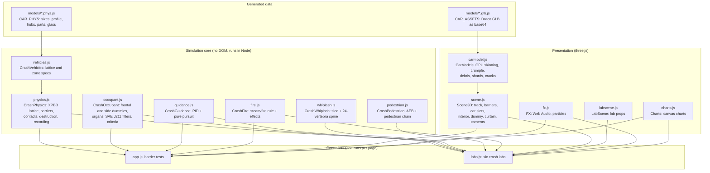

`index.html` loads the data and core modules as classic scripts. A small module script then imports three.js (0.170, OrbitControls, GLTFLoader, DRACOLoader), puts it on `window`, and loads the presentation modules and **one** controller: `labs.js` when the URL has `?lab=`, otherwise `app.js`.

### Data flow of one run

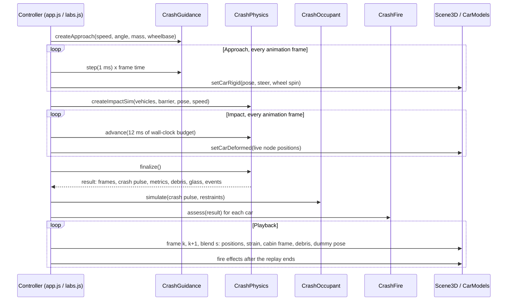

The impact computation is time-sliced. `sim.advance(budgetMs)` runs substeps until its wall-clock budget is spent, then returns, so the page keeps drawing and stays responsive. Emergency stop can cancel it.

### The crash result

`finalize()` returns one object that everything downstream reads:

| Field | Contents |
|---|---|
| `frames` | Recorded snapshots: time, every node's position (Float32), every node's plastic strain (Uint8), the cabin frame (origin, forward, up), brick and debris poses (position + quaternion), crush, intrusion, and the energy breakdown. Recorded every 1 ms for 0.3 s after first contact, every 4 ms to 1 s, then every 10 ms. |
| `pulse` | The cabin's acceleration and velocity resampled onto a uniform 0.1 ms grid and filtered (CFC 60), plus the barrier force. This drives the dummy. |
| `metrics` | Impact speed, speed change (Δv), rebound, peak deceleration, time to stop, maximum and permanent crush, cabin intrusion, initial kinetic energy. |
| `units` | Per vehicle (two in the two-vehicle and side labs): its own pulse, metrics, crush, cabin frames and intrusion measurements. |
| `debris`, `glass`, `bursts` | Parts and wheels that came off (with the lattice state at that moment), panes and lamps that broke (time, origin, velocity), tyres that burst. |
| `events` | First contact, contact impulses, parts detaching, glass breaking: these drive sounds and particles. |

Playback finds the two frames around the playback time and blends between them (positions linearly, rotations by slerp), so any playback speed looks smooth.

### Rendering and loading

- **three.js scene** (`scene.js`):
  - a test track with sky, ground and shadows;
  - an approach-path gizmo;
  - the rigid barrier, or an instanced brick wall;
  - one or more **car slots**, each with its body, interior (seat, dash, steering wheel, airbag, belts), dummy and curtain airbag;
  - cameras, with an onboard picture-in-picture inset.
- **Imported cars** (`carmodel.js`): parsed once from the embedded GLB, then skinned to the physics lattice on the GPU (see [Rendering the damage](#rendering-the-damage)).
- **Single-file build** (`tools/build-standalone.js`):
  - **Simulator:** inlines the model data and core modules as ordinary scripts, and the presentation modules as `text/x-inline` blocks that the loader executes after three.js is ready. It fails if any embedded file doesn't match its source.
  - **Home page:** embeds the pictures as data URLs and the video as base64, which the page turns into a blob URL.

---

## How the physics works

All the vehicle physics is in `js/physics.js`. Units are SI throughout. Car-local axes are x forward, y up, z right, with the ground at y = 0. The rigid barrier's face is at x = 0, and the car approaches from −x.

### 1. The vehicle as a lattice

Each car is a 3D grid of point masses (**nodes**) joined by springs (**distance constraints**), fitted to the car's body:

- **The grid.** Columns run along the car, placed so both axles fall on columns: about 24 cm apart for the imported cars, uniform for the Lab sedan. There are about 29 cm between rows and about 22 cm across the car. Nodes more than one row above the body's roof profile are dropped. The row just above the surface becomes light **ghost nodes** (0.25 kg) that only carry the render mesh.
- **The springs.** Every node connects to 13 neighbours: 3 along the axes, 6 face diagonals and 4 body diagonals, each pair once. The diagonals give the lattice shear and bending stiffness.

  | Vehicle | Nodes (ghost) | Springs |
  |---|---|---|
  | Lab sedan | 672 (96) | 6,506 |
  | Lexus RX 350 | 999 (144) | 9,913 |
  | Ford Mustang GT500 | 774 (144) | 7,563 |
  | Side-impact barrier trolley | 480 | 4,490 |

- **Mass.** The curb mass is spread over the structural nodes. 12% sits on the engine block's nodes, and 20 kg per corner sits on the wheel nodes (imported cars).
- **Zones.** Spring stiffness and yield strain are multiples of a base stiffness *K₀* = 1.1 MN/m (scaled with the lattice spacing, so the material stays as stiff) and a base yield strain *ε_y* = 1.15%:

  | Zone | Stiffness | Yield strain |
  |---|---|---|
  | Front crumple zone (ahead of the firewall) | 1× (× the Soft/Standard/Stiff setting) | 1× |
  | Engine block (inside the crumple zone) | 2.5× | 2.5× |
  | Passenger safety cell | 2.5× | 2.4× |
  | Rear structure | 1.5× | 1.2× |
  | Ghost springs | 0.15× | 1× |

  The zones are placed relative to each car's H-point (the driver's hip point) and rear axle, so every car gets a crumple zone, an engine, a cabin and a rear of the right size.

### 2. The solver: XPBD with plastic flow

The structure is integrated with **XPBD**, extended position-based dynamics (Macklin, Müller & Chentanez, 2016). It uses many small substeps, each with one constraint pass ("small steps" XPBD), which keeps stiff springs stable without a global solve. Each substep:

1. **Predict.** Save each node's position *x\**, add gravity to its velocity, move it: *x ← x + v·Δt*.
2. **Project the springs.** For each spring between nodes *a* and *b*, with inverse masses *w*, rest length *L₀* and compliance *α = 1/k*:

   ```
   C      = |x_b − x_a| − L₀                        (constraint: stretch of the spring)
   γ      = (c · α) / Δt                             (damping weight; c = 2ζ·√(k·m_reduced), ζ = 0.08)
   ẋ_rel  = relative displacement along the spring this substep
   Δλ     = −(C + γ·ẋ_rel) / ((1 + γ)(w_a + w_b) + α/Δt²)
   x_a   −= w_a·Δλ·n,   x_b += w_b·Δλ·n            (n: unit vector from a to b)
   ```

   Stiffness is physical. A spring of stiffness *k* behaves like one, independent of the step size, and each spring carries 8% of critical damping.
3. **Plastic yield.** If the spring's elastic strain after the correction exceeds its yield strain, the excess flows plastically: **the rest length moves**. The steel stays bent instead of springing back. The work done, yield force × plastic flow, is booked as plastic deformation energy, and the accumulated plastic strain is stored per spring. Rest lengths are clamped to 0.25–1.8× their original length, which models crushed structure bottoming out.
4. **Contacts.** Penetrating nodes are pushed out (next section).
5. **Friction.** Coulomb friction at every contact. The kinetic energy it removes, net of what went into springs and height, is booked as friction heat.
6. **Velocities.** *v = (x − x\*) / Δt*, then a velocity pass for contacts with rigid bodies.

**Time step.** 0.1 ms from the start and for 0.3 s after first contact, while the crash pulse runs. Then 0.5 ms for the rebound and debris settling. 1 ms gains energy with the stiff mortar bonds, so it isn't used.

**Duration.** The barrier tests continue 1.2–2.4 s after first contact, depending on the car and barrier, so parts and bricks land.

### 3. Contacts and friction

Every structural node is a sphere of radius 12 cm. Contacts with bricks, debris and the lab obstacles cancel the node's approach in that substep but never push it apart faster than 1 m/s, so deep penetrations can't pump energy in.

| Contact | How |
|---|---|
| Ground | Nodes stay above their floor height. Wheel nodes ride at hub height, so the tyre carries the car: friction 0.8 sideways, rolling resistance 0.015. |
| Rigid barrier | A concrete block (18 m wide, 3 m tall) with its face at x = 0, friction 0.3. The normal forces are summed like a load-cell wall. |
| Brick wall | Bricks are rigid boxes found through a spatial hash. Contacts are solved between the node and the brick's closest surface point, with the brick's own generalised mass and rotation. |
| Offset barrier, pole | A signed-distance function: a block with a 150 mm rounded edge (small-overlap test), or a 254 mm cylinder. |
| Honeycomb face | A 5 cm grid of aluminium cells in front of the offset barrier. A node presses on the cells under its share of the lattice face. Below their crush stress (0.34 MPa, or 1.7 MPa in the front strip) they stop it; above it they crush at constant force and bottom out when nearly flat. A cell's crush per step is capped at the node's forward advance, so sideways sliding can't crush it. The crush work is a separate energy channel. |
| Vehicle against vehicle | All cars' lattices run in one solver. Nodes of different cars meet as spheres, found through a spatial hash of the overlap of their bounding boxes, with friction 0.4. Crushed fronts interlock, so these contacts only cancel approach (at most 2 cm/s of separation); pushing nodes apart would pump energy in. |
| Debris | Parts and wheels that came off are rigid bodies with contact points on their outline, colliding with the ground, barrier and bricks. |

### 4. The brick wall

The wall has 366 bricks (40 × 20 × 25 cm, 2,000 kg/m³) in 12 courses, between two concrete pillars. Each brick is a rigid body: position, quaternion, linear and angular velocity, and the gyroscopic term for free spin.

- **Mortar.** Each joint is two **bond points**, so a joint carries bending as well as tension and shear. A bond is a stiff XPBD point constraint (compliance 2×10⁻⁸ m/N).
- **Failure.** A bond breaks in tension or shear above the mortar strength: weak 8 kN, standard 30 kN, strong 120 kN. Compression raises the shear capacity (Coulomb, factor 0.6). The energy stored in a breaking bond is booked as fracture energy.
- **Sleeping.** Bricks are *dormant* until loaded and go back to sleep when still. Bricks cut off from the footing and pillars lose their support and fall, singly or as clusters.

### 5. Destruction

Imported cars are split into named parts: bumpers, hood, fenders, doors, trunk or tailgate, mirrors, glass panes, lamps and wheels.

- **Panels ride on the lattice** until the springs they're mounted on have yielded far enough (mean plastic strain), then **come off as rigid debris** that keeps its crushed shape.

  | Part | Mass | Comes off at (mean plastic strain of its mounts) |
  |---|---|---|
  | Front / rear bumper | 9 / 7 kg | 16.5% / 15% |
  | Hood | 15 kg | 25% |
  | Fender | 4 kg | 18% |
  | Front / rear door | 24 / 20 kg | 6% |
  | Trunk or tailgate | 14 kg | 15% |
  | Mirror | 1.5 kg | 5%, or when it hits something |

  *Dramatic* damage multiplies every limit by 0.3.
- **Conservation at the break.** A debris body's mass is taken out of the nodes it sat on. Its velocity comes from their momentum. Its angular velocity is *I⁻¹L*, clamped so kinetic energy can't rise; the kinetic energy given up is booked as fracture energy. The headless check fails if a break changes total momentum or energy.
- **Wheels** are lattice nodes until their mount yields (30% mean plastic strain) or the hub is shoved back 45 cm; then they come off as rigid wheels spinning at their rolling speed. A **tyre bursts** when the rim meets an obstacle or the hub is shoved back 20 cm. It then goes flat over 50 ms, keeping 25% of its sidewall height, and its rolling resistance rises.
- **Glass and lamps** are decided after the run, from the recorded strain of the structure around each pane:
  - tempered side and rear windows break at 6% mean plastic strain;
  - the roof glass at 12%;
  - lamps at 10%;
  - any pane or lamp breaks when it touches the barrier or a brick, or when its panel comes off.

  Tempered glass bursts into a few hundred shards. The laminated windshield stays in and cracks instead, at 2.5% or where the dummy's head hits it.

### 6. Measuring the crash

- **The cabin frame.** Its origin is the mass-weighted centre of the passenger-cell nodes; forward runs from the rear to the front cabin nodes, and up from the floor to the roof nodes. The dummy rides in this frame.
- **The crash pulse.** The cabin velocity is resampled onto a uniform 0.1 ms grid, differentiated and filtered with an SAE J211 CFC 60 filter (a phaseless 4-pole Butterworth). It gives the deceleration, Δv, peak g and time to stop.
- **Crush and intrusion.** Crush is how far the front face has moved back relative to the cabin (mean of the front column). Cabin intrusion is how far the dash has moved toward the seat.
- **Lab measurement points.** Steering column, brake pedal, toe pan, hinge pillar, B-pillar and door points are embedded in the lattice. They are measured in a frame fitted (least squares, polar decomposition) to the undamaged rear corner of the cabin, so the car's own rotation doesn't count as intrusion.
- **Energy.** The books hold: car and debris kinetic energy (with wheel spin), elastic, plastic, fracture, friction, gravity and honeycomb crush. Position-based dynamics can't attribute contact, structural damping and numerical losses separately, so they form one residual channel, "contact, damping & solver". The energy chart shows where the initial ½mv² went.

### 7. The approach

`js/guidance.js` drives the car on a kinematic bicycle model:
- a **PID speed controller** sets the drive or brake force;
- **pure-pursuit steering** follows the approach line through the barrier centre at the chosen angle.

The car starts 30–130 m back (3 s at the test speed), 0.6 m off the line with a 4° heading error, so the controllers have something to correct. The impact simulation takes over when the gap is 1 cm plus 4 ms of travel, with the car's exact pose, speed and yaw rate.

### 8. After the crash: steam and fire

`js/fire.js` decides from the recorded crash:

- **Steam.** The front was crushed back to the radiator (25 cm behind the front, or the front of the engine if that's nearer). Hot coolant vents as steam.
- **Engine-bay fire.** The engine block, measured as the mean of its lattice nodes in the cabin frame, was driven **30 cm or more** back toward the firewall. That crushes the fuel rail and the fuel and oil lines against the hot exhaust at the back of the engine.

The fire grows in stages:
- smoke starts at once (0.3 s);
- flames after about a second;
- well alight after about 9 s, with burning fluid spreading under the car.

With the Lexus into the rigid barrier:
- 56 km/h pushes the engine back about 10 cm: steam only;
- 80, 100 and 130 km/h push it back about 43–50 cm: fire.

Rear impacts, which cause most fuel-tank fires, aren't simulated, so there is no fuel-tank rule.

---

## Occupant and injury models

The dummies are **driven by the crash** (one-way coupling, like a sled test). The vehicle simulation produces the cabin's motion, and the dummy reacts to it inside the cabin frame. This keeps the dummy cheap enough to re-run instantly with other restraints on the same crash.

### Frontal dummy (`occupant.js`)

- **Body.** A 2D side-view multibody of seven particles: pelvis, thorax, upper spine (T1), a compliant sternum, the top of the neck, and the front and back of the head. They are joined by stiff links and joint springs, plus a simple two-pendulum model for lateral sway.
- **Three-point belt.** Shoulder and lap belts with elastic webbing. A **pretensioner** takes out up to 8 cm of slack in the first milliseconds, and a **load limiter** pays out webbing at 4.5 kN.
- **Driver airbag.** It fires when the cabin's speed change reaches 2 m/s within 45 ms of contact, inflates, then vents.
- **Contacts.** Steering wheel with a collapsing column, windshield and roof (placed per car from its glass and roof lines), knee bolster, chin to chest. A head strike on the windshield cracks it where the head hit.
- **Injury criteria.** Channels are filtered per SAE J211 (CFC 1000 head, CFC 180 chest, CFC 600 neck) and scored against FMVSS 208-style limits:

  | Criterion | Limit |
  |---|---|
  | HIC15 (head injury criterion, 15 ms window) | 700 |
  | Chest acceleration, 3 ms clip | 60 g |
  | Chest deflection | 63 mm |
  | Nij (neck injury criterion) | 1.0 |
  | Neck tension / compression | 4.17 / 4.0 kN |

### Side-impact dummy

- **Body.** A frontal-plane dummy: pelvis, thorax with struck-side ribs, shoulders, neck and head, in the struck car's frame.
- **Loading.** The car's lateral acceleration, taken from the undamaged far half of the car where the seats are mounted. Also the door's inner surface, taken from the lattice at pelvis, chest and window height. Door padding crushes at a plateau force.
- **Window and curtain.** The window glass breaks at 4 kN or when the intruding door reaches it. A vented curtain airbag fires on a 1 m/s lateral speed change.
- **Criteria.** HIC36 (limit 1,000), rib deflection from a chest potentiometer (44 mm), pelvis force (6 kN).

### Organs: the third collision

The brain and the heart are masses on springs inside the head (50 Hz) and the chest (25 Hz). They keep moving after the body has stopped and then strike the inside of the skull or rib cage: the "third collision". It is why a hard stop can injure the brain or tear the aorta without a mark outside.

### Whiplash dummy (`whiplash.js`)

- **Spine.** A side-view chain of pelvis, 24 vertebrae (5 lumbar, 12 thoracic, 7 cervical) and head. Each joint has a rotational spring and a damper, with an end stop in the neck. The damping is integrated exactly per joint, because explicit damping is unstable on 2 cm vertebrae.
- **Seat.** Foam, a 25° seatback on a recliner that yields above 2.2 kN·m, and a head restraint placed by backset and height.
- **Sled pulse.** A triangular pulse of 91 ms whose speed change is half the striking car's speed: a stationary car struck from behind.
- **Criteria.** Head-restraint contact time (70 ms or less), T1 acceleration (9.5 g or less), NIC (15 m²/s²), neck extension.

### Pedestrian (`pedestrian.js`)

- **Body.** A 2D chain of feet, knees, pelvis, chest, neck and head, for an adult (1.75 m, 75 kg) or a 6-year-old child (1.17 m, 23 kg), struck in the car's plane.
- **The car's front.** Built from the car's real side profile. Its surfaces crush in two stages (elastic, then plastic): the bumper (rigid steel or energy-absorbing foam), the hood's leading edge, the hood (it dents onto the engine), the windshield and the roof edge.
- **Criteria.** HIC15 is scored separately for the head striking the car and the road. Also tibia and pelvis acceleration, knee bending, wrap-around distance and throw.
- **Emergency braking.** A rule-based model of a radar-and-camera system:
  - it sees ±25° to 60 m (45 m for a child), unless a parked car blocks the line of sight (checked with a segment-box test);
  - it confirms a pedestrian after 0.25 s;
  - it warns at 1.8 s to collision;
  - it brakes at 1.1 s (0.85 g, built up over 0.25 s after 0.1 s of latency).

---

## How each crash lab works

| Lab | Setup in the physics |
|---|---|
| Frontal overlap | An `offset` barrier: a rigid block 1 m wide covering 40% or 25% of the Lexus's width, optionally faced with honeycomb (0.54 m deep). The lab gives the cabin's outer front corners (toe pan, hinge pillar) sheet-metal strength instead of safety-cell strength, so a wheel driven back can push them in. Intrusion points are measured in the undamaged-cabin frame. |
| Two vehicles | Two lattices in one solver, placed nose to nose at the chosen angle with a tiny gap, no barrier. Each car gets its own crash pulse, dummy, plastic work and momentum. Mass is set independently of the model. The camera follows the pair's centre of mass, which moves at a nearly steady speed through the crash. |
| Side impact | Two units: the struck Lexus, standing still, and the barrier trolley. The trolley is a lattice with a crushable SUV-height face (0.38–1.14 m, 0.45 m deep) on a rigid body. In the pole test, the car slides sideways on a low-friction carrier (friction 0.03) into a fixed cylinder. The door ring (doors, B-pillar, sill, roof rail) uses the chosen steel: mild 0.6× stiffness and yield, hot-stamped 1.4× stiffness and 1.8× yield. The cabin between floor and roof is hollow, so the door can come in. |
| Whiplash sled | No vehicle physics: the sled pulse drives the seat and spine model directly. |
| Occupant restraints | A 35 mph (56 km/h) full-width rigid-barrier crash of the Lexus. The same crash pulse drives three dummy runs (unbelted, plain belt, full system), and the organ model splits the crash into its three collisions. |
| Pedestrian & braking | The car's motion is planned first: constant speed, sensor detection and braking. The impact is then computed with the pedestrian chain; the pedestrian is too light to change the car's motion. The other bumper is run too, for comparison. |

---

## Simulation diagrams

Each simulation as a pipeline from its settings to what you see, followed by the timing or state logic that drives it. The numbers are the model's actual thresholds and settings.

Colour key for the pipeline charts:
- **blue:** settings;
- **amber:** the model that is built;
- **purple:** computation;
- **red:** decisions;
- **green:** results on screen.

### Rigid barrier

`Simulator.html?preset=rigid`: the free simulator's full-frontal test (preset 56 km/h, Realistic damage).


The first 150 ms, as the restraints see it (times are relative to the airbag's firing time, *t_fire*):

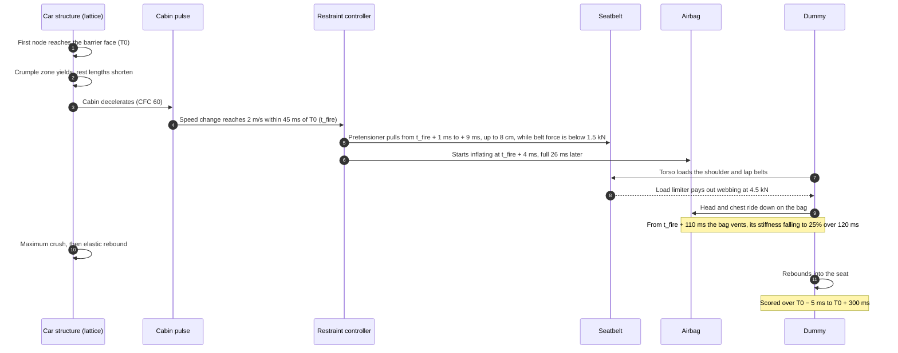

### Brick wall

`Simulator.html?preset=brick`: the same free simulator into a breakable wall (preset 64 km/h, Dramatic damage).

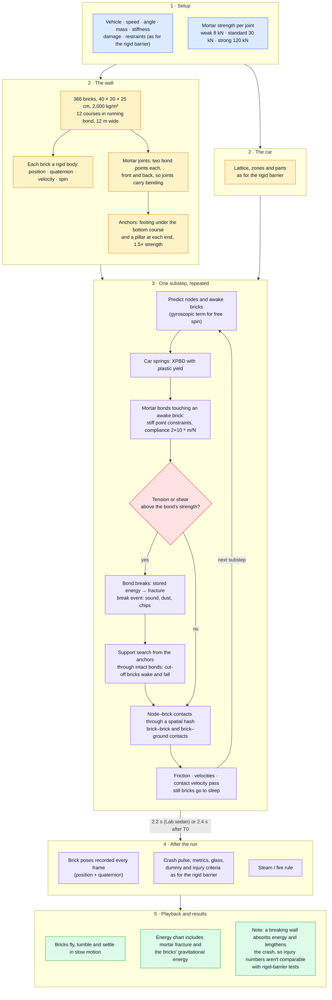

A brick's life, and a mortar bond's:

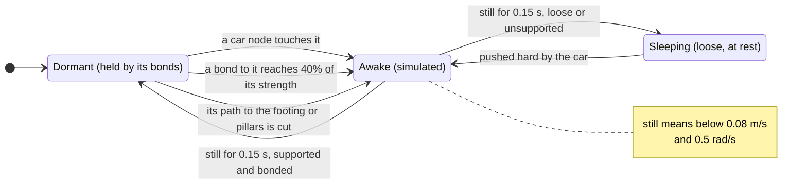

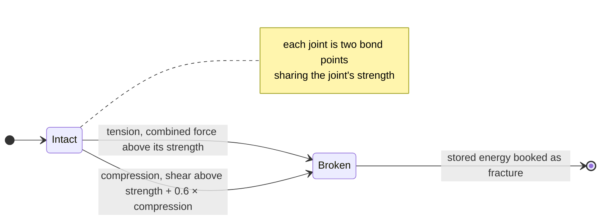

### Frontal overlap lab

`Simulator.html?lab=overlap`: part of the front hits a barrier.

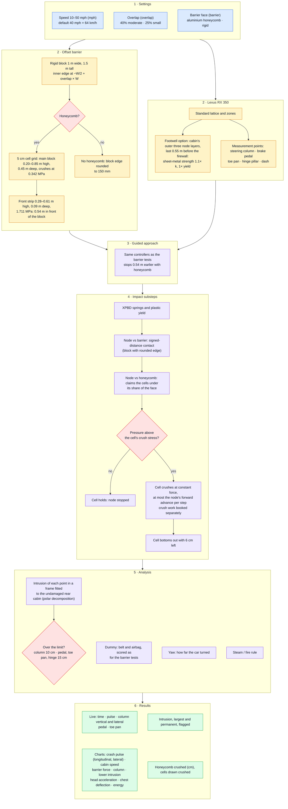

Why the two overlaps differ (the claim the physics check holds it to):

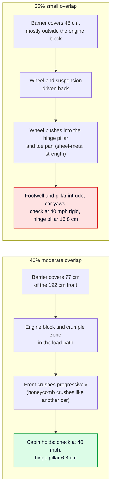

### Two-vehicle collision lab

`Simulator.html?lab=multi`: two cars crash into each other in one solver.

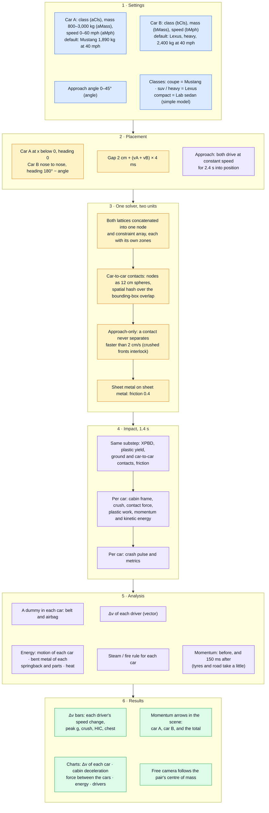

What the lab teaches, step by step:

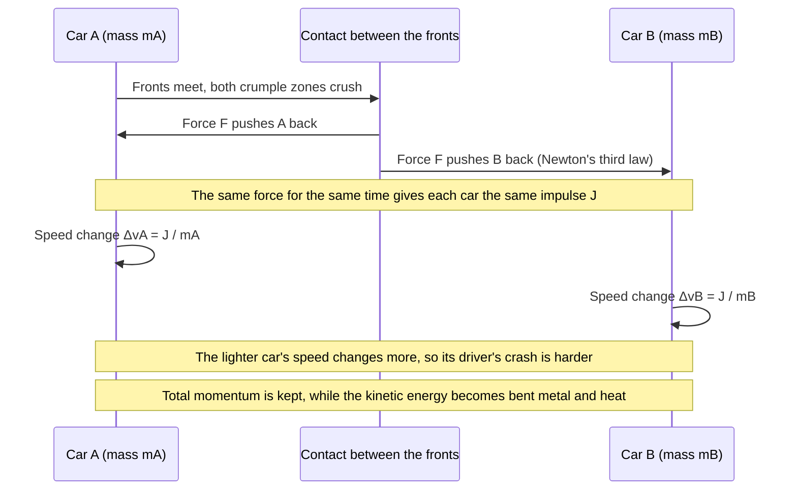

### Side impact lab

`Simulator.html?lab=side`: a barrier trolley or a pole hits the driver's door.

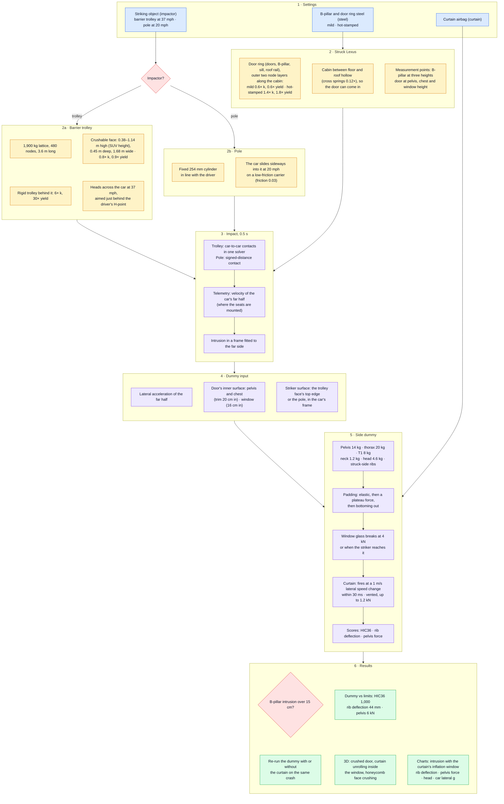

The race between the door and the curtain airbag:

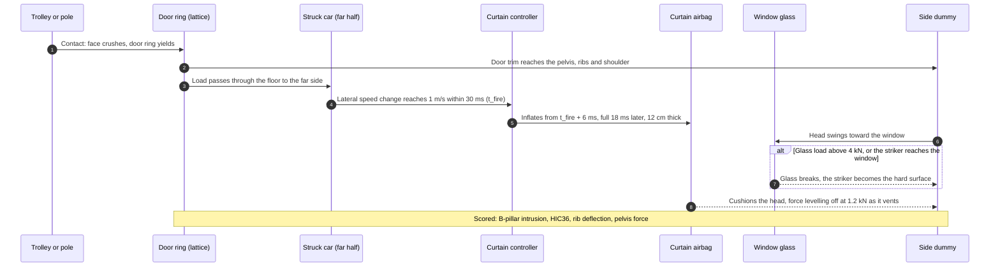

### Whiplash sled lab

`Simulator.html?lab=whiplash`: a seat on a sled is shoved forward, as when a stopped car is hit from behind.

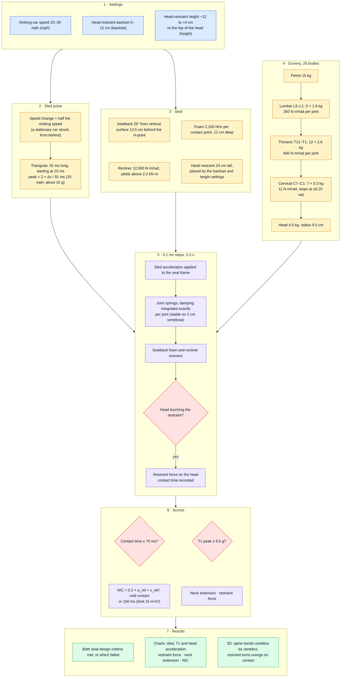

The rear-impact sequence:

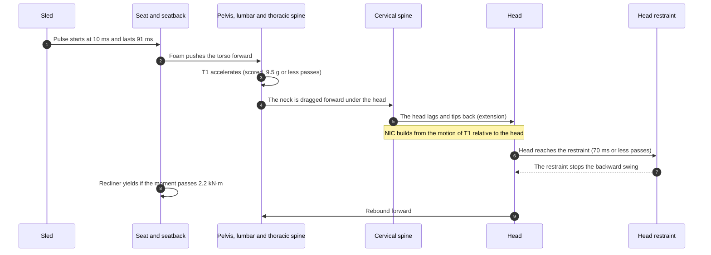

### Occupant restraint lab

`Simulator.html?lab=restraint`: one crash, three restraint systems, three collisions.

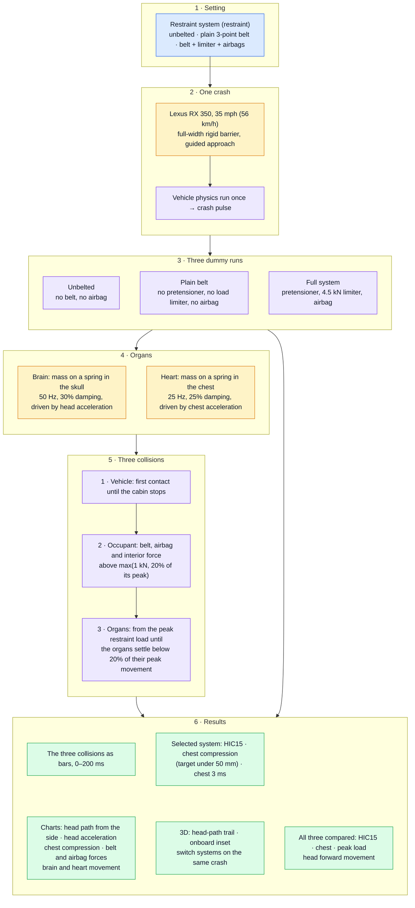

What each system does with the same crash (the physics check's numbers at 56 km/h):

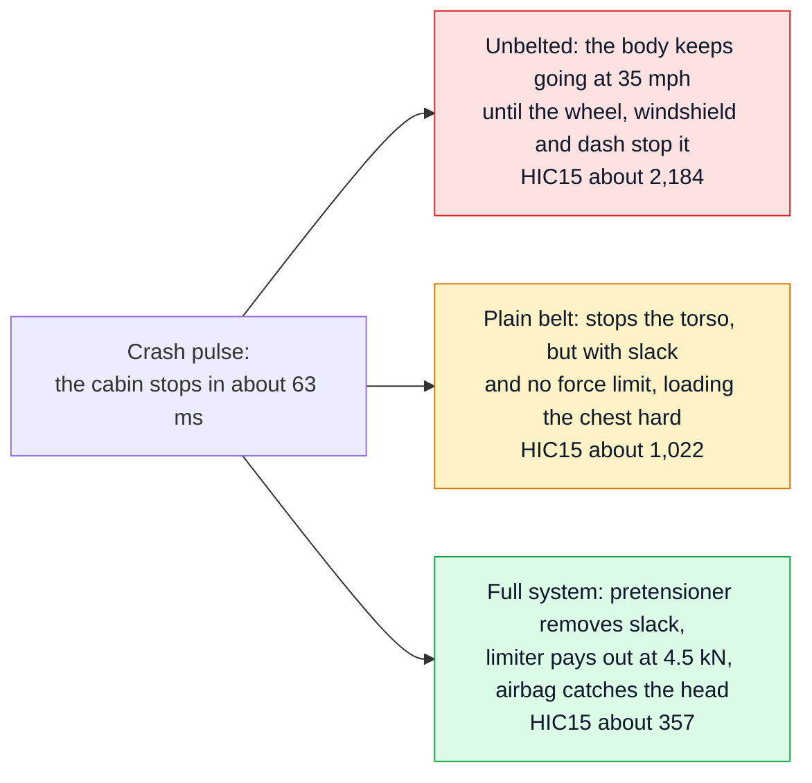

### Pedestrian and emergency braking lab

`Simulator.html?lab=pedestrian`: a pedestrian crosses, and the car may or may not brake in time.

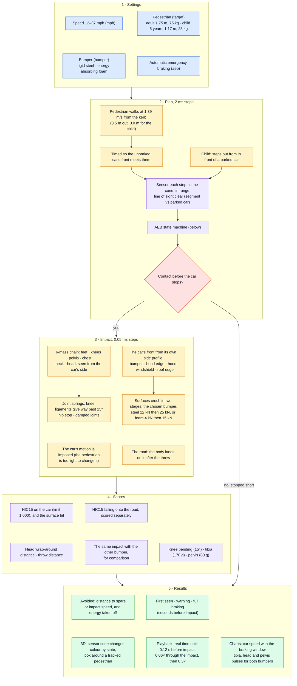

The emergency-braking system's states (the colour of the sensor cone in the scene):

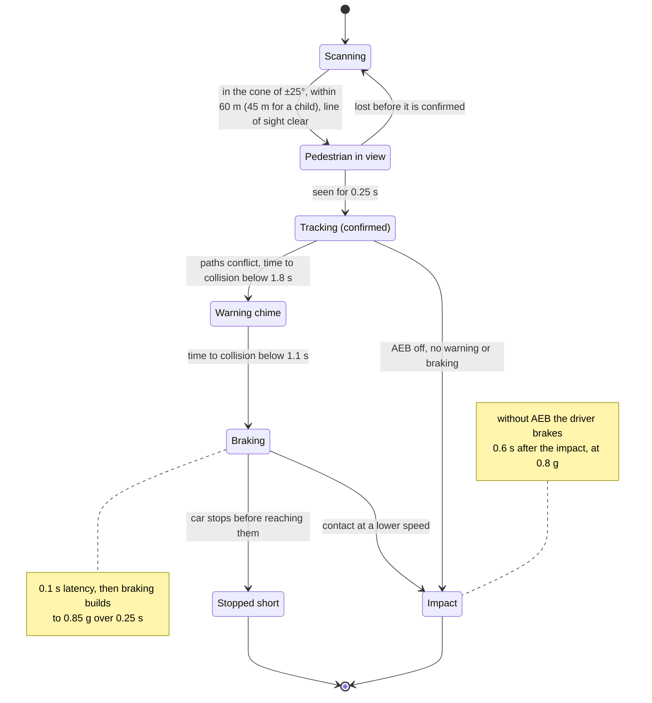

The impact itself:

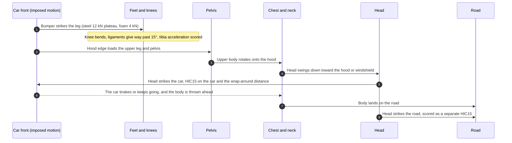

---

## Rendering the damage

### Skinning the model to the lattice (GPU)

Each vertex of the imported car's mesh is embedded in the lattice cell that contains it: 8 node indices and its position (*t*ₓ, *t*ᵧ, *t*_z) in the cell. Every frame, the node positions and plastic strains are uploaded as a float texture (one RGBA texel per node). The vertex shader then rebuilds each vertex by trilinear interpolation.

Normals aren't recomputed. Each authored normal is turned by the cell's deformation gradient *F* through its cofactor, *n′ = cof(F)·n*. So the model keeps its own smoothing and hard edges while it crumples, and stays exact under rigid motion. A custom depth material skins the shadows the same way. The simple Lab sedan is a subdivided box skinned on the CPU.

### Crumpled metal

The lattice, about 24 cm between nodes, is too coarse for sheet-metal folds, so the shader adds them where the lattice says the metal yielded:

- **Where.** From about 4.5% plastic strain, fully at 18%.
- **Buckles.** Broad buckles move the surface by up to 2.2 cm, along a smoothed normal so hard edges stay closed. Their wavelength is about 20 cm, as the mesh's vertices are 3–8 cm apart.
- **Folds.** Finer folds shade the surface through a screen-space bump, faded with distance so they don't shimmer.
- **Direction.** Where a lattice cell was compressed, the fold pattern blends toward copies squeezed 2.2× along that axis, so the folds run across the crush as on a crushed panel.
- **Paint.** Creases darken, and paint cracks off to grey primer along the sharpest ones.
- **Debris.** A part that comes off keeps its folds: they are baked into its frozen copy on the CPU, with a JavaScript port of the same noise.

This is visual only: intrusion and every number come from the lattice.

### Other effects

- **Debris** is a frozen copy of the part, skinned on the CPU at the moment it came off, following its rigid body's recorded pose.
- **Glass shards** are instanced meshes on precomputed ballistic paths (fall, bounce, settle). They are seeded from the pane name, so scrubbing and replays are consistent.
- **Windshield cracks** are a spider-web pattern drawn on a canvas texture from the break origin and head strikes.
- **Burst tyres** flatten against the ground in the vertex shader.
- **The curtain airbag** is shaped from the car's driver-side window panes: a quilted cushion with sewn chambers that unrolls from the roof rail just inside the glass. Its points ride on the lattice, so the crushed door pushes it in.
- **Fire and steam** are camera-facing instanced sprites: flames (additive), sooty smoke, embers and steam, plus a flickering point light. Each particle's state is a pure function of its index and the time since the crash, so the fire looks the same on every replay.
- **Sound** is synthesised live with Web Audio: structural crunch, metal clank, glass, windshield crackle, tyre pop, airbag, the AEB chime, fire roar and crackle, steam hiss. Point particles show sparks, dust and glass.

---

## Verification

```
node tools/headless-check.js            all scenarios (about two minutes)
node tools/headless-check.js lexus      a subset, by name fragment (rigid56, lab-, fire, ...)
```

The check runs the real modules in Node.

**Scenarios:**
- **Lab sedan:** 13 crashes (30–150 km/h, 30°, mass and stiffness variants, the brick wall at three strengths) and a standing-wall test.
- **Lexus and Mustang:** crashes at 30, 56, 100 and 150 km/h, at 30° and into the brick wall, in both damage modes. Also a parked car, a coasting car, a free wheel spinning at 130 rad/s, a wheel dropped while sliding, the same crash at half the time step, and destruction on vs off.

**It exits non-zero if any of these happens:**
- a run produces NaN, gains energy (more than 3% above the initial kinetic energy) or never reaches the barrier;
- the wall can't stand on its own;
- a part coming off changes total momentum or energy;
- anything comes off at 30 km/h, or at 56 km/h in Realistic mode;
- nothing comes off, or no front tyre bursts, at 150 km/h;
- fewer than 3 parts come off, or no window breaks, in Dramatic mode at 100 km/h;
- a parked car moves or sheds parts; a coasting car slows by more than 5%;
- a free wheel loses spin, or a dropped wheel doesn't end up rolling;
- halving the step changes which parts come off, or their timing by more than 5 ms;
- destruction changes the peak deceleration or HIC by 3% or more.

**Each crash lab is checked for the claim it makes:**
- **Overlap:** the 25% small overlap intrudes more at the hinge pillar than the 40% moderate overlap, and the honeycomb crushes within its depth.
- **Two vehicles:** equal cars get equal Δv. A car of half the mass gets about twice the Δv (1.6–2.4×), while momentum holds over the first 30 ms.
- **Side impact:** the mild-steel B-pillar intrudes more than 15 cm and the hot-stamped one less, and the curtain airbag lowers HIC in the pole test.
- **Whiplash:** a well-placed head restraint passes both criteria, a 10 cm backset doesn't, and T1 acceleration rises with speed.
- **Restraints:** HIC falls from unbelted to plain belt to full restraints.
- **Pedestrian:** emergency braking avoids an adult at 25 mph and cuts a 37 mph impact by more than 40%, and the foam bumper lowers the leg's acceleration.
- **Fire:** a 56 km/h Lexus barrier test vents steam but doesn't catch fire; a 100 km/h one does.

**Results at 56 km/h** (rigid barrier, belt and airbag):

| Car | Crush | Peak (CFC 60) | HIC15 |
|---|---|---|---|
| Lab sedan | about 540 mm | 57 g | about 310 |
| Lexus RX 350 | about 580 mm | 69 g | about 360 |
| Ford Mustang GT500 | about 670 mm (long front overhang) | 36 g | about 210 |

---

## Tools: building, recording, exporting models

### Single-file build

```
node tools/build-standalone.js
```

Writes `Simulator.html` (from `index.html` and every script) and `Car Crash Simulation.html` (from `home.html` and `media/`). Edit the sources, not these two files.

### Recording the home page's video and pictures

```
node tools/record-video.js [shots|video|labs] [--lab <id>]
```

Records the built `Simulator.html` in headless Chrome. It writes:
- `media/crash-reel.mp4`: about a minute of crashes with captions;
- `media/poster.jpg`: the video's poster frame;
- `media/shot-rigid.jpg`, `media/shot-brick.jpg`: the barrier tests;
- `media/lab-<id>.jpg`: one picture per lab.

How it works:
- **Virtual clock.** The page runs on a virtual clock that advances exactly 1/30 s per captured frame, so the video is smooth however long each frame takes to render.
- **Encoding.** Blender's built-in FFmpeg encodes the frames (`tools/encode-video.py`), so no separate ffmpeg install is needed. Use `--chrome <path>` and `--blender <path>` if they aren't in their default folders.
- **Order.** Rebuild before recording, then again afterwards to embed the new media in the home page.
- **No sound.** The app's sounds are synthesised live and aren't captured.

### Rebuilding the car models

```
blender -b -Y --factory-startup --python tools/export-car.py -- tools/cars/lexus.json
```

Needs Blender 4.2 or later (tested with 5.1). `-Y` stops scripts stored in the .blend from running. The exporter:
- strips the rig, the driver, lights and the interior;
- turns the car to x forward and y up, and scales it to the real wheelbase;
- sorts mesh pieces into named parts using the material lists and region boxes in `tools/cars/<car>.json`;
- decimates the meshes;
- writes `models/<car>.glb.js` (a Draco-compressed GLB) and `models/<car>.phys.js` (sizes, roof profile, hubs, tyre size, H-point, part samples, glass panes).

It stops if the wheelbase, axle direction, glass-pane count or H-point come out wrong. Add `--report` to only list the mesh pieces in car coordinates.

Parts follow a naming scheme that carries over to game engines: `DEFORM_` (panels that crumple), `RIGID_Cage_` (body structure), `RIGID_Mech_` (wheels, engine), `BRITTLE_` (glass, lamps) and `BREAKAWAY_` (mirrors).

---

## Design decisions

- **Not real time during the impact.** 60 FPS applies to the approach and playback. The impact is integrated at 0.1 ms, because 30–120 Hz can't resolve a ~100 ms crash pulse or give a valid HIC.
- **Single-threaded plain JavaScript physics.** No WebAssembly, WebGPU compute or SharedArrayBuffer. The impact runs in time-sliced chunks on the main thread, so the page also works from a plain file. Rendering is WebGL (three.js), and the body skinning runs on the GPU.
- **No external physics library.** Destruction follows the node-and-beam approach of BeamNG and Rigs of Rods, built on the same solver:
  - ammo.js soft bodies have no plasticity;
  - a second engine such as Rapier would split the solver and the energy books.
- **Physics on the simulation nodes, not on render vertices.** Material properties live in the lattice and `js/physics.js`; the render mesh only follows it.
- **Two barrier modes.** A rigid barrier, for injury numbers comparable with standard tests, and a breakable brick wall as a demonstration. A breaking wall absorbs energy and lengthens the crash, which lowers every injury number.
- **Mass and stiffness are separate controls.** Changing them together can cancel out.
- **Speed range 10–150 km/h.**
- **Sled-style occupant.** The dummy is driven by the cabin pulse (one-way coupling), not a 3D multibody inside the deforming car. That makes re-running it with other restraints instant.
- **Part-level fracture.** Panels and wheels come off whole; the body structure itself doesn't tear. Bricks break at mortar joints only.
- **Every run is computed.** There are no pre-baked destruction caches.
- **Kill switch per stage.** It brakes during the approach and cancels during the computation. It isn't available during the ~100 ms impact itself.
- **Colour-blind-safe heatmaps, no flashing.** Status is always given as text too.

---

## Limitations

- **Not validated against physical crash tests.** Numbers show trends between settings; they don't predict real injuries.
- **Break limits are judgement calls**, tuned to plausible outcomes:
  - 30–56 km/h: lamps break, no panels or wheels come off;
  - 100 km/h: the bumper, hood, fenders and front wheels come off, depending on the car;
  - 150 km/h: most of the front comes off.
- **Lab settings are judgement calls too.** Steel strengths, honeycomb and trolley-face stiffness, padding, the curtain airbag, seat foam and sensor timings were tuned to give plausible numbers and the right trends. They aren't measured values.
- **The lattice is a box-section approximation of each body.** Its contact surface doesn't follow rounded corners exactly.
- **The "contact, damping & solver" energy share is large**, roughly 20–45%. In a real crash, most of that would be plastic work.
- **Two cars: energy split.** Once the crushed fronts interlock, friction and the solver residual trade energy back and forth. Their total stays right, so the lab shows them together as heat.
- **Debris doesn't collide with the car** after it comes off (it can pass through the body). Bricks don't collide with the interior.
- **Glass shards are visual only.** They don't collide with the car, and on the rigid barrier they stop at its face.
- **Crumple folds and fire are visual.**
  - The folds are drawn where the lattice yielded; they don't add stiffness or change any number.
  - Fire is a rule (engine driven 30 cm into the firewall), not a combustion model. It doesn't weigh how likely ignition is, how much fuel leaked, or fire spreading into the cabin.
  - Real crash fires are much rarer than "every severe crash", so read it as "this crash could start a fire".
- **Hoods and doors don't swing on their hinges** before they come off.
- **The imported interiors are removed.** The app's own seat, wheel, airbag and dash are used, because the occupant model is built around them. The Lexus model has no engine, so a plain block stands in.
- **Lab-only structure.** The overlap lab's weaker cabin corners and the side lab's door-ring steel and hollow cabin are used in those labs only. The barrier tests' cars keep their uniform safety cell.
- **Simplified dummies and braking.**
  - The side-impact dummy works in one plane and leaves out the legs.
  - The whiplash seat is generic.
  - The pedestrian is a single 2D chain, so the arms and far leg only follow it in the 3D view.
  - Emergency braking is a rule-based model of one system, not a particular product.
- **Performance.** The brick-wall computation takes several seconds on a laptop. The phone layout works but is cramped.

---

## Project structure

```
Car Crash Simulation.html   generated single-file home page (edit home.html, then rebuild)
Simulator.html              generated single-file simulator (edit the sources, then rebuild)
home.html                   home page source
index.html                  simulator page source and script loader
css/style.css               layout and theme
js/
  vehicles.js     vehicle specs: lattice grid, zones, interior lines; the side-impact trolley
  physics.js      XPBD lattice, barriers (rigid, brick wall, offset + honeycomb, pole), several
                  vehicles, contacts, destruction, recording, crash pulse, intrusion measurement
  occupant.js     frontal and side-impact dummies, organ model, J211 filters, injury criteria
  guidance.js     PID speed control and pure-pursuit steering for the approach
  whiplash.js     rear-impact sled and the 24-vertebra dummy
  pedestrian.js   emergency braking and the pedestrian impact
  fire.js         steam and fire after the crash: the rule and the effects
  carmodel.js     imported cars: GPU skinning, crumple shading, debris, shards, cracks, flat tyres
  scene.js        three.js scene, the Lab sedan's body, interior, dummy, curtain airbag, cameras
  labscene.js     lab props: offset barrier and honeycomb, pole, barrier trolley, sled and spine,
                  pedestrian, sensor cone, momentum arrows, head trail
  charts.js       canvas line and stacked-area charts with scrub cursors
  fx.js           Web Audio sounds and point particles
  app.js          controller for the barrier tests
  labs.js         controller for the six crash labs (runs instead of app.js with ?lab=)
models/           generated car models (Draco GLB as base64) and physics data
media/            the home page's video, poster and pictures of the eight simulations
tools/
  headless-check.js     physics and lab checks in Node
  build-standalone.js   builds the two single-file pages
  record-video.js       records the home page's media in headless Chrome
  encode-video.py       encodes the video with Blender's FFmpeg
  export-car.py         Blender exporter for the car models
  cars/*.json           per-car part rules for the exporter
```

---

## Credits

- **Lexus RX 350:** "[Lexus RX 350 + rigged (+ rigged driver (human))](https://sketchfab.com/3d-models/lexus-rx-350-rigged-rigged-driver-human-6b9a1994b2dd445c8248270c81eead6b)" by menarzuw, CC BY 4.0.
- **Ford Mustang GT500:** "[Ford Mustang Gt 500 With pro Rig FOR FREE!](https://sketchfab.com/3d-models/ford-mustang-gt-500-with-pro-rig-for-free-f26a29f766844f46910547d6d2cc291d)" by NoOb StUfFs, CC BY 4.0.

Both models are split into parts, re-oriented, scaled and simplified for this app.

**Libraries:**
- [three.js](https://threejs.org/) (MIT), loaded from jsDelivr;
- the Draco decoder (Apache 2.0);
- the simplex noise in the crumple shader, after Ashima Arts and Stefan Gustavson (MIT).

**References:** Macklin, Müller & Chentanez, "XPBD: Position-Based Simulation of Compliant Constrained Dynamics" (2016); Macklin et al., "Small Steps in Physics Simulation" (2019); SAE J211-1 (instrumentation for impact tests); FMVSS 208 (occupant crash protection).
